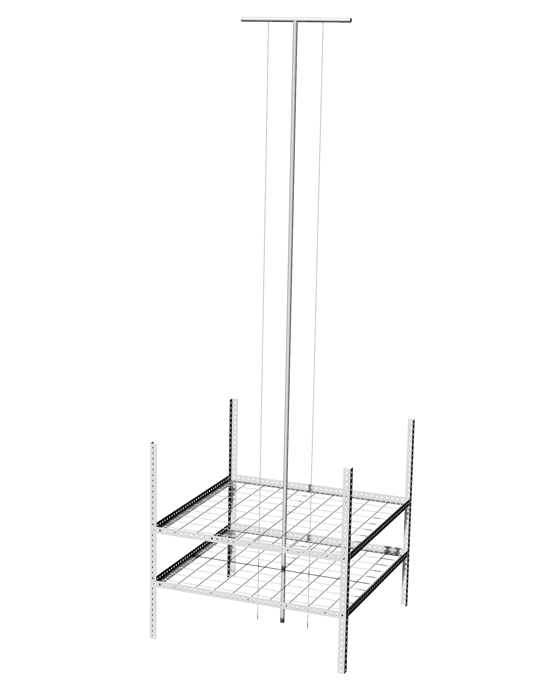

```{r setup, include=FALSE, cache=FALSE, message = FALSE}
library(knitr); library(plyr); library(dplyr); library(readr); library(ggplot2); library(tidyr)

#opts_knit$set(root.dir=normalizePath('../'))

### Chunk options: see http://yihui.name/knitr/options/ ###

## Text results
opts_chunk$set(echo = F, warning = F, message = F, include = TRUE)

## Code decoration
opts_chunk$set(tidy = TRUE, comment = NA, highlight = TRUE)

## Cache
opts_chunk$set(cache = 2, cache.path = "cache/")

## Plots
opts_chunk$set(fig.path = "figures/")
opts_chunk$set(dpi = 300)
# opts_chunk$set(dev = c("png"))

struc_colors <- scale_color_manual(values=c("red","blue"))
struc_fill <- scale_fill_manual(values=c("red","blue"))

```


```{r knitcitations, cache = F}

library(knitcitations)
cleanbib()   
cite_options(citation_format = "pandoc")
library(bibtex)
library(RefManageR)

```

\singlespace

\vspace{2mm}\hrule

Write your abstract here.

\vspace{3mm}\hrule

*Keywords*: fine fuels, fire heterogeneity, fire intensity, fuel load, fuel structure, fire behavior

\doublespace

\bleft


# INTRODUCTION

Fine surface fuels play a major role in the ignition, spread, and intensity of fires. Fire behavior from ~1-m^2^ to landscape (hectares) scales is driven by weather conditions and fuel characteristics, including fuel load, structure, moisture, and continuity. Understanding how fuel characteristics influence fire intensity, severity, and behavior is imperative for fire ecologists, modelers, and land managers where fire is an integral part of the landscape. However, specific information is know about relatively few species, and while valuable, this information is often obtained by studies conducted across a spectrum of realism. Methods range from *in situ* approaches where measurements are made before, during, and after prescribed fires (high realism, low replication), to laboratory bench approaches where small amounts of fuel are combusted in highly controlled settings (low realism, highly replicable) EXPAND ON GAPS & REALISM/REPLICATION TRADEOFF (@Fernandes2012).

Fire ecology experiments in the field often only manipulate the fuel load or type, necessarily sacrificing some realism in fuel structure. Fuels are often piled horizontally even though fuel complexes are typically more heterogeneous with subtantial vertical structure that affects fire behavior (@Loudermilk2014). For example, in a grass-savanna landscape @Bowman2017 piled fuels horizontally for a field experiment examining how fine fuel loads of different types affected fire intensity and survival of tree saplings. They found that sapling mortality increased with fire intensity (maximum temperature at 5 cm). Fire intensity increased with fuel load, and grass-only and grass-litter fuel complexes produced greater fire intensities than litter-only fuels. Similarly, @Thaxton2006 altered fuel loads in a longleaf pine system to examine groundcover shrub survival. They added fixed amounts of fuel by piling either longleaf pine needles or pieces of pine wood, or removing a fixed amount of fine fuels from plots. The fuel addition treatments resulted in greater fire temperatures and shrub mortality compared to the removal and control treatments. 

Each of these studies provide useful information that is applicable to the conditions of their study area and for the scale of the question, however, they also necessarily sacrifice some realism in fuel structure.  

@JAUREGUIBERRY2011, @Simpson2016, @Wyse2016

(Discussion/Conclusion??) In this paper we present an experimental apparatus that can bridge the gap between making measurements of flammability at the lab bench and the limited replication of prescribed fires. The Fine Aboveground Biomass Incineration Organizer (FABIO) enables experimental manipulation of fuel load and structure at a realtively small but realistic and relevant scale of 1-m^2^. We expect our design will be most useful for grasses or grass-like fuels, but it could be used or adapted for other fuel types such as small shrubs and trees. 


Fuel load has been shown to be a particularly important driver of combustibility, sustainability, and rate of spread. 

Temperature metrics are influenced by fuel structure. In general, fuels with greater vertical arrangement will achieve higher maximum temperatures, but will also burn faster. Faster burning should result in less exposure to temperatures that cause plant tissue damage. We show these differences in maximum temperature and time above 100 ºC for standing and piled fuels.

Also, density, dead:live ratio - the more flammable dead fuels can disproportionately influence fire behavior.

Grasses in particular fuel lots of fires, fuel loads are often increased in landscapes invaded by non-native grasses.  

We present a methodology for maintaining realism in fuel structure in experiments where fine fuels with typical vertical structure, e.g. grasses, are manipulated.

Using the exotic invasive cogongrass we illustrate how changing the fuel structure can substantially alter flammability characteristics. 

It can be deployed in the field or in a more controlled "laboratory" setting. 

We qualitatively compare the fire intensity and behavior measurements from these experimental fires, where the fuel load was entirely piled or entirely standing, to measurements made for five experimental fires with a combination of piled and standing fuels, and to measurements made during a prescribed fire in a longleaf pine ecosystem.


# METHODS

## Study site
We harvested ~50 kg of standing cogongrass from an invasion at the Biven's Arm Research Station (BARS), Florida, USA. The fuel was stored in a shed for 48-hours to protect it from rainfall, and then spread outside in a cleared area to dry for ~72 hours. We raked through the pile each day to increase drying, while carefully maintaining stem orientation in the same direction. We found that consistent stem orientation was more efficient for weighing and loading fuels vertically into the FABIO. 

1.	Study Species

      a.	Collection of materials

      b.	Drying to a “constant” fuel moisture

2.	Burning Location	

      a.	BARS
      
      b.	Weather measurements
            i. Kestrel data

3.	Experimental treatments

      a.	Piled vs Standing
      
      b.	Number of burns
      
            i.	Blocked by day 

4.	Flammability measurements

      a.	All fires were ignited with a drip torch (Brand XX style XX)
            
            i.	All were lighted as head fires
            ii.	If failed to burn, was attempted 3 times from 3 sides before deemed a failure.
      
      b.	Fire temperature was measured every second with XX type thermocouples
            i.	Locations of sensors
            ii.	Determined maximum temperature
            iii.	Determined time above 100C
            
      c.	Rate of spread
            i.	50cm distance and stop watch

      d.	Flame height
            i.	String soaked in Foscheck

      e.	Remaining biomass was collected to determine percent consumed

5.	Statistical Analysis


## Experimental apparatus: Fine Aboveground Biomass Incineration Organizer (FABIO)
The fine aboveground biomass incineration organizer (FABIO) is a freestanding device for outdoor use to efficiently manipulate fuel structure and assess the effects on fire intensity (Figure 2). These outdoor small-scale (1m^2^) experimental fires allow for repeated measurements of fire intensity across multiple fuel loads without the onerous task of setting up all of the experimental plots prior to a large-scale prescribed that is subject to weather conditions and sufficient personnel. The FABIO is equipped with nine type K braided steel insulated thermocouples (TP875 Extech Instruments, Nashua, NH, USA) that were 100 cm long with a diameter of XX mm at the point of measurement. These thermocouples were robust to exposure to multiple fires and could therefore be used continuously throughout the day. Thermocouples were connected to HOBO J,K,S,T thermocouple loggers (Model U12, Onset Computer Corporation, Bourne, MA, USA) capable of recording temperatures between 0 and 1250 ºC every second. The loggers were housed in Pelican cases (1010 Micro Case, Torrance, CA, USA) with foam inserts (1012 Pick N Pluck). A small hole drilled in the lid of each case to pass through the thermocouple wire. In order to more accurately capture temperatures throughout the fire profile, three thermocouples are placed at each of three heights (ground level, 25cm, and 50cm) with equidistant horizontal spacing. Two measurements of flame heights are quantified using passive flame height sensors. The passive flame height sensors are twisted cotton string (XXX) soaked in flame retardant (Phos-Chek LC-95, ICL Performance Products LC, Ontario, CA, USA) and dried for at least 24 hours. The strings are tied to a horizontal piece of steel conduit so that they hang vertically and we used two for each fire (see Figure 2). The flame height sensors we used were capable of measuring heights up to 275cm and allow for rapid replacement between experimental fires. Passive flame height sensors like these have been used previously for in situ fire behavior experiment and provide a reliable measurement for quantifying flame heights that is free from human biases (Flory et al. 2015; Kolaks et al. 2004; Ryan 1981).




## Data collection and analysis

### Experimental design
We burned three fires using piled fuel and three fires using standing fuel for each of five fuel loads (250 g, 500 g, 1000 g, 1500 g, 2000 g) spanning the range of cogongrass biomass observed from field measurements across Florida, USA. We ultimately burned 32 fires in this experiment, with one additional fire in the 1000g category due to mislabeling during biomass sorting and weighing. We put the fire intensity and behavior measurements from these experimental fires in the context of measurements made during a prescribed fire in a longleaf pine ecosystem, and measurements made for five experimental fires using the FABIO where fuels were both piled and standing. The prescribed fire was conducted in a longleaf pine forest at Camp Blanding Joint Forces Training Center near Keystone Heights, FL, USA. The forest had prescribed fire applied regularly on an 18-36 month interval, promoting a herbaceous understory dominated by the bunch grass *Aristida stricta* (wiregrass). We successfully recorded temperatures and flame height at seven locations across the ~250 hectare management unit.

### Temperature and weather measurement
We recorded temperatures every second for all fires. 

For the 32 experimental fires where the fuel loads were either piled or standing we used the braided steel insulated thermocouples (TP875 Extech Instruments, Nashua, NH, USA) that were 100 cm long with a diameter of XX mm at the point of measurement.  

During the prescribed fire we used braided glass insulated wire probes (TC6-K, Onset Computer Corporation, Bourne, MA, USA) and wire was only good for a single exposure to direct flame. The bead wire probes were more expensive, but ultimately more economical because they didn't degrade when exposed to flames. Weather data was recorded every two seconds during fires using a Kestrel 5500 Fire Weather Pro pocket weather tracker (Nielsen-Kellerman, Boothwyn, PA, USA) mounted on a tripod 1m above the ground. Data points were matched to the time of each fire and average values were calculated for air temperature, relative humidity, and wind speed.


### Statistical analyses
We used ordinary least squares linear regressions to model the response variables of average maximum temperature, time above 100 ºC at each probe height, the average flame height, and the rate of spread. We used beta regression to model the proportion of biomass consumed. Fuel load (mass) and fuel structure (piled vs. standing) were used as explanatory variables in each model, and fuel load was entered as a continuous variable. We tested the main effects and interaction of fuel load and fuel structure along with weather covariates (e.g. air temperature, wind speed, relative humidity). Statistically insignificant weather variables were excluded from final models. Because our main goal was to assess the effect of fuel structure (piled vs. standing) on measures of fire intensity and behavior we retained fuel structure and biomass as main effects in all models.

Regression models had the following general form:

$$
y_{i} = \alpha + \beta_{1}fuel \ load_{i} + \beta_{2}fuel \ load_{i}*\beta_{3}fuel \ structure_{i} + \epsilon
$$
where $y_{i}$ was either average maximum temperature, time above 100 ºC, average flame height, or the rate of spread. 

```{r load data from FABIO experiment}

# source("~/SERDP_Project/fire-temps.R")
# source("~/SERDP_Project/fire-weather-data.R")

fires_biomass1 <- read_csv("~/SERDP_Project/data/fabio-fires-biomass.csv")
fires_biomass <- filter(fires_biomass1, date > "2017-11-30")
# summary(fires_biomass)
fires_biomass <- fires_biomass %>% 
      select(date, fire_id, biomass, structure:max_fuel_ht, avg_fuel_ht) %>% 
      mutate(f_structure = as.factor(structure),
             rate_of_spread_ms = 1/rate_of_spread_50cm*2)
fires_biomass$rate_of_spread_ms[fires_biomass$rate_of_spread_ms=="Inf"] <- 0


fire_temps1 <- read_csv("~/SERDP_Project/data/fabio-fires-temperatures.csv")
fire_temps <- filter(fire_temps1, date > "2017-11-30") %>% select(-probe_type)
fire_temps <- left_join(
      fire_temps,
      select(fires_biomass, fire_id, structure, biomass),
      by = "fire_id"
                        )

      
# average the temperature across each vertical level "location"
fire_temps_avg <- fire_temps %>% 
      group_by(date, time, biomass, location, structure, fire_id) %>% 
      summarise(tempC = mean(tempC)) %>% 
      arrange(fire_id)
# write_csv(fire_temps_avg, "~/SERDP_Project/data/piled-vs-stand-avg-fire-temps.csv")

time_abv100 <- fire_temps_avg %>%
      group_by(location, structure, fire_id) %>%
      filter(tempC>100) %>%
      summarise(s_abv100 = length(tempC),
                heat_flux_abv100 = sum(tempC)) %>%
      ungroup(.)

# time above 100 ºC by location & position (left, right, middle)
t_abv100 <- fire_temps %>% 
      group_by(fire_id, location, position, structure) %>% 
      filter(tempC>100) %>% 
      summarise(s_abv100 = length(tempC),
                heat_abv100 = sum(tempC)) %>% 
      ungroup(.) %>% 
      group_by(fire_id, location, structure) %>% 
      summarise(s_abv100 = mean(s_abv100),
                heat_flux_abv100 = mean(heat_abv100)) %>% 
      ungroup(.)

# d1$flame_ht2 <- as.integer(d1$flame_ht2)
max_temp <- fire_temps %>%
      group_by(location, structure, fire_id) %>%
      summarise(max_temp = max(tempC)) %>% 
      ungroup(.)

# average max temp from each position (left, right, middle) 
m_temp <- fire_temps %>% 
      group_by(fire_id, location, position, structure) %>% 
      summarise(max_temp = max(tempC)) %>% 
      ungroup(.) %>% 
      group_by(fire_id, location, structure) %>% 
      summarise(max_temp = mean(max_temp)) %>% 
      ungroup(.)

# average the 5 highest temperatures at each height
avg_max_temp <- fire_temps_avg %>% 
      group_by(location, structure, fire_id) %>% 
      arrange(desc(tempC)) %>% 
      summarise(avg2_max_temp = mean(tempC[1:5])) %>% 
      ungroup(.)

# average the 5 highest temperatures at each height & position
a2_m_temp <- fire_temps %>% 
      group_by(fire_id, location, position, structure) %>% 
      arrange(desc(tempC)) %>% 
      summarise(a2_max_temp = mean(tempC[1:5])) %>% 
      ungroup(.) %>% 
      group_by(fire_id, location, structure) %>% 
      summarise(avg2_max_temp = mean(a2_max_temp)) %>% 
      ungroup(.)

# fabio_fires <- join_all(list(max_temp, avg_max_temp, time_abv100), 
#                type = "full", match = "all")

fabio_fires <- join_all(list(m_temp, a2_m_temp, t_abv100), 
               type = "full", match = "all")


# summary(fabio_fires)
fabio_fires$s_abv100[is.na(fabio_fires$s_abv100)] <- 0
fabio_fires$heat_flux_abv100[is.na(fabio_fires$heat_flux_abv100)] <- 0

fabio_fires <- left_join(fabio_fires, fires_biomass) %>% 
      mutate(location = as.factor(location),
             structure = as.factor(structure),
             # struc_indicator = as.factor(ifelse(structure=="piled", 0, 1)),
             f_biomass = as.factor(biomass))

fire_weather_summary <- read_csv(
      "~/SERDP_Project/data/piled-vs-standing-fire-wx-summary.csv"
      )
fabio_fires <- left_join(fabio_fires, fire_weather_summary)

# write_csv(fabio_fires, "~/SERDP_Project/data/piled-vs-stand-aggregate.csv")

fabio_fires_summary <- fabio_fires %>%
      group_by(location, structure, biomass) %>%
      summarise(n_obs = length(location),
                avg_s_abv100 = mean(s_abv100),
                se_s_abv100 = sd(s_abv100)/sqrt(n_obs),
                avg_heat_flux_abv100 = mean(heat_flux_abv100),
                se_heat_flux_abv100 = sd(heat_flux_abv100)/sqrt(n_obs),
                avg_max_temp = mean(max_temp),
                se_max_temp = sd(max_temp)/sqrt(n_obs),
                avg2_max_temp_avg = mean(avg2_max_temp),
                se_avg2_max_temp = sd(avg2_max_temp)/sqrt(n_obs)
                )
# write_csv(fabio_fires_summary, "~/SERDP_Project/data/piled-vs-stand-summary.csv")

fabio_fireid_summary <- fabio_fires %>%
      group_by(location, structure, biomass, fire_id) %>%
      summarise(n_obs = length(location),
                avg_s_abv100 = mean(s_abv100),
                # se_s_abv100 = sd(s_abv100)/sqrt(n_obs),
                avg_heat_flux_abv100 = mean(heat_flux_abv100),
                # se_heat_flux_abv100 = sd(heat_flux_abv100)/sqrt(n_obs),
                avg_max_temp = mean(max_temp),
                # se_max_temp = sd(max_temp)/sqrt(n_obs),
                avg2_max_temp_avg = mean(avg2_max_temp)
                # se_avg2_max_temp = sd(avg2_max_temp)/sqrt(n_obs)
                )

fire_weather_summary <- read_csv(
      "~/SERDP_Project/data/piled-vs-standing-fire-wx-summary.csv"
      )
fabio_fireid_summary <- left_join(
      select(fabio_fireid_summary, -n_obs), 
      select(fire_weather_summary, -date, -n_obs))

fabio_fireid_summary_0cm_piled <- ungroup(fabio_fireid_summary) %>% 
      filter(location=="0cm", structure=="piled") %>% 
      select(biomass, starts_with("avg"))


fires_biomass <- left_join(
      fires_biomass, 
      select(fire_weather_summary, fire_id, starts_with("avg"))
      )

```

```{r all fabio fires}

all_fabio_fires_biomass <- fires_biomass1 %>% 
            filter(pct_green!=75|is.na(pct_green)==TRUE) %>%
            mutate(
             rate_of_spread_ms = 1/rate_of_spread_50cm*2,
             litter_biomass = ifelse(structure=="piled" & litter_biomass==0, biomass, litter_biomass),
             pct_piled = 100*litter_biomass/total_biomass) %>% 
            select(fire_id, structure, total_biomass, pct_piled, rate_of_spread_ms, avg_flame_ht, pct_consumed, litter_biomass, pct_fuel_moisture, est_pct_fuel_moisture)

# average the 5 highest temperatures at each height & position
mean_max_temp <- fire_temps1 %>% 
      group_by(fire_id, location, position) %>% 
      arrange(desc(tempC)) %>% 
      summarise(a2_max_temp = mean(tempC[1:5])) %>% 
      ungroup(.) %>% 
      group_by(fire_id, location) %>% 
      summarise(avg2_max_temp = mean(a2_max_temp)) %>% 
      ungroup(.)

time_abv100 <- fire_temps1 %>% 
      group_by(fire_id, location, position) %>% 
      filter(tempC>100) %>% 
      summarise(s_abv100 = length(tempC),
                heat_abv100 = sum(tempC)) %>% 
      ungroup(.) %>% 
      group_by(fire_id, location) %>% 
      summarise(s_abv100 = mean(s_abv100),
                heat_flux_abv100 = mean(heat_abv100)) %>% 
      ungroup(.)

all_fabio_fires_data <- left_join(
      mean_max_temp,
      all_fabio_fires_biomass) %>% 
      left_join(., time_abv100)
# summary(all_fabio_fires_data)

all_fabio_fires_data <- all_fabio_fires_data %>%
      filter(is.na(structure)==FALSE,
             total_biomass<3500)

all_fabio_fires_data$s_abv100[is.na(all_fabio_fires_data$s_abv100)==TRUE] <- 0
all_fabio_fires_data$heat_flux_abv100[is.na(all_fabio_fires_data$heat_flux_abv100)==TRUE] <- 0


# all_fabio_fires_data %>%
## Limit data to litter of 500g biomass for fires w/"both" ####
d1 <- anti_join(all_fabio_fires_data %>% 
                filter(total_biomass<2100, fire_id!=17),
          all_fabio_fires_data %>%
      filter(structure == "both", litter_biomass > 999))

d1$location <- factor(d1$location, levels = c("50cm","25cm","0cm"))

d1 <- rbind(filter(d1,fire_id > 42),
            filter(d1,structure=="both"))

```

We limited the data for fires with both standing and piled (litter) to those where litter biomass was 500g (n=5). Our expectation is that the litter biomass increases fuel continuity and therefore affects the behavior of fires with relatively small standing fuel loads, i.e., 250g m^-2^ of standing fuel alone is different from a fire with an additional 500g ^-2^ of piled fuel (litter). In this example, we expect that the 750g m^-2^ total (standing + piled) to have similar fire intensity to 750g m^-2^ of standing only fuel. 

```{r test figures, eval=F}

## All FABIO fires ####
ggplot(d1, aes(total_biomass, s_abv100)) +
      geom_smooth(aes(linetype = structure, color = structure, fill = structure), method = "lm", alpha = .2) +
      geom_point(aes(color = structure, shape = structure), size = 2) +
      facet_grid(location~., scales = "free_y") +
      # scale_color_viridis_d() +
      scale_color_manual(values = c("both"="purple","piled"="red","standing"="blue")) +
      # scale_fill_viridis_d() +
      scale_fill_manual(values = c("both"="purple","piled"="red","standing"="cyan")) +
      scale_shape_manual(values = c("piled" = 2, "standing" = 0, "both" = 19)) +
      theme_bw()

## Only fires with "both" ####
all_fabio_fires_data %>% 
      filter(structure == "both", litter_biomass < 1000) %>% 
ggplot(aes(total_biomass, s_abv100)) +
      geom_smooth(aes(linetype = location), method = "lm", alpha=.2) +
      geom_point(aes(shape = location, color = pct_piled), size = 2) +
      # facet_grid(.~location) +
      scale_color_viridis_c() +
      theme_bw() +
      NULL

```


```{r pairs-panel-fxns}
panel.cor <- function(x, y, digits = 2, cex.cor, ...)
{
  usr <- par("usr"); on.exit(par(usr))
  par(usr = c(0, 1, 0, 1))
  # correlation coefficient
  r <- (cor(x, y))
  txt <- format(c(r, 0.123456789), digits = digits)[1]
  txt <- paste("r= ", txt, sep = "")
  if(missing(cex.cor)) cex.cor <- 0.8/strwidth(txt)
  text(0.5, 0.5, txt, cex = cex.cor * abs(r))


  # p-value calculation
  # p <- cor.test(x, y)$p.value
  # txt2 <- format(c(p, 0.123456789), digits = digits)[1]
  # txt2 <- paste("p= ", txt2, sep = "")
  # if(p<0.01) txt2 <- paste("p= ", "<0.01", sep = "")
  # text(0.5, 0.4, txt2)
}

panel.hist <- function(x, ...)
{
      usr <- par("usr"); on.exit(par(usr))
      par(usr = c(usr[1:2], 0, 1.5) )
      h <- hist(x, plot = FALSE)
      breaks <- h$breaks; nB <- length(breaks)
      y <- h$counts; y <- y/max(y)
      rect(breaks[-nB], 0, breaks[-1], y, col = "cyan", ...)
}
```

```{r prescribed fire data}

prescribed_fire <- read_csv("~/SERDP_Project/data/prescribed_fire_data_summarized.csv")

cnames <- c("date_time", "date_time2_s", "wind_speed_ms", "air_temp_C", "temp_wind_chill_C", "rh_pct", "hi_C", "dew_pt_C", "wb_C", "pressure_mb", "alt", "da")
pfire_wx_data <- read_csv("~/SERDP_Project/data/experimental-fire-weather-201707_05_12.csv", skip = 2, col_names = cnames)

pfire_wx_data %>% 
      select(date_time, date_time2_s, air_temp_C, wind_speed_ms, rh_pct) %>% 
      separate(col = date_time, into = c("date", "time"), sep = " ") %>% 
      mutate(date = as.Date(date, format = "%m-%d-%y")) %>% 
      filter(date == "2017-07-06") %>% 
      write_csv(., "~/SERDP_Project/data/prescribed-fire-weather-20170706.csv")

pfire_wx_data <- read_csv("~/SERDP_Project/data/prescribed-fire-weather-20170706.csv")

# summary(pfire_wx_data)
      

# names(fabio_fires)
# names(prescribed_fire)

```

We used the statistical language `R` `r citep(citation())` for all our analyses. These were implemented in dynamic rmarkdown documents using `knitr` `r citep(citation("knitr"))` and `rmarkdown` `r citep(citation("rmarkdown"))` packages. OLS models were fit using the `lm` function in the `stats` package included with `R` and the beta regression of the proportion of biomass consumed was fit using the `betareg` package (@Cribari-Neto_2010).


# RESULTS
```{r figures setup, eval = T}
      
      # geom_smooth(aes(color = structure, fill = structure, linetype = structure), method = "lm", se = F, size = .8, alpha = .2, show.legend = F) +
      # geom_smooth(data = filter(d1, structure!="both"), aes(color = structure, fill = structure, linetype = structure), method = "lm", se = T, size = .8, alpha = .2, show.legend = F) +
      # geom_point(aes(color = structure, shape = structure)) +
      #       
      # ## Prescribed fire data ##
      # geom_errorbar(data = p_fire_summary, aes(x = avg_biomass, y = avg_max_temp, ymax = avg_max_temp + sd_max_temp, ymin = avg_max_temp - sd_max_temp), width = .1) +
      # geom_errorbarh(data = p_fire_summary, aes(x = avg_biomass, y = avg_max_temp, xmin = avg_biomass - sd_biomass, xmax = avg_biomass + sd_biomass), height = .1) +
      # geom_point(data = p_fire_summary, aes(avg_biomass, avg_max_temp, shape = type, color = type), size = 2, fill = "gold") +
            
shapes <- scale_shape_manual(values = c("natural" = 23, "piled" = 2, "standing" = 0, "both" = 19))

colors <- scale_color_manual(values = c("piled" = "red", "standing" = "blue", "natural" = "black", "both" = "purple"))

fills <- scale_fill_manual(values = c("both"="purple","piled"="red","standing"="cyan"))

linetypes <- scale_linetype_manual(values=c("piled"="solid","standing"="solid","both"="dashed"))

```
## Fuel moisture

```{r fuel_moisture}

# library(skimr)
# skim(fires_biomass, pct_fuel_moisture)
# fires_biomass %>% 
#       group_by(date, structure) %>% 
#       skim(pct_fuel_moisture)
# names(fires_biomass)

# all_fabio_fires_biomass
ggplot(d1, aes(structure, pct_fuel_moisture)) +
      geom_boxplot(aes(color = structure), outlier.shape = 8) +
      geom_point(aes(color = structure),size = 1, alpha = .5, show.legend = F) +
      stat_summary(aes(fill = structure), fun.y = "mean", geom = "point", shape = 22, size = 3, show.legend = F) +

      colors + 
      scale_fill_manual(values = c("both"="purple","piled"="red","standing"="blue")) +
      shapes +
      linetypes +

      theme_classic() +
      ylab("Estimated fuel moisture (%)") +
      # xlab("Date")
      theme(legend.position = "none") +
      NULL

fuel_moisture <- d1 %>% 
      filter(!duplicated(fire_id)) %>% 
      group_by(structure) %>% 
      summarise(nobs = n(),
                min_moisture = min(pct_fuel_moisture, na.rm = T),
                avg_moisture = mean(pct_fuel_moisture, na.rm = T),
                max_moisture = max(pct_fuel_moisture, na.rm = T),
                sd_moisture = sd(pct_fuel_moisture, na.rm = T),
                se_moisture = sd_moisture/sqrt(nobs)) 
      
knitr::kable(fuel_moisture, digits = 2)

standing_fuels <- d1 %>% 
      filter(!duplicated(fire_id), structure=="standing")

piled_fuels <- d1 %>% 
      filter(!duplicated(fire_id), structure=="piled")
      
```

Across all experimental fires, fuel moisture content ranged from `r round(min(fuel_moisture$min_moisture), digits = 1)` to `r round(max(fuel_moisture$max_moisture), digits = 1)` %. Moisture of fuels used for piled fires ranged from `r round(min(piled_fuels$pct_fuel_moisture), digits = 1)` to `r round(max(piled_fuels$pct_fuel_moisture), digits = 1)` % (mean = `r round(filter(fuel_moisture, structure=="piled")$avg_moisture, digits = 1)` ± 0.7% SE) and for standing fires from 6.8 to 19.6% (mean = `r round(filter(fuel_moisture, structure=="standing")$avg_moisture, digits = 1)` ± 0.9% SE). We did not measure fuel moisture for the prescribed fire.

```{r eval=F}

ggplot(fire_temps_avg, aes(time, tempC)) +
      geom_line(aes(color = structure)) +
      struc_colors +
      facet_grid(biomass~location) +
      theme_bw() +
      theme(panel.grid = element_blank())

```


```{r explore model data, eval=F}

model_data <- select(fabio_fires, max_temp, s_abv100, heat_flux_abv100, avg_flame_ht, max_flame_ht, rate_of_spread_50cm, biomass, structure, location, pct_fuel_moisture, avg_air_temp, avg_rh, avg_wind_speed)

# GGally::ggpairs(model_data %>% filter(location == "0cm"),
                # ggplot(model_data, aes(color = structure)))

pairs(model_data, lower.panel = panel.cor, diag.panel = panel.hist,
      main = "All Levels of Temperature")

pairs(filter(model_data, location == "0cm"), main = "Ground Level",
      lower.panel = panel.cor, diag.panel = panel.hist)

model_data2 <- select(fires_biomass, rate_of_spread_ms, pct_consumed, max_flame_ht, avg_flame_ht, biomass, f_structure, pct_fuel_moisture, max_fuel_ht:avg_wind_speed)

pairs(model_data2, lower.panel = panel.cor, diag.panel = panel.hist,
      main = "Aggregate Fire Data")

```

```{r summarise prescribed fire data}

prescribed_fire$s_abv100[is.na(prescribed_fire$s_abv100)==TRUE] <- 0
prescribed_fire$heat_flux_abv100[is.na(prescribed_fire$heat_flux_abv100)==TRUE] <- 0

# summary(prescribed_fire)
p_fire_summary <- prescribed_fire %>% 
      group_by(location) %>% 
      summarise(avg_biomass = mean(total_biomass, na.rm = T),
                n = length(total_biomass),
                sd_biomass = sd(total_biomass, na.rm = T),
                se_biomass = sd_biomass/sqrt(n),
                avg_max_temp = mean(max_temp, na.rm = T),
                sd_max_temp = sd(max_temp, na.rm = T),
                se_max_temp = sd_max_temp/sqrt(n),
                avg_s_abv100 = mean(s_abv100, na.rm = T),
                sd_s_abv100 = sd(s_abv100, na.rm = T),
                se_s_abv100 = sd_s_abv100/sqrt(n)
                ) %>% 
      mutate(type = "natural")

p_fire_summary$location <- factor(p_fire_summary$location, levels = c("50cm","25cm","0cm"))

p_fire_flame_ht <- prescribed_fire %>% 
      select(id, total_biomass, avg_flame_ht) %>% 
      filter(!duplicated(id)) %>% 
      filter(id != "fabio naturale") %>%
      mutate(type = "natural") %>% 
      group_by(type) %>% 
      summarise(n = length(id),
                sd_flame_ht = sd(avg_flame_ht),
                se_flame_ht = sd_flame_ht/n,
                avg_flame_ht = mean(avg_flame_ht),
                avg_biomass = mean(total_biomass),
                sd_biomass = sd(total_biomass),
                se_biomass = sd_biomass/n)

```

Prescribed Fire Summary Table
```{r rx fire summary table}

kable(select(p_fire_summary, location, avg_max_temp:se_s_abv100), digits = 2)

```


## Maximum temperature
The "maximum temperature" at each height for each fire was calculated by averaging the five highest temperatures for each probe and then averaging these values across the three temperature probes located at each height. For some of the fires with the lowest amount of biomass (250 g) probe temperatures did not deviate from near-ambient (Fig. 3). 

**Summary table for maximum temperature**
```{r max temp summary table}

d1 %>% 
      # filter(!duplicated(fire_id)) %>% 
      group_by(structure, location) %>% 
      summarise(nobs = n(),
                min_max_t = min(avg2_max_temp, na.rm = T),
                avg_avg_max_t = mean(avg2_max_temp, na.rm = T),
                max_max_t = max(avg2_max_temp, na.rm = T),
                sd_avg_max_t = sd(avg2_max_temp, na.rm = T),
                se_avg_max_t = sd_avg_max_t/sqrt(nobs)) %>% 
      kable(., digits = 2)

```

```{r maxtemp-figure, eval = F}

# bowman_maxtemp <- read_csv("~/SERDP_Project/data/bowman-etal-maxtemp.csv")
# bowman_maxtemp$source <- "Piled (Bowman et al.)"
# 
# # names(bowman_maxtemp)
# bowman_maxtemp <- filter(bowman_maxtemp, biomass_type == "grass")
# fabio_maxtemp <- fabio_burns %>% 
#       filter(litter_biomass == 0, biomass_type == "cogongrass", pct_green == 25, standing_biomass < 2000) %>% 
#       select(standing_biomass, max_temp, location, biomass_type, source) %>% 
#       rename(biomass = standing_biomass, tempC = max_temp)
# 
# maxtemp_df <- rbind(bowman_maxtemp,fabio_maxtemp)
# maxtemp_df <- maxtemp_df %>% 
#       filter(location != "25cm")
# # unique(maxtemp_df$location)
# maxtemp_df$location[maxtemp_df$location!="50cm"] <- "near ground"

# maxtemp <- ggplot(fabio_fires, aes(biomass, max_temp)) +
#       # geom_line(aes(color = location, linetype = structure)) +
#       geom_point(aes(color = structure)) +
#       facet_grid(.~location) +
#       # scale_shape_manual(values = 21) +
#       scale_color_discrete(h.start = 20) +
#       theme_bw()
# maxtemp +
#       xlab(expression(paste("Fuel load (g/", m^{2}, ")"))) +
#       ylab("Maximum Temperature ºC") +
#       theme(legend.title = element_blank(), 
#             # legend.direction = "vertical",
#             # legend.position = c(.02,.98),
#             legend.justification = c("left","top"),
#             legend.spacing = unit(x = -.3, units = "cm"),
#             axis.title = element_text(size = 16),
#             axis.text = element_text(size = 12),
#             plot.margin = unit(c(.5,.5,.5,.5), "cm")
#             )
fabio_fires_summary$structure <- stringr::str_to_title(fabio_fires_summary$structure)


# maxtemp_avg <- ggplot(fabio_fires, aes(biomass, avg2_max_temp)) +
#       # geom_line(aes(color = location, linetype = structure)) +
#       geom_point(aes(color = structure)) +
#       facet_grid(location~.) +
#       # scale_shape_manual(values = 21) +
#       scale_color_discrete(h.start = 20) +
#       theme_bw() +
#       xlab(expression(paste("Fuel load (g/", m^{2}, ")"))) +
#       ylab("Average Max Temperature ºC") +
#       theme(legend.title = element_blank(), 
#             # legend.direction = "vertical",
#             # legend.position = c(.02,.98),
#             legend.justification = c("left","top"),
#             legend.spacing = unit(x = -.3, units = "cm"),
#             axis.title = element_text(size = 16),
#             axis.text = element_text(size = 12),
#             plot.margin = unit(c(.5,.5,.5,.5), "cm")
#             )
# maxtemp_avg

# ggplot(fabio_fires_summary, aes(biomass, avg2_max_temp_avg)) +
#       geom_point(aes(shape = structure), size = 2) +
#       scale_color_discrete(h.start = 20) +
#       facet_grid(.~location) +
#       # geom_bar(stat = "identity", fill = "grey60") +
#       # scale_fill_continuous(low = "yellow", high = "red") +
#       geom_errorbar(aes(ymin = avg2_max_temp_avg + se_avg2_max_temp, 
#                         ymax = avg2_max_temp_avg - se_avg2_max_temp),
#                     width = .1) +
#       # facet_grid(location~.) +
#       ylab("Average Max Temperature") +
#       xlab("Fuel Load (g)") +
#       theme_bw()

```      

```{r maxtemp pub fig}
maxtemp_fig_labels <- data.frame(
      location = c("50cm","25cm","0cm"), 
      pid = c("d","e","f"), 
      total_biomass = c(200,200,200),
      avg2_max_temp = c(rep(950, 3))
      )

max_temp_fig <- ggplot(d1, aes(total_biomass, avg2_max_temp)) +
      
      geom_smooth(aes(color = structure, fill = structure, linetype = structure), method = "lm", se = F, size = .8, alpha = .2, show.legend = F) +
      geom_smooth(data = filter(d1, structure!="both"), aes(color = structure, fill = structure, linetype = structure), method = "lm", se = T, size = .8, alpha = .2, show.legend = F) +
      geom_point(aes(color = structure, shape = structure)) +
      # geom_smooth(color = "black", linetype = "dotdash", method = "lm") +
            
      ## Prescribed fire data ##
      # geom_point(data = prescribed_fire, aes(total_biomass, max_temp), size = 1) +
      geom_errorbar(data = p_fire_summary, aes(x = avg_biomass, y = avg_max_temp, ymax = avg_max_temp + sd_max_temp, ymin = avg_max_temp - sd_max_temp), width = .1) +
      geom_errorbarh(data = p_fire_summary, aes(x = avg_biomass, y = avg_max_temp, xmin = avg_biomass - sd_biomass, xmax = avg_biomass + sd_biomass), height = .1) +
      geom_point(data = p_fire_summary, aes(avg_biomass, avg_max_temp, shape = type, color = type), size = 2, fill = "gold") +
      # geom_boxplot(data = prescribed_fire, aes(total_biomass, max_temp)) +
      ## ##
            
      scale_shape_manual(values = c("natural" = 23, "piled" = 2, "standing" = 0, "both" = 19)) +
      scale_color_manual(values = c("piled" = "red", "standing" = "blue", "natural" = "black", "both" = "purple")) +
      scale_fill_manual(values = c("both"="purple","piled"="red","standing"="cyan")) +
      scale_linetype_manual(values=c("piled"="solid","standing"="solid","both"="dashed")) +
      
      geom_text(data = maxtemp_fig_labels, aes(label = pid), fontface = "bold") +
      
      facet_grid(location~.) +
      
      ylab("Maximum temperature (ºC)") +
      xlab(expression(paste("Fuel load (g ", m^{-2}, ")"))) +
      theme_bw() +
      scale_x_continuous(breaks = c(250,500,1000,1500,2000), labels = c("250","500","1000","1500","2000")) +
      # theme_classic() +
      theme(legend.title = element_blank(),
            legend.text = element_text(size = 12),
            # legend.position = c(.92, .1),
            legend.background = element_blank(),
            strip.background = element_blank(),
            panel.grid = element_blank(),
            axis.title = element_text(size = 14),
            strip.text = element_text(size = 12)
            # panel.border = element_blank(),
            # panel.background = element_blank(),
            # axis.line = element_line(colour = "black")
            )

# max_temp_fig

```

```{r maxtemp linear models}

## Exclude "both" structure from model fitting
d2 <- filter(d1, structure != "both") %>% 
      mutate(location = as.character(location))

max_temp_lm_full <- glm(avg2_max_temp ~ total_biomass + total_biomass*structure + total_biomass*location + structure:location,
                  data = d2, na.action = "na.fail")
# summary(max_temp_lm_full)

# options(na.action = "na.fail")
# library(MuMIn)
# dd <- dredge(max_temp_lm_full, extra = c("R^2"))
# filter(dd, delta < 10)

# 0cm location ####
fabio_fires_0cm <- filter(d2, location == "0cm")
max_temp_0cm <- lm(avg2_max_temp ~ total_biomass*structure, data = fabio_fires_0cm)
# summary(max_temp_0cm)
# dredge(max_temp_0cm, extra = c("R^2"))
## Interaction not p<.05 significant, eaual support for additive model
max_temp_0cm <- lm(avg2_max_temp ~ total_biomass + structure, data = fabio_fires_0cm)
summ_max_temp_0cm <- summary(max_temp_0cm)
# summ_max_temp_0cm$adj.r.squared

my_row_names <- c("Intercept", "Biomass", "Structure: standing")
coef0cm <- as.data.frame(summary(max_temp_0cm)$coefficients)
rownames(coef0cm) <- my_row_names
coef0cm <- cbind(coef0cm, confint(max_temp_0cm))
# kable(coef0cm, digits = 3, caption = "Max temperature at ground level")
coef0cm <- coef0cm %>% 
      mutate(Location = "0cm", 
             Variable = my_row_names) %>% 
      select(Variable, Estimate:Location)

# 25cm location ####
fabio_fires_25cm <- filter(d2, location == "25cm")
max_temp_25cm <- lm(avg2_max_temp ~ total_biomass*structure, data = fabio_fires_25cm)
# summary(max_temp_25cm)
# dredge(max_temp_25cm, extra = c("R^2"))
## Interaction marginal p=.07, biomass-only model teensy bit better
max_temp_25cm <- lm(avg2_max_temp ~ total_biomass + structure, data = fabio_fires_25cm)
summ_max_temp_25cm <- summary(max_temp_25cm)
# summ_max_temp_25cm$adj.r.squared

my_row_names <- c("Intercept", "Biomass", "Structure: standing")
coef25cm <- as.data.frame(summary(max_temp_25cm)$coefficients)
rownames(coef25cm) <- my_row_names
coef25cm <- cbind(coef25cm, confint(max_temp_25cm))
# kable(coef25cm, digits = 3, caption = "Max temperature at 25cm")
coef25cm <- mutate(coef25cm, Location = "25cm",
                   Variable = my_row_names) %>% 
      select(Variable, Estimate:Location)

# 50cm location ####
fabio_fires_50cm <- filter(d2, location == "50cm")
max_temp_50cm <- lm(avg2_max_temp ~ total_biomass*structure, data = fabio_fires_50cm)
# summary(max_temp_50cm)
# dredge(max_temp_50cm, extra = c("R^2"))

max_temp_50cm <- lm(avg2_max_temp ~ total_biomass + structure, data = fabio_fires_50cm)
summ_max_temp_50cm <- summary(max_temp_50cm)
# summ_max_temp_50cm$adj.r.squared

my_row_names <- c("Intercept", "Biomass", "Structure: standing")
coef50cm <-  as.data.frame(summary(max_temp_50cm)$coefficients)
rownames(coef50cm) <- my_row_names
coef50cm <- cbind(coef50cm, confint(max_temp_50cm))
# kable(coef50cm, digits = 3, caption = "Max temperature at 50cm")
coef50cm <- mutate(coef50cm, Location = "50cm",
                   Variable = my_row_names) %>% 
      select(Variable, Estimate:Location)

```

**Estimates from fitted maximum temperature model**

Maximum temperature is a function of fuel load (biomass), fuel structure, and the interaction of fuel load and fuel structure.

```{r table all maxtemp coefs}

all_maxtemp_coefs <- rbind(coef50cm, coef25cm, coef0cm)
all_maxtemp_coefs <- all_maxtemp_coefs %>% 
      select(Location, Variable, 1:ncol(all_maxtemp_coefs))
kable(all_maxtemp_coefs, digits = 2)

```

**Maximum temperature model's R^2^**
```{r maxtemp adj rsquared}

adj_rsquare_df <- data.frame(cbind(
      c(summ_max_temp_50cm$adj.r.squared, summ_max_temp_25cm$adj.r.squared,
        summ_max_temp_0cm$adj.r.squared), c("50cm","25cm","0cm")))
adj_rsquare_df$X1 <- as.numeric(as.character(adj_rsquare_df$X1))
colnames(adj_rsquare_df) <- c("Adj. R-squared","Location")

kable(adj_rsquare_df, digits = 2)

```


## Time above 100 ºC

```{r compare_secsAbv100 fig, eval=F}

# bowman_s_abv100 <- read_csv("~/SERDP_Project/data/bowman-etal-s_abv100.csv")
# bowman_s_abv100$source <- "Piled (Bowman et al.)"
# 
# # names(bowman_s_abv100)
# bowman_s_abv100 <- filter(bowman_s_abv100, biomass_type == "grass")
# fabio_s_abv100 <- fabio_burns %>% 
#       filter(litter_biomass == 0, biomass_type == "cogongrass", pct_green == 25, standing_biomass < 2000) %>% 
#       select(standing_biomass, s_abv100, location, biomass_type, source) %>% 
#       rename(biomass = standing_biomass)
# 
# s_abv100_df <- rbind(bowman_s_abv100, fabio_s_abv100)
# s_abv100_df <- s_abv100_df %>% 
#       filter(location != "25cm")
# # unique(s_abv100_df$location)
# s_abv100_df$location[s_abv100_df$location!="50cm"] <- "near ground"

# summary(lm(s_abv100 ~ total_biomass*structure, data = filter(d1, location=="0cm", structure!="both")))
# s_abv100_avg_plot <- ggplot(fabio_fires_summary, aes(biomass, avg_s_abv100)) +
#       # scale_color_discrete(h.start = 20) +
#       scale_color_grey(start = .3, end = .8) +
#       # scale_color_brewer(palette = "Set1") +
#       facet_grid(.~location) +
#       # geom_bar(stat = "identity", fill = "grey60") +
#       # scale_fill_continuous(low = "yellow", high = "red") +
#       geom_errorbar(aes(ymin = avg_s_abv100 + se_s_abv100, 
#                         ymax = avg_s_abv100 - se_s_abv100),
#                     width = .1) +
#       geom_smooth(aes(color = structure, linetype = structure), method = "lm", se = F, size = .8) +
#       geom_point(aes(color = structure, shape = structure), size = 2) +
#       # facet_grid(location~.) +
#       ylab("Seconds >100 ºC") +
#       xlab("Fuel Load (g)") +
#       theme_bw() +
#       theme(legend.title = element_blank(),
#             legend.text = element_text(size = 12),
#             legend.position = c(.92, .9),
#             legend.background = element_blank(),
#             strip.background = element_blank(),
#             panel.grid = element_blank(),
#             axis.title = element_text(size = 14)
#             )
# s_abv100_avg_plot

```

**Summary table for time above 100 ºC**
```{r secs abv100 table}

d1 %>% 
      # filter(!duplicated(fire_id)) %>% 
      group_by(structure, location) %>% 
      summarise(nobs = n(),
                min_sabv_t = min(s_abv100, na.rm = T),
                avg_sabv_t = mean(s_abv100, na.rm = T),
                max_sabv_t = max(s_abv100, na.rm = T),
                sd_sabv_t = sd(s_abv100, na.rm = T),
                se_sabv_t = sd_sabv_t/sqrt(nobs)) %>% 
      kable(., digits = 2)

```

```{r secs abv100 pub fig}

sabv_fig_labels <- data.frame(location = c("50cm","25cm","0cm"), pid = c("a","b","c"), total_biomass = c(200,200,200), s_abv100 = c(162,200,775))

s_abv100_fig <- ggplot(d1, aes(total_biomass, s_abv100)) +
      # geom_line(aes(color = source, linetype = location)) +
      geom_smooth(aes(color = structure, fill = structure, linetype = structure), method = "lm", se = F, size = .8, alpha = .2, show.legend = F) +
      geom_smooth(data = filter(d1, structure!="both"), aes(color = structure, fill = structure, linetype = structure), method = "lm", se = T, size = .8, alpha = .2, show.legend = F) +
      geom_point(aes(color = structure, shape = structure)) +
      # scale_color_grey(start = .2, end = .8) +
      # scale_color_manual(values=c("red","blue")) +
       
      ## Prescribed fire data ##
      # geom_point(data = p_fire_summary, aes(avg_biomass, avg_s_abv100), size = 3.5, shape = 15, color = "gold") +
      geom_errorbar(data = p_fire_summary, aes(x = avg_biomass, y = avg_s_abv100, ymax = avg_s_abv100 + sd_s_abv100, ymin = avg_s_abv100 - sd_s_abv100), width = .1) +
      geom_errorbarh(data = p_fire_summary, aes(x = avg_biomass, y = avg_s_abv100, xmin = avg_biomass - sd_biomass, xmax = avg_biomass + sd_biomass), height = .1) +
      geom_point(data = p_fire_summary, aes(avg_biomass, avg_s_abv100, shape = type, color = type), size = 2, fill = "gold") +
      ## ##
       
      scale_shape_manual(values = c("natural" = 23, "piled" = 2, "standing" = 0, "both" = 19)) +
      scale_color_manual(values = c("piled" = "red", "standing" = "blue", "natural" = "black", "both" = "purple")) +
      scale_fill_manual(values = c("both"="purple","piled"="red","standing"="cyan")) +
      scale_linetype_manual(values=c("piled"="solid","standing"="solid","both"="dashed")) +
      # scale_y_continuous(limits = c(0, 1000)) +
      
      geom_text(data = sabv_fig_labels, aes(label = pid), fontface = "bold") +
      
      facet_grid(location~., scales = "free_y") +
      # scale_shape_manual(values = 21) +
      theme_bw() +
       scale_x_continuous(breaks = c(250,500,1000,1500,2000), labels = c("250","500","1000","1500","2000")) +
      xlab(expression(paste("Fuel load (g ", m^{-2}, ")"))) +
      ylab("Seconds above 100 ºC") +
      theme(legend.title = element_blank(),
            legend.text = element_text(size = 12),
            # legend.position = c(.92, .9),
            legend.background = element_blank(),
            strip.background = element_blank(),
            panel.grid = element_blank(),
            axis.title = element_text(size = 14),
            strip.text = element_text(size = 12)
            )

# s_abv100_fig

```

```{r s_abv100_linear_models}

s_abv100_lm <- lm(s_abv100 ~ total_biomass + total_biomass*structure + total_biomass*location + structure*location, data = d2, na.action = na.fail)
# summary(s_abv100_lm)

# dd <- dredge(update(s_abv100_lm, .~. -avg_air_temp -avg_rh -pct_fuel_moisture), extra = c("adjR^2"))
# filter(dd, delta < 10)

## Above 100 at 0cm model ####
s_abv100_0cm <- lm(s_abv100 ~ total_biomass*structure, data = filter(d2, location == "0cm"))
summ_s_abv100_0cm <- summary(s_abv100_0cm)

my_row_names <- c("Intercept", "Biomass", "Structure: standing", "Biomass X Structure")
coef0cm <- as.data.frame(summary(s_abv100_0cm)$coefficients)
rownames(coef0cm) <- my_row_names
# kable(coef0cm, digits = 3, caption = "Time above 100 ºC (seconds) at ground level")
coef0cm <- mutate(coef0cm, Location = "0cm",
                  Variable = my_row_names) %>% 
      select(Variable, Estimate:Location)

## Above 100 at 25cm model ####
s_abv100_25cm <- lm(s_abv100 ~ total_biomass*structure, data = filter(d2, location == "25cm"))
summ_s_abv100_25cm <- summary(s_abv100_25cm)
coef25cm <- as.data.frame(summary(s_abv100_25cm)$coefficients)
rownames(coef25cm) <- my_row_names
# kable(coef25cm, digits = 3, caption = "Time above 100 ºC (seconds) at 25cm")
coef25cm <- mutate(coef25cm, Location = "25cm",
                   Variable = my_row_names) %>% 
      select(Variable, Estimate:Location)

## Above 100 at 50cm ####
s_abv100_50cm <- lm(s_abv100 ~ total_biomass*structure, data = filter(d2, location == "50cm"))
summ_s_abv100_50cm <- summary(s_abv100_50cm)
coef50cm <- as.data.frame(summary(s_abv100_50cm)$coefficients)
# rownames(coef50cm) <- my_row_names
# kable(coef50cm, digits = 3, caption = "Time above 100 ºC (seconds) at 50cm")
coef50cm <- mutate(coef50cm, Location = "50cm",
                   Variable = my_row_names) %>% 
      select(Variable, Estimate:Location)

```

```{r compare_heatFlux_abv100, eval=F}
flux_abv100 <- ggplot(fabio_fires, aes(biomass, heat_flux_abv100)) +
      # geom_line(aes(color = source, linetype = location)) +
      geom_point(aes(color = structure)) +
      struc_colors +
      facet_grid(location~.) +
      # scale_shape_manual(values = 21) +
      theme_bw()
flux_abv100 +
      xlab(expression(paste("Fuel load (g/", m^{2}, ")"))) +
      ylab("Flux above 100 ºC") +
      theme(legend.title = element_blank(), 
            # legend.direction = "vertical",
            # legend.position = c(.02,.98),
            legend.justification = c("left","top"),
            legend.spacing = unit(x = -.3, units = "cm"),
            axis.title = element_text(size = 16),
            axis.text = element_text(size = 12),
            plot.margin = unit(c(.5,.5,.5,.5), "cm")
            )

ggplot(fabio_fires_summary, aes(biomass, avg_heat_flux_abv100)) +
      geom_point(aes(shape = structure), size = 2) +
      scale_color_discrete(h.start = 20) +
      facet_grid(location~.) +
      # geom_bar(stat = "identity", fill = "grey60") +
      # scale_fill_continuous(low = "yellow", high = "red") +
      geom_errorbar(aes(ymin = avg_heat_flux_abv100 + se_heat_flux_abv100, 
                        ymax = avg_heat_flux_abv100 - se_heat_flux_abv100),
                    width = .1) +
      # facet_grid(location~.) +
      ylab("Flux >100 ºC") +
      xlab("Fuel Load (g)") +
      theme_bw()

```
 

**Estimates from fitted time above 100 ºC models**
```{r time above 100 fitted models}

all_s_abv100_models <- rbind(coef50cm, coef25cm, coef0cm)
all_s_abv100_models <- all_s_abv100_models %>% 
      select(Location, Variable, 1:ncol(all_s_abv100_models))
kable(all_s_abv100_models, digits = 2)

```

**Time above 100 ºC model's R^2^**
```{r abv100 ad r squared}

abv100_rsquared_df <- data.frame(cbind(
      c(summ_s_abv100_50cm$adj.r.squared, summ_s_abv100_25cm$adj.r.squared,
        summ_s_abv100_0cm$adj.r.squared), c("50cm","25cm","0cm")))
abv100_rsquared_df$X1 <- as.numeric(as.character(abv100_rsquared_df$X1))
colnames(abv100_rsquared_df) <- c("Adj. R-squared","Location")

kable(abv100_rsquared_df, digits = 2)

```


## Multi-panel temperature figure

```{r max sabv100 pub figure, fig.height=7.5, fig.width=7.5}

cowplot::plot_grid(
      s_abv100_fig +
            theme(
                  strip.text = element_blank(),
                  legend.position = c(.25,.25)
                  ),
      max_temp_fig +
            # xlab("") +
            theme(legend.position = "none"),
      nrow = 1, rel_widths = c(1,1.05)
      # labels = "auto"
      )

# ggsave("figures/temperature-fig.png", width = 7.5, height = 7.5)

```


## Flame height

```{r flame ht fig, eval=F}

# bowman_flame_ht <- read_csv("~/SERDP_Project/data/bowman-etal-flame-height.csv")
# bowman_flame_ht$source <- "Piled (Bowman et al.)"
# 
# bowman_flame_ht <- filter(bowman_flame_ht, biomass_type == "grass")
# fabio_flame_ht <- fabio_burns %>% 
#       filter(litter_biomass == 0, biomass_type == "cogongrass", 
#              pct_green == 25, standing_biomass < 2000, max_flame_ht != -Inf,
#              location == "0cm") %>% 
#       select(standing_biomass, max_flame_ht, biomass_type, source) %>%
#       rename(biomass = standing_biomass)
# 
# max_flame_ht_df <- rbind(bowman_flame_ht, fabio_flame_ht)

# piled_fires <- filter(fires_biomass, structure=="piled")
# pairs(select(piled_fires, biomass, rate_of_spread_50cm, pct_consumed:avg_wind_speed),
#       lower.panel = panel.cor, diag.panel = panel.hist)

# ggplot(fires_biomass, aes(biomass, max_flame_ht)) +
#       # geom_line(aes(color = structure)) +
#       geom_point(aes(color = structure), size = 3) +
#       geom_smooth(aes(color = structure), method = "lm") +
#       scale_color_discrete(h.start = 20) +
#       theme_bw() +
#       xlab(expression(paste("Fuel load (g/", m^{2}, ")"))) +
#       ylab("Max flame height (cm)") +
#       theme_classic() +
#       theme(legend.title = element_blank(), 
#             # legend.direction = "vertical",
#             legend.position = c(.02,.98),
#             legend.justification = c("left","top"),
#             legend.spacing = unit(x = -.3, units = "cm"),
#             axis.title = element_text(size = 16),
#             axis.text = element_text(size = 12),
#             plot.margin = unit(c(.5,.5,.5,.5), "cm")
#             )

# d1
# prescribed_fire
# p_fire_summary
```

```{r flame ht pub fig}

flame_height_fig <- ggplot(d1, aes(total_biomass, avg_flame_ht)) +
      # struc_colors +
      # geom_point(aes(shape = structure), size = 2) +
      # stat_summary(fun.data = "mean_se", geom = "pointrange", position = position_dodge(width = 100), aes(shape = structure)) +
       # geom_smooth(aes(color = structure, fill = structure, linetype = structure), method = "lm", se = T, size = .8, alpha = .2) +
            
      # struc_colors +
      # struc_fill +
      geom_smooth(aes(color = structure, fill = structure, linetype = structure), method = "lm", se = F, size = .8, alpha = .2, show.legend = F) +
      geom_smooth(data = filter(d1, structure!="both"), aes(color = structure, fill = structure, linetype = structure), method = "lm", se = T, size = .8, alpha = .2, show.legend = F) +
      geom_point(aes(color = structure, shape = structure)) +
            
      ## Prescribed fire data ##
      geom_errorbar(data = p_fire_flame_ht, aes(x = avg_biomass, y = avg_flame_ht, ymax = avg_flame_ht + sd_flame_ht, ymin = avg_flame_ht - sd_flame_ht), width = .1) +
      geom_errorbarh(data = p_fire_flame_ht, aes(x = avg_biomass, y = avg_flame_ht, xmin = avg_biomass - sd_biomass, xmax = avg_biomass + sd_biomass), height = .1) +
      geom_point(data = p_fire_flame_ht, aes(avg_biomass, avg_flame_ht, shape = type, color = type), size = 2, fill = "gold") +
      ## ##
            
      scale_shape_manual(values = c("natural" = 23, "piled" = 2, "standing" = 0, "both" = 19)) +
      scale_color_manual(values = c("piled" = "red", "standing" = "blue", "natural" = "black", "both" = "purple")) +
      scale_fill_manual(values = c("both" = "purple", "piled" = "red", "standing" = "cyan")) +
      scale_linetype_manual(values=c("piled" = "solid", "standing" = "solid", "both" = "dashed")) +
      
      theme_bw() +
      scale_x_continuous(breaks = c(250,500,1000,1500,2000), labels = c("250","500","1000","1500","2000")) +
      xlab(expression(paste("Fuel load (g/", m^{2}, ")"))) +
      ylab("Average flame height (cm)") +
      theme(legend.title = element_blank(), 
            # legend.direction = "vertical",
            legend.position = c(.02,.98),
            legend.justification = c("left","top"),
            legend.spacing = unit(x = -.3, units = "cm"),
            axis.title = element_text(size = 12),
            axis.text = element_text(size = 12),
            plot.margin = unit(c(.5,.5,.5,.5), "cm"),
            panel.grid = element_blank()
            )

# flame_height_fig

```

```{r flame height modeling}

f_ht_mod <- lm(avg_flame_ht ~ biomass*structure + avg_fuel_ht*structure, data = fires_biomass)
# summary(f_ht_mod)
# sjPlot::plot_model(f_ht_mod, type = "int")

f_ht_mod2 <- lm(avg_flame_ht ~ biomass*structure + avg_fuel_ht, data = fires_biomass)
# summary(f_ht_mod2)
# sjPlot::plot_model(f_ht_mod2, type = "pred", terms = c("biomass", "structure"))

f_ht_mod3 <- lm(avg_flame_ht ~ biomass*structure, data = fires_biomass)
# summary(f_ht_mod3)

# AIC(f_ht_mod, f_ht_mod2, f_ht_mod3)
# anova(f_ht_mod, f_ht_mod2, f_ht_mod3)

# car::Anova(f_ht_mod3, type = "II")
# car::Anova(f_ht_mod3, type = "III")

# sjPlot::plot_model(f_ht_mod3, type = "pred", terms = c("biomass", "structure"))
# sjPlot::plot_model(f_ht_mod3, type = "int", show.data = T)

```


**Flame height model coefficients**
```{r flame ht model coefs}

flame_ht_mod_summ <- summary(f_ht_mod3)

my_row_names <- c("Intercept", "Biomass", "Structure: standing", "Biomass X Structure")
flame_ht_coefs <- as.data.frame(flame_ht_mod_summ$coefficients)

flame_ht_coefs <- flame_ht_coefs %>% 
      mutate(Variable = my_row_names) %>% 
      select(Variable, 1:ncol(flame_ht_coefs))

kable(flame_ht_coefs, digits = 2, caption = "Model estimates of flame heights from experimental fires")

```

**Flame height model ANOVA table (Type II F-test)**
```{r flame ht model Anova type2, eval = F}

# require(car)
f_ht_anova <- car::Anova(f_ht_mod3, type = "II")

kable(f_ht_anova, digits = 3)

```

```{r fuel height, eval=F}

ggplot(fires_biomass, aes(biomass, avg_fuel_ht, color = structure)) +
      # scale_color_grey(start = .3, end = .8) +
      struc_colors +
      geom_smooth(aes(color = structure, fill = structure, linetype = structure), method = "lm", se = T, size = .8, alpha = .2) +
      # stat_summary(fun.data = "mean_se", geom = "pointrange") +
      geom_point() +
      # geom_smooth(aes(color = structure), method = "lm") +
      # scale_color_discrete(h.start = 20) +
      theme_classic() +
      xlab(expression(paste("Fuel load (g/", m^{2}, ")"))) +
      ylab("Average fuel height (cm)") +
      theme(legend.title = element_blank(), 
            # legend.direction = "vertical",
            legend.position = c(.5,.5),
            legend.justification = c("left","top"),
            legend.spacing = unit(x = -.3, units = "cm"),
            axis.title = element_text(size = 12),
            axis.text = element_text(size = 12),
            plot.margin = unit(c(.5,.5,.5,.5), "cm")
            )

ggplot(fires_biomass, aes(avg_fuel_ht, avg_flame_ht, color = structure)) +
      geom_point()

```


## Biomass consumed figure

```{r compare biomass consumption}

# ggplot(pile_vs_stand, aes(biomass, remaining_biomass, color = structure)) +
#       geom_point(size = 2, position = "jitter") +
#       scale_color_discrete(h.start = 20) +
#       theme_bw()

# m1 <- lm(pct_consumed ~ 0 + biomass, data = filter(fires_biomass, structure=="standing", biomass<1500))
# summary(m1)
# sjPlot::plot_model(m1, type = "pred", terms = "biomass", show.data = T)
pct_consumed_data <- d1 %>% filter(!duplicated(fire_id)) %>% 
      select(structure, total_biomass, pct_consumed) %>% 
      mutate(p_consumed = pct_consumed*.01,
             p_consumed = if_else(p_consumed==1, .99, p_consumed),
             pct_consumed = p_consumed * 100)

# ggplot(filter(pct_consumed_data, structure == "standing"),
#        aes((total_biomass), (pct_consumed))) +
#       geom_point() +
#       geom_smooth(se = F)

pct_consumed_fig <- ggplot(pct_consumed_data, aes(total_biomass, pct_consumed)) +
      
      geom_smooth(data = filter(pct_consumed_data, structure=="standing"), aes(color = structure, fill = structure, linetype = structure), method = "loess", se = F, size = .8, alpha = .2, show.legend = F) +
      geom_smooth(data = filter(pct_consumed_data, structure!="standing"), aes(color = structure, fill = structure, linetype = structure), method = "lm", se = F, size = .8, alpha = .2, show.legend = F) +
      geom_point(aes(color = structure, shape = structure)) +
      
      scale_shape_manual(values = c("natural" = 23, "piled" = 2, "standing" = 0, "both" = 19)) +
      scale_color_manual(values = c("piled" = "red", "standing" = "blue", "natural" = "black", "both" = "purple")) +
      scale_fill_manual(values = c("both" = "purple", "piled" = "red", "standing" = "cyan")) +
      scale_linetype_manual(values=c("piled" = "solid", "standing" = "solid", "both" = "dashed")) +
      
      theme_bw() +
      xlab(expression(paste("Fuel load (g ", m^{-2}, ")"))) +
      ylab("Mass consumed (%)") +
      scale_x_continuous(breaks = c(250,500,1000,1500,2000), labels = c("250","500","1000","1500","2000")) +
      scale_y_continuous(breaks = c(0, 20, 40, 60, 80,100), labels = c("0","20","40","60","80", "100"), limits = c(0, 102)) +
      theme(legend.title = element_blank(), 
            # legend.direction = "vertical",
            legend.position = c(.8,.4),
            legend.justification = c("left","top"),
            legend.spacing = unit(x = -.3, units = "cm"),
            axis.title = element_text(size = 12),
            axis.text = element_text(size = 12),
            plot.margin = unit(c(.5,.5,.5,.5), "cm"),
            panel.grid = element_blank()
            )

# pct_consumed_fig

```

```{r pct consumed skim table, eval = F }

t <- skimr::skim(
      fires_biomass %>% 
            filter(structure=="standing") %>% 
            select(biomass, pct_consumed, structure) %>% 
            group_by(biomass)
            )
str(t)
select(t)

```

```{r pct consumed model fitting}

pcons_model_data <- filter(pct_consumed_data, structure!="both")

m1 <- glm(p_consumed ~ total_biomass*structure, data = pcons_model_data, family = "gaussian")
# summary(m1)
# car::Anova(m1)

# library(betareg)
pct_consumed_breg <- betareg::betareg(p_consumed ~ total_biomass*structure, data = pcons_model_data)
# filter(pct_consumed_data, structure!="both")
# summary(pct_consumed_breg)
# car::Anova(pct_consumed_breg, type = "II")# suggested don't use in this post http://rcompanion.org/handbook/J_02.html, 
# lmtest::coeftest(pct_consumed_breg)
# emmeans::joint_tests(pct_consumed_breg)
# lmtest::lrtest(pct_consumed_breg)
# rcompanion::nagelkerke(pct_consumed_breg)

m2 <- betareg::betareg(p_consumed ~ total_biomass + structure, data = pcons_model_data)
# summary(m2)

m3 <- betareg::betareg(p_consumed ~ total_biomass, data = pcons_model_data)
# summary(m3)

# AIC(m2, m3, pct_consumed_breg)

# lmtest::lrtest(m2,m3,pct_consumed_breg)

# plot(fitted(pct_consumed_breg),resid(pct_consumed_breg))
# plot(pct_consumed_breg)

# pct_consumed_breg$fitted.values
# pct_consumed_breg$nobs

# plot(pcons_model_data$total_biomass, fitted(pct_consumed_breg))


marginal <- emmeans::emmeans(pct_consumed_breg, ~ structure)
# pairs(marginal, adjust = "tukey")

```

Run a beta regression for modeling proportional response data, i.e. the proportion of initial biomass burned by the fire.

```{r pct consumed model summary}

pct_consumed_breg <- betareg::betareg(p_consumed ~ total_biomass*structure, data = pcons_model_data)

pct_consumed_summ <- summary(pct_consumed_breg)

my_row_names <- c("Intercept", "Biomass", "Structure: standing", "Biomass X Structure")
pct_consumed_coefs <- as.data.frame(pct_consumed_summ$coefficients)

pct_consumed_coefs <- pct_consumed_coefs %>% 
      mutate(Variable = my_row_names) %>% 
      select(Variable, Estimate = 1, `Std. Error` = 2, `z value` = 3, `Pr(>|z|)` = 4)


```

For the piled fires, the small amounts of remaining biomass that weren't consumed consisted mostly of the thicker stems of the grass. We did not model the relationship for the fires where fuel structure was "both" piled and standing.

```{r pct consumed fitted model figure}

sjp.p.consumed <- sjPlot::plot_model(pct_consumed_breg, type = "pred", terms = c("total_biomass","structure"), show.data = T, ci.lvl = F)

pct_consumed_fig <- ggplot(sjp.p.consumed$data, aes(x, predicted)) +
      
      geom_point(data = pct_consumed_data, aes(total_biomass, p_consumed, color = structure, shape = structure)) +
      geom_smooth(
            data = filter(pct_consumed_data, structure == "both"),
            aes(total_biomass, p_consumed, color = structure, linetype = structure),
            method = "lm", se = F, show.legend = F
            ) +
      geom_line(aes(color = group), show.legend = F) +
      
      scale_shape_manual(values = c("natural" = 23, "piled" = 2, "standing" = 0, "both" = 19)) +
      scale_color_manual(values = c("piled" = "red", "standing" = "blue", "natural" = "black", "both" = "purple")) +
      scale_fill_manual(values = c("both" = "purple", "piled" = "red", "standing" = "cyan")) +
      scale_linetype_manual(values=c("piled" = "solid", "standing" = "solid", "both" = "dashed")) +
      xlab(expression(paste("Fuel load (g ", m^{-2}, ")"))) +
      ylab("Mass consumed (%)") +
      
      scale_x_continuous(breaks = c(250,500,1000,1500,2000), labels = c("250","500","1000","1500","2000")) +
      scale_y_continuous(breaks = c(0, 0.2, 0.4, 0.6, 0.8,1.0), labels = c("0","20","40","60","80", "100"), limits = c(0, 1.0)) +
      theme_bw() +
      theme(legend.title = element_blank(), 
            # legend.direction = "vertical",
            legend.position = c(.8,.4),
            legend.justification = c("left","top"),
            legend.spacing = unit(x = -.3, units = "cm"),
            axis.title = element_text(size = 12),
            axis.text = element_text(size = 12),
            plot.margin = unit(c(.5,.5,.5,.5), "cm"),
            panel.grid = element_blank()
            )

# pct_consumed_fig

```


## Rate of spread
Rate of spread was measured by recording the number of seconds it took the fire-line to travel 50 cm and then converted to units of m s^-1^. 
We did not record rate of spread for fires with "both" fuel structure.

```{r rate of spread}

## Analyze rate of spread with zeroes and with zeroes excluded as NA.

## Filter data to fires where rate of spread was measured
# ros_data <- d1 %>% 
#       filter(!is.na(rate_of_spread_ms)) %>% 
#       filter(!duplicated(fire_id)) %>% 
#       select(structure, total_biomass, rate_of_spread_ms) %>% 
#       mutate(rate_of_spread_ms = if_else(rate_of_spread_ms==Inf, 0, rate_of_spread_ms))

# unique(ros_data$structure)
## We did not record rate of spread for fires with "both" fuel structure

# View(filter(fires_biomass, rate_of_spread_50cm>62, structure=="standing"))
ros_fig <- ggplot(fires_biomass, 
       aes(biomass, rate_of_spread_ms, color = structure)) +
            
      geom_smooth(aes(color = structure, fill = structure, linetype = structure), method = "lm", se = T, size = .8, alpha = .2, show.legend = F) +
      geom_point(aes(color = structure, shape = structure)) +
      
      scale_shape_manual(values = c("natural" = 23, "piled" = 2, "standing" = 0, "both" = 19)) +
      scale_color_manual(values = c("piled" = "red", "standing" = "blue", "natural" = "black", "both" = "purple")) +
      scale_fill_manual(values = c("both" = "purple", "piled" = "red", "standing" = "cyan")) +
      scale_linetype_manual(values=c("piled" = "solid", "standing" = "solid", "both" = "dashed")) +
      
      scale_x_continuous(breaks = c(250,500,1000,1500,2000), labels = c("250","500","1000","1500","2000")) +
      scale_y_continuous(
            breaks = c(0, 0.3, 0.6),
            labels = c("0","0.3","0.6"),
            limits = c(0, 0.72)
            ) +
      
      theme_bw() +
      xlab(expression(paste("Fuel load (g ", m^{-2}, ")"))) +
      ylab(expression(paste("Rate of spread (m ", s^{-1}, ")"))) +
      theme(legend.title = element_blank(), 
            # legend.direction = "vertical",
            legend.position = c(.02,.98),
            legend.justification = c("left","top"),
            legend.spacing = unit(x = -.3, units = "cm"),
            axis.title = element_text(size = 12),
            axis.text = element_text(size = 12),
            plot.margin = unit(c(.5,.5,.5,.5), "cm"),
            panel.grid = element_blank()
            )

# ros_fig

```

```{r ros modeling}

ros_model1 <- lm(rate_of_spread_ms ~ total_biomass*structure + avg_air_temp, data = fires_biomass)
# summary(ros_model1)

ros_model2 <- lm(rate_of_spread_ms ~ total_biomass*structure, data = fires_biomass)
# summary(ros_model2)

# AIC(ros_model1, ros_model2)
# anova(ros_model1, ros_model2)

```

**ROS model coefficient estimates**
```{r ros model summary}

ros_model_summ <- summary(ros_model1)
ros_model_coef <- as.data.frame(ros_model_summ$coefficients)
var_names <- c("Intercept", "Biomass", "Structure: standing", "Air temperature", "Biomass X Structure")
ros_model_coef <- ros_model_coef %>% 
      mutate(Variable = var_names, 
             Response = "Rate of spread") %>% 
      select(Response, Variable, 1:ncol(ros_model_coef))

knitr::kable(ros_model_coef, digits = 3)

# ros_model_summ$adj.r.squared

```

**Rate of spread model ANOVA table (Type II F-test)**
```{r ros model ANOVA table}

rnames <- c("Biomass", "Structure: standing", "Air temperature", "Biomass X Structure")
ros_anova <- car::Anova(ros_model1)
ros_anova <- ros_anova[c(1:nrow(ros_anova)-1),]

ros_anova <- ros_anova %>% 
      mutate(Variable = rnames,
             Response = "Rate of spread") %>% 
      select(Response, Variable, 1:ncol(ros_anova))


knitr::kable(ros_anova, digits = 2)

```

```{r flame ros consumed pub figure, fig.height=7.5, fig.width=4}

cowplot::plot_grid(
      flame_height_fig +
            xlab(""),
      ros_fig + 
            xlab("") +
            theme(legend.position = "none"),
      pct_consumed_fig +
            theme(legend.position = "none"),
      ncol = 1, labels = "auto")
# ggsave("figures/ros-flame-consumed.png", height = 7.5, width = 4)

```

The confidence interval around the fitted line for the standing fuels in the rate of spread panel (b) doesn't extend to the 250g fuel load because only one fire at that fuel load had a measurable rate of spread. 

```{r flame ros consumed tables}

flame_ht_coefs <- flame_ht_coefs %>% 
      mutate(Response = "Flame height") %>% 
      select(Response, 1:ncol(flame_ht_coefs)) %>% 
      rename(`Crit. value` = `t value`,
             `P value` = `Pr(>|t|)`)
ros_model_coef <- ros_model_coef %>% 
      rename(`Crit. value` = `t value`,
             `P value` = `Pr(>|t|)`)
pct_consumed_coefs <- pct_consumed_coefs %>% 
      mutate(Response = "Percent consumed") %>% 
      select(Response, 1:ncol(pct_consumed_coefs)) %>% 
      rename(`Crit. value` = `z value`,
             `P value` = `Pr(>|z|)`)

flame_ros_consumed_coefs <- rbind(
      flame_ht_coefs,
      ros_model_coef,
      pct_consumed_coefs
)

knitr::kable(flame_ros_consumed_coefs, digits = 2)

flame_ros_consumed_r2 <- data.frame(
      "Response" = c("Flame height", "Rate of spread", "Percent consumed"),
      "R-squared" = c(flame_ht_mod_summ$adj.r.squared, ros_model_summ$adj.r.squared, pct_consumed_summ$pseudo.r.squared)
)

knitr::kable(flame_ros_consumed_r2, digits = 2)

```


# DISCUSSION

The data for fires with both piled and standing were from a separate experiment run where fuel moisture was less uniform by design. Greater heterogeneity of fuel moisture and different weather conditions are likely sources of noise seen in the scatter plots.  


# CONCLUSIONS


# ACKNOWLEDGEMENTS


# REFERENCES

```{r write_citations, cache=FALSE, include=FALSE, eval=F}

write.bibtex(file="knitcitations.bib")

```

<div id = "refs"></div>


\eleft

\clearpage


\listoftables


\newpage

```{r Table1, results='asis', echo=FALSE, cache=FALSE, eval=F}

kable(head(iris), caption = "A glimpse of the famous *Iris* dataset.")

```


\newpage


\clearpage

\listoffigures


\newpage


\newpage


\newpage


\newpage

\blandscape

```{r Fig2, echo=FALSE, fig.cap="Second figure in landscape format.", cache=FALSE, eval=F}

a <- sort(rnorm(100))
b <- c(rep("Group Small", 35), rep("Group Big", 65))
boxplot(a ~ b)

```

\elandscape

\clearpage

\newpage

# Appendix 1

**Table A1.** Weather during experimental fires.

```{r Table1 fire-weather-table, results='asis'}

# fires_biomass
fire_wx_table <- left_join(
      select(fire_weather_summary, -n_obs),
      select(fires_biomass, fire_id, biomass, structure)
             ) %>% 
      arrange(fire_id) %>%
      mutate(avg_air_temp = round(avg_air_temp, 1),
             se_air_temp = round(se_air_temp, 1),
             avg_rh = round(avg_rh, 1),
             se_rh = round(se_rh, 1),
             avg_wind_speed = round(avg_wind_speed, 1),
             se_wind_speed = round(se_wind_speed, 1),
             air_temp_avg_se = paste(avg_air_temp, " ± ", se_air_temp),
             rh_avg_se = paste(avg_rh, " ± ", se_rh),
             wind_speed_avg_se = paste(avg_wind_speed, " ± ", se_wind_speed)) %>% 
      select(fire_id, date, structure, biomass, air_temp_avg_se:wind_speed_avg_se)

fire_wx_table <- fire_wx_table %>% mutate(fire_id = seq_len(length(fire_id)))

wxtable_col_names <- c("Fire ID", "Date", "Structure", "Biomass", "Air temperature (ºC)", "RH (%)", "Wind Speed (m s^-1^)")

# fire_wx_table

wxtable <- knitr::kable(
      fire_wx_table, col.names = wxtable_col_names, align = 'c',
      caption = "Summary of weather for each fire (means ± SE). Fire IDs 54, 56, 70, & 74 were assigned values from their paired fires 53, 55, 69, & 73 due to missing data.")
wxtable

# xtable::xtable(fire_wx_table)

```


```{r sessioninfo, echo = FALSE, eval = FALSE}
# set eval = FALSE if you don't want this info (useful for reproducibility) to appear 
sessionInfo()
```


## Key experimental fire ecology studies for reference

@Bowman2017 *Differential demographic filtering by surface fires: How fuel type and fuel load affect sapling mortality of an obligate seeder savanna tree.*

In this study, "Grass fuels had to be laid horizontally rather than standing vertically." The context provided is that the native sorghum grass flattens easily after it dries and does not remain vertical throughout the dry season. 

- This reads like a response to a reviewer comment, which might indicate a gap that the FABIO methodology can fill. 

- Average flame height was measured "when the fire was within 15cm of the tree stem using a metal grid placed verically against a steel picket placed next to the stem."


Additional references given where fuels have been laid flat when testing flammability:

 - **@Jaureguiberry2011**

      - Built the "Bar-B-Q"" apparatus to fill a need to quantify flammability of whole plants of many species
    
      - Quantified flammability characteristics of 34 species using "whole plant"
    
      - Fuels are still burnt horizontally, so no vertical structure
    
      - Length of fuel limited by size of burning surface


 - **@Simpson2016**
 
      - Assessed flammability of 25 savanna grass species
      
      - five plant traits: biomass quantity, biomass density, biomass moisture content, leaf surface-area:volume ratio, leaf effective heat combustion
      
      - related plant traits to three components of flammability: ignitability, sustainability, combustibility at leaf and plant scales
      
      - Results: total above-ground biomass drove combustibility and sustainability - high biomass was more intense for longer; moisture content was main driver of ignitability and also reduced combustion rate; estimates of whole-plant combustion rates showed >20-fold variation; Showed that there was significant variation between species in flammability at the plant-level and leaf-level
 

 - **@Wyse2016**

*All of these studies assessed flammability of multiple species, or multiple fuel complexes.*
