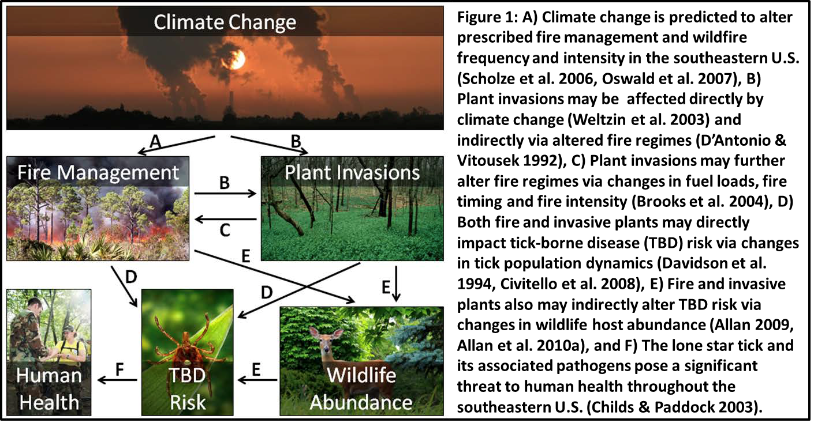
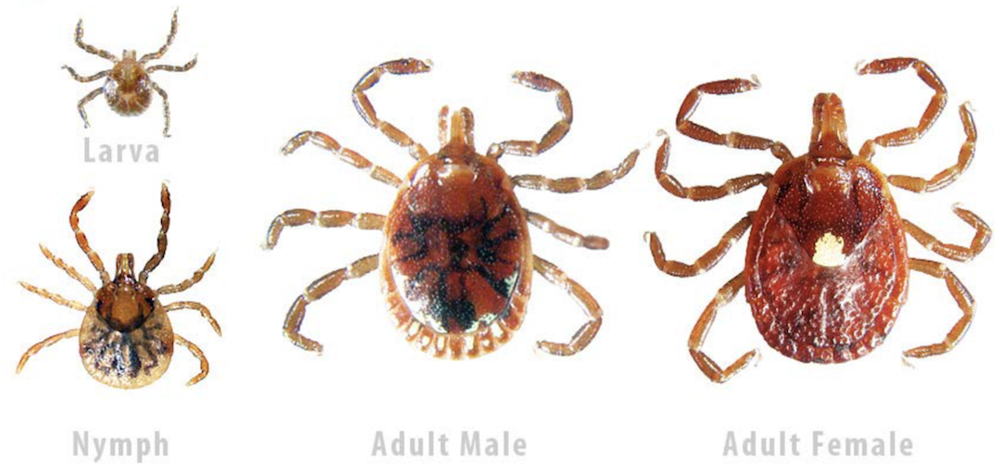
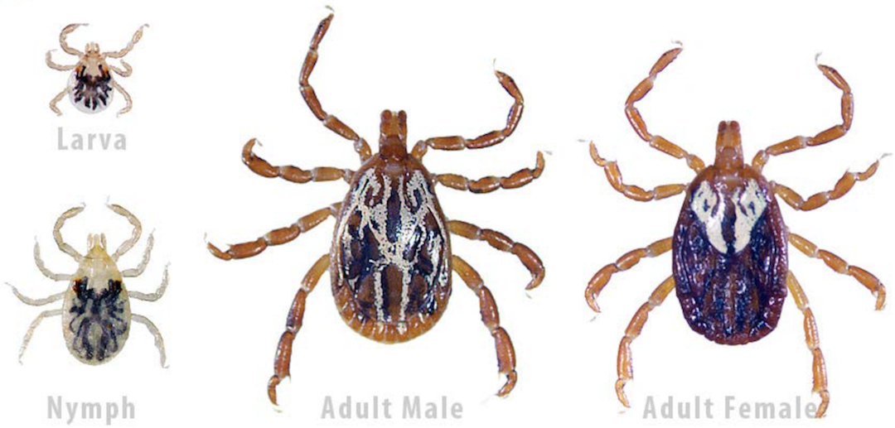
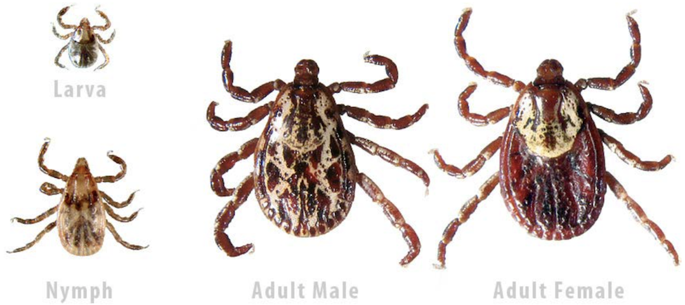
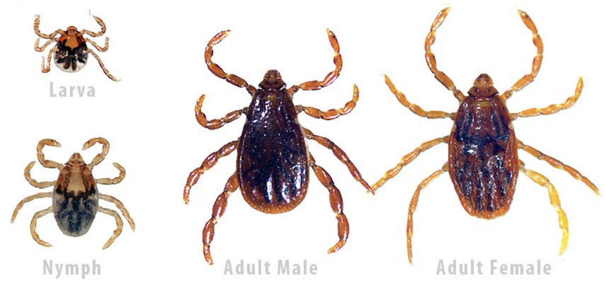
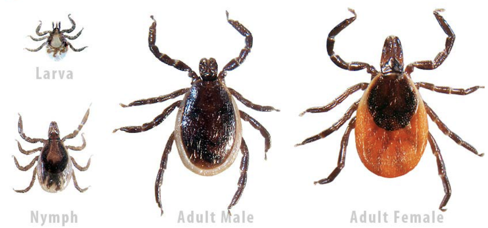

```{r set installation name options, echo=F}
# inst_name values to go in the params argument in the YAML header above
## provide name without quotation marks
# 1 Avon Park AFR
# 2 Camp Blanding
# 3 Camp Shelby
# 4 Eglin AFB
# 5 Fort Benning
# 6 Fort Gordon
# 7 Fort Jackson
# 8 Moody AFB
# 9 Tyndall AFB
```

```{r setup, include=FALSE}

knitr::opts_chunk$set(echo = F)
knitr::opts_chunk$set(warning = F)
knitr::opts_chunk$set(message = F)
knitr::opts_chunk$set(dpi = 150)

library(knitr)
library(kableExtra)
library(plyr); library(dplyr); library(ggplot2); library(readr)
library(stringi); library(stringr)
library(tidyr)
library(viridisLite); library(viridis)

def_theme <- theme(legend.title = element_blank(),
            legend.text = element_text(size = 12),
            legend.position = "top",
            axis.text = element_text(size = 12),
            axis.title = element_text(size = 16),
            plot.title = element_text(size = 28),
            strip.background = element_blank(),
            panel.grid = element_blank()
            )
invasion_color <- scale_color_manual(values = c("dodgerblue","red3"))
invasion_fill <- scale_fill_manual(values = c("dodgerblue","red3"))
installation_color <- "gold"

```

```{r knitcitations, cache = F}

library(knitcitations)
cleanbib()   
cite_options(citation_format = "pandoc")
library(bibtex)
library(RefManageR)

```

```{r set installation name, echo=F}

## set installation name from yaml header parameter
inst_name = params$inst_name

```

```{r load plot visit data processing ASK ABOUT WORDING OF PLOT VISIT VS TOTAL}

plot_visit_data <- read_csv("data/processed_data/plot_visit_data.csv")
plot_visit_data$imcy_inv <- factor(plot_visit_data$imcy_inv, levels=c("uninvaded","invaded"), labels = c("Uninvaded","Invaded"))

n_plots <- filter(plot_visit_data, installation_full_name==inst_name)
n_plots <- n_distinct(n_plots$plot_id)

n_fire_yrs <- 
      plot_visit_data %>% 
      filter(installation_full_name==paste(inst_name)) %>% 
      n_distinct(.$years_since_fire)

n_total_plots_all <- n_distinct(plot_visit_data$plot_id)
n_total_plots_all_invaded <- n_distinct(filter(plot_visit_data, imcy_inv=="Invaded"))

n_plots_invaded_inst <- n_distinct(filter(plot_visit_data, imcy_inv=="Invaded" &  installation_full_name==paste(inst_name)))
                              
```

```{r woody 100m subplot for processing for tick dependency, results='hide'}

subplot_data_import <- read_csv("data/processed_data/woodysubplot.csv")

subplot_data <- left_join(
      select(subplot_data_import, -notes),
      select(plot_visit_data, -notes)
)

subplot_plot_summary <- subplot_data %>% 
      group_by(plot_id, visit_year, imcy_inv, years_since_fire, installation_full_name) %>% 
      summarise(shrub_sap_rich = n_distinct(veg_id),
                total_stems_100m2 = sum(stems_100m2))
```

```{r load 25cm biomass data and processing, results='hide'}

biomass_data_import <- read_csv("data/processed_data/quadrat25cm.csv")

biomass_data <- biomass_data_import %>% 
      mutate(pct_litter_moisture = 100*(litter_mass_wet-litter_mass_dry)/litter_mass_wet)
summary(biomass_data)
biomass_data <- biomass_data %>% 
      mutate(pct_litter_moisture = ifelse(pct_litter_moisture<0,0,pct_litter_moisture))

biomass_data <- left_join(
      select(biomass_data, -Notes),
      select(plot_visit_data, -notes))
summary(biomass_data)

biomass_plot_summary <- biomass_data %>% 
      group_by(plot_id, visit_year, years_since_fire, imcy_inv, installation_full_name) %>% 
      mutate(standing_gm2 = standing_fuel_mass_wet*16,
             litter_gm2 = litter_mass_wet*16,
             dry_standing_gm2 = standing_fuel_mass_dry*16,
             dry_litter_gm2 = litter_mass_dry*16) %>% 
      summarise(avg_dry_standing_gm2 = mean(dry_standing_gm2),
                se_dry_standing_gm2 = sd(dry_standing_gm2)/sqrt(length(dry_standing_gm2)),
                avg_dry_litter_gm2 = mean(dry_litter_gm2),
                se_litter = sd(dry_litter_gm2)/sqrt(length(dry_litter_gm2)),
                avg_pct_litter_moisture = mean(pct_litter_moisture))
summary(biomass_plot_summary)

biomass_plot_summary <- filter(biomass_plot_summary, !is.na(years_since_fire))
```

```{r load canopy cover data, eval = T}

canopy_cover <- read_csv("data/processed_data/canopy-cover.csv")
  
canopy_cover_summary <- canopy_cover %>%
      filter(distance == 10) %>% 
      group_by(installation, plot_id, visit_year) %>%
      summarise(avg_canopy_cover = mean(pct_canopy_cover),
                sd_canopy_cover = sd(pct_canopy_cover),
                n_obs = length(pct_canopy_cover),
                se_canopy_cover = sd_canopy_cover/sqrt(n_obs))
# summary(canopy_cover_summary)

canopy_cover_summary <- left_join(canopy_cover_summary, plot_visit_data)

```

```{r load 1m quadrat data and summarise}

quadrat_data <- read_csv("data/processed_data/quadrat1m.csv")

quadrat_data <- left_join(
      select(quadrat_data, -notes),
      select(plot_visit_data, -notes))

quadrat10_data <- filter(
      quadrat_data, quadrat_id %in% c("e10","w10","n10","s10"
      ))                         

quadrat10_summaries <- quadrat10_data %>%
      group_by(plot_id, visit_year, installation) %>%
      summarise(
            avg_woody_ht1 = mean(woody_veg_ht1),
            avg_woody_ht_all = mean(
                  c(woody_veg_ht1,woody_veg_ht2,woody_veg_ht3), na.rm = T),
            avg_herb_ht1 = mean(herb_veg_ht1),
            avg_herb_ht_all = mean(c(herb_veg_ht1, herb_veg_ht2, herb_veg_ht3), na.rm = T),
            avg_litter_depth1 = mean(litter_ht1),
            avg_litter_depth_all =
                  mean(c(litter_ht1,litter_ht2,litter_ht3), na.rm = T),
            avg_pct_green = mean(pct_green),
            avg_pct_litter = mean(pct_litter),
            avg_pct_wood = mean(pct_wood_litter),
            avg_pct_bare = mean(pct_bare))

quadrat10_summaries <- left_join(
      quadrat10_summaries,
      plot_visit_data
)
```

```{r load species data}

species_data_import <- read_csv("data/processed_data/species1m.csv")

species_data <- left_join(
      select(species_data_import, installation:visit_year),
      select(plot_visit_data, -notes)
)
species_data$functional_group <- tolower(species_data$functional_group)

species10_data <- species_data %>% 
      filter(quadrat_id %in% c("e10","w10","n10","s10"))
veg_cover_data <- species10_data %>% arrange(date) %>% 
      group_by(installation, plot_id, visit_year, functional_group) %>% 
      summarise(
            total_pct_cover = sum(pct_cover),
            avg_pct_cover = mean(pct_cover)
      )
veg_cover_data <- left_join(
      veg_cover_data,
      plot_visit_data)

veg_cover_plot_data <- species10_data %>%
      group_by(installation_full_name, visit_year, plot_id, imcy_inv, years_since_fire, quadrat_id) %>%
      summarise(veg_cover = sum(pct_cover, na.rm = T)) %>% 
      ungroup(.) %>% 
      group_by(plot_id, visit_year, imcy_inv, years_since_fire, installation_full_name) %>% 
      summarise(
            plot_avg_veg_cover = mean(veg_cover, na.rm = T),
            n_obs = length(veg_cover),
            max_veg_cover = max(veg_cover, na.rm = T),
            sd_veg_cover = sd(veg_cover, na.rm = T),
            se_veg_cover = sd_veg_cover / sqrt(n_obs)) %>% 
      ungroup(.)
```

```{r species richness data processing}

species_richness <- species10_data %>%
      group_by(installation_full_name, years_since_fire, imcy_inv, plot_id) %>%
      summarise(richness = n_distinct(scientific_name)) %>% 
      mutate(ln_richness = log(richness),
             max_richness = max(richness))

invaded_quadrats <- species10_data %>% 
      filter(scientific_name=="Imperata cylindrica") %>% 
      mutate(quadrat_invaded = "yes") %>% 
      select(installation:quadrat_id, quadrat_invaded, years_since_fire, installation_full_name)

species10_data <- left_join(species10_data, invaded_quadrats)
species10_data$quadrat_invaded[is.na(species10_data$quadrat_invaded)] <- "no"

quadrat_species_richness <- species10_data %>%
      group_by(installation_full_name, years_since_fire, plot_id, quadrat_invaded, quadrat_id) %>%
      summarise(richness = n_distinct(scientific_name)) %>% 
      mutate(ln_richness = log(richness),
             max_richness = max(richness),
             invasion_status = factor(quadrat_invaded, levels = c("no","yes"), labels = c("Uninvaded","Invaded")))

```

```{r load tree data, results='hide'}

tree_data_import <- read_csv("data/processed_data/trees.csv")

tree_data <- tree_data_import %>% 
      select(installation:date, species:canopy, height, char)

tree_data <- left_join(
      tree_data,
      select(plot_visit_data, -notes)) %>% 
      rename(tree_id = species) %>% 
      mutate(labels = "")
tree_data$tree_id <- tolower(tree_data$tree_id)

tree_data$labels[agrep("qu", tree_data$tree_id, max.distance = 0)] <- "Quercus"
tree_data$labels[agrep("pi", tree_data$tree_id, max.distance = 0)] <- "Pinus"
tree_data$labels[!(tree_data$labels %in% c("Quercus","Pinus"))] <- "Other"

tree_grp_summary <- tree_data %>% 
      filter(health!=0) %>% 
      group_by(plot_id, labels, years_since_fire, imcy_inv, visit_year) %>% 
      summarise(
            total_dbh_cm = sum(dbh, na.rm = T),
            avg_dbh_cm = mean(dbh, na.rm = T),
            n_stems = length(tree_id))

dbh_by_tree_grp <- tree_grp_summary %>% 
      select(-avg_dbh_cm, -n_stems) %>% 
      spread(labels, total_dbh_cm) %>% 
      mutate(Quercus = if_else(is.na(Quercus)==TRUE,0,Quercus),
                   Pinus = if_else(is.na(Pinus)==TRUE,0,Pinus),
                   Other = if_else(is.na(Other)==TRUE,0,Other),
                   total_dbh = rowSums(cbind(Other,Pinus,Quercus), na.rm = T),
                   pct_pinus_dbh = 100*(Pinus/total_dbh))


tree_data_plot_summary <- tree_data %>% 
      filter(health!=0) %>% 
      group_by(plot_id, years_since_fire, imcy_inv, visit_year, installation_full_name) %>% 
      summarise(
            total_dbh = sum(dbh, na.rm = T),
            richness = n_distinct(tree_id),
            avg_tree_ht = mean(height, na.rm = T),
            avg_char_ht = mean(char, na.rm = T))

tree_data_plot_summary <- left_join(
      tree_data_plot_summary, 
      select(dbh_by_tree_grp, plot_id:visit_year, pct_pinus_dbh)
      )

```

```{r load dung data and process, results='hide'}

dung_data_import <- read_csv("data/processed_data/dung.csv")
dung_data_import$species[is.na(dung_data_import$species) & dung_data_import$dung1m>0] <- "other"
dung_data_import$species[is.na(dung_data_import$species) & dung_data_import$dung2m>0] <- "other"

dung_data <- dung_data_import 

dung_data <- left_join(
      dung_data,
      select(plot_visit_data, -notes))
summary(dung_data)
filter(dung_data, is.na(years_since_fire))$plot_id

dung_plot_data <- dung_data %>% 
      group_by(installation, plot_id, visit_year, years_since_fire, imcy_inv, species, installation_full_name) %>% 
      summarise(
            total_clusters1m = sum(dung1m, na.rm = T),
            avg_clusters1m = mean(dung1m, na.rm = T),
            total_clusters2m = sum(rowSums(cbind(dung1m,dung2m), na.rm=T)),
            avg_clusters2m = mean(rowSums(cbind(dung1m,dung2m), na.rm=T))
                )
summary(dung_plot_data)
```

```{r import tick data, results='hide'}

tick_data <- read_csv("data/processed_data/ticks.csv")

tick_data <- left_join(
      tick_data, plot_visit_data)

tick_data$life_stage <- factor(
      tick_data$life_stage, 
      levels = c("adult","nymph"),
      labels = c("Adult","Nymph"))

tick_data <- tick_data %>% 
      mutate(tick_count = ifelse(life_stage=="Larval",1,count),
             tick_count = ifelse(is.na(tick_count),0,tick_count))

total_ticks <- tick_data %>% 
      filter(installation_full_name==inst_name) %>%
      summarise(tick_count_sum = sum(tick_count, na.rm = T))

```

```{r summarize-tick-abundance-data, results='hide'}

tick_data_life_stage_summary <- tick_data %>% 
      group_by(plot_id, visit_year, life_stage, years_since_fire, imcy_inv, installation_full_name, date) %>% 
      summarise(total_ticks = sum(tick_count)) %>% 
      ungroup(.)

summary(tick_data)


tick_data_plot_summary <- tick_data %>% 
      group_by(installation, plot_id, visit_year, years_since_fire, imcy_inv, installation_full_name) %>% 
      summarise(total_ticks = sum(tick_count)) %>% 
      ungroup(.)

summary(tick_data_plot_summary)
filter(tick_data_plot_summary, is.na(years_since_fire))$plot_id
filter(tick_data_plot_summary, is.na(imcy_inv))$plot_id

tick_biomass_data <- left_join(
      tick_data_plot_summary, 
      ungroup(biomass_plot_summary))

tick_quad10_data <- left_join(
      tick_data_plot_summary,
      select(ungroup(quadrat10_summaries), -notes, -visit_date))

tick_vegcover_data <- left_join(
      tick_data_plot_summary,
      ungroup(veg_cover_plot_data)
)

tick_canopycover_data <- left_join(
      tick_data_plot_summary, 
      ungroup(canopy_cover_summary))

tick_host_data <- left_join(
      tick_data_plot_summary, 
      dung_plot_data %>% 
            ungroup(.) %>% 
            group_by(plot_id, visit_year, years_since_fire, imcy_inv) %>% 
            summarise(total_clusters1m = sum(total_clusters1m),
                      total_clusters2m = sum(total_clusters2m)))

tick_tree_data <- left_join(
      tick_data_plot_summary, 
      ungroup(tree_data_plot_summary))

tick_subplot_data <- left_join(
      tick_data_plot_summary,
      ungroup(subplot_plot_summary)
)

tick_data_sum <- join_all(list(tick_biomass_data, tick_canopycover_data, tick_quad10_data, tick_host_data, tick_host_data, tick_tree_data, tick_subplot_data, tick_vegcover_data))

summary(tick_data_sum)
```

##### Page Break

# Project Summary

Tick-borne diseases (TBDs) represent a major public health threat in North America, particularly for military personnel training on Department of Defense (DoD) installations. We received funding from the Strategic Environmental Research and Development Program to explore several of the predicted consequences of climate change on fire regimes and plant communities, and their interactions with wildlife, for human risk of exposure to TBDs in the southeastern U.S.



Our specific objectives are to:

1. Evaluate the interactions between fire and plant invasions spanning a gradient in fire management, invasive plant distribution and abundance, and climatic conditions across the southeastern U.S.

2. Quantify the effects of fire and plant invasions and their interactions on wildlife abundance, tick abundance, tick infection rates, and TBD risk to humans.

3. Calibrate a spatially explicit model of TBD risk in response to fire-invasion interactions   and examine the responses of fire, plant invasions, wildlife, TBD risk, using simulations of    climate change scenarios.

This progress report is intended to provide the managers at each installation that have granted access to collect data results from preliminary summaries and analyses of the data we collected. We emphasize that these are **preliminary results** summarizing the data and presenting general patterns of the relationships we are exploring with further statistical modeling. 

**In most figures, the data points for `r paste(inst_name)` are highlighted in  `r installation_color` in the context of the general pattern from plots sampled across all the installations. Note there may be fewer points plotted than the total number of sample plots visited due to overlap.**

##### Page Break

# Number of plots sampled 


A total of `r n_plots` plot(s) were established and sampled at `r paste(inst_name)`. Of the `r n_plots`, there were `r n_plots_invaded_inst` plot(s) with a cogongrass invasion. 

```{r installation plots visited figure, fig.width=7.5}

plot_nums <- plot_visit_data %>%
      group_by(installation_full_name, imcy_inv, years_since_fire) %>% 
      summarise(plot_ct = n_distinct(plot_id)) %>% 
      mutate(inst_flag = ifelse(installation_full_name==inst_name,T,F))
tot_plots <- plot_visit_data %>%
      group_by(installation_full_name, imcy_inv) %>% 
      summarise(plot_ct = n_distinct(plot_id)) %>% 
      mutate(inst_flag = ifelse(installation_full_name==inst_name,T,F))

tot_plots %>% 
      ungroup(.) %>% 
      mutate(installation_full_name = str_replace(installation_full_name, " ", "\n")
) %>% 
      ggplot(aes(installation_full_name, plot_ct, label=plot_ct)) +
      geom_col(aes(color = inst_flag), size = 4, show.legend = F) +
      geom_col(aes(fill = imcy_inv)) +
      scale_color_manual(values = c("TRUE" = "gold", "FALSE" = NA)) +
      invasion_fill +
      ylab("Number of sample plots") +
      xlab("") +
      scale_y_continuous(breaks = seq(0, 14, by = 7)) +
      theme_classic() +
      def_theme +
      theme(legend.direction = "vertical") +
      NULL

```

**Figure 1:** The total number of plots sampled at each installation visited in the 2017 and 2018 field seasons. The number of sites with cogongrass invasion are indicated in red.

##### Page Break

## Range of fire history at all installations

Across all installations, we established `r n_total_plots_all` plot(s) in areas ranging in time since last fire from `r min(plot_visit_data$years_since_fire, na.rm = T)` to `r max(plot_visit_data$years_since_fire, na.rm = T)` years. Of the `r n_total_plots_all`, there were `r n_total_plots_all_invaded` plot(s) with a cogongrass invasion.

``` {r fire invasion by installation figure}

plot_visit_data %>% 
      filter(!is.na(years_since_fire)) %>%
      ggplot(aes(as.factor(years_since_fire))) +
      geom_bar(aes(fill = imcy_inv), position = "dodge") +
      invasion_fill +
      ylab("Number of plots") +
      xlab("Years since fire") +
      theme_classic() +
      def_theme +
      theme(legend.position = c(.8,.9)) +
      NULL

```

**Figure 2:** Cumulative number of plots sampled in a range of fire history in terms of years since fire across all installations. Plots with one year since fire were most common (n = 20), and 10 years since fire least common (n = 1).

##### Page Break

## Range of fire history sampled `r paste("at ", inst_name)`

We established plots in areas at `r paste(inst_name)` ranging in time since last fire from `r min(filter(plot_visit_data, installation_full_name==inst_name)$years_since_fire, na.rm = T)` to `r max(filter(plot_visit_data, installation_full_name==inst_name)$years_since_fire, na.rm = T)` years.

```{r sampling fire history at specific installation figure}

plot_nums %>% 
      filter(!is.na(years_since_fire), installation_full_name==inst_name) %>%
      ggplot(aes(as.factor(years_since_fire), as.factor(plot_ct))) +
      geom_col(aes(fill = imcy_inv), position = "dodge") +
      invasion_fill +
      ylab("Number of plots") +
      xlab("Years since fire") +
      theme_classic() +
      def_theme +
      theme(legend.position = "none") +
      NULL

```

**Figure 3:** Specific fire history of plots sampled at `r inst_name`.

##### Page Break

# Tick Abundance Relationships

## Raw tick abundance at each installation

```{r raw tick numbers figure caption processing}

n_total_raw_ticks_all <- sum(tick_data$tick_count)

n_raw_ticks_inst_2017 <- tick_data %>% 
      filter(installation_full_name==inst_name & visit_year==2017) %>% 
      # group_by(visit_year) %>%
      summarise(raw_ticks_sum = sum(.$tick_count))
      

n_raw_ticks_inst_2018 <- filter(tick_data, installation_full_name==inst_name & visit_year==2018)%>% 
  # group_by(visit_year) %>% 
  summarise(raw_ticks_sum = sum(.$tick_count))

#unique(tick_data$life_stage)
#filter(tick_data, life_stage=="Adult" & installation=="tyndall") %>% 
#  select(count, tick_count, life_stage) %>% 
#  summary(.)

#`r n_raw_ticks_inst_2017` ### for below  next to 2018

```

A total of `r n_total_raw_ticks_all` ticks were collected across all installations. At `r paste(inst_name)`, `r n_raw_ticks_inst_2017` ticks were collected in 2017, and `r n_raw_ticks_inst_2018` ticks were collected in 2018. Note the different scales of the y-axis on each panel.

```{r raw tick numbers by installation figure}

inst_data <- tick_data %>% 
  filter(installation_full_name==inst_name)
  
tick_data %>% 
             filter(!is.na(years_since_fire)) %>% 
             group_by(installation_full_name, years_since_fire, visit_year) %>%
             summarise(tick_count = sum(tick_count)) %>% 
      ggplot(aes(installation_full_name, tick_count, fill = installation_full_name)) +
      geom_col() +
      scale_fill_brewer(palette = "Set1") +
      facet_grid(visit_year~., scales = "free_y") +
      xlab("") +
      ylab("Tick abundance") +
      scale_y_continuous(breaks = seq(0, 250, by = 50)) +
      theme_bw() +
      theme(legend.position = "none",
            axis.text.x = element_text(angle = 290),
            panel.grid = element_blank(),
            strip.background = element_blank()) +
      NULL

```

**Figure 4:** The raw number of ticks collected at each installation is recorded for each visit year. The zero values occurring for installations in 2017 and 2018 are because those installations were not visited in those years.

##### Page Break

## Tick abundance and fire history

The figure below shows the general relationship between the abundance of adult and nymph life-stage ticks (observations of larvae were counted as "1") across all the installations. The points contributed by `r paste(inst_name)` are highlighted in `r installation_color`. The y-axis (tick abundance) is natural-log transformed, i.e., a value of 2 corresponds to about `r round(exp(2))` ticks. We collected a total of `r total_ticks` ticks at `r paste(inst_name)`. 

```{r tick abundance fire all, eval = F}

inst_data <- tick_data %>% 
      filter(installation_full_name==inst_name) %>% 
      group_by(plot_id, years_since_fire, imcy_inv) %>%
      summarise(tick_count_sum = sum(tick_count, na.rm = T))

tick_data %>% 
      group_by(installation, plot_id, years_since_fire, imcy_inv) %>%
      summarise(tick_count_sum = sum(tick_count, na.rm = T)) %>%
      ungroup(.) %>% 
      filter(!is.na(imcy_inv)) %>% 

      ggplot(aes(years_since_fire, log1p(tick_count_sum))) +
      geom_point(aes(color = imcy_inv), position = "jitter", size = 1) +
      geom_smooth(aes(fill = imcy_inv, color = imcy_inv), method = "lm", alpha = .3, se=F) +
      geom_point(
            data = inst_data,
            aes(years_since_fire, log1p(tick_count_sum)), 
            color = "blue", size = 2
            ) +
      invasion_color +
      invasion_fill +
      scale_x_continuous(breaks = c(seq(0,11,1))) +
      xlab("Years since fire") +
      ylab("log(Tick abundance)") +
      theme_classic() +
      def_theme +
      theme(legend.direction = "vertical",
            legend.position = c(.15,.95)) +
      NULL

```

```{r tick abundance-fire log-linear relationship figure}

inst_data <- tick_data_plot_summary %>% 
  filter(installation_full_name==inst_name)

(tick_fire_fig <- ggplot(filter(tick_data_plot_summary, !is.na(imcy_inv)), 
       aes(years_since_fire, log1p(total_ticks))) +
      geom_smooth(aes(fill = imcy_inv, color = imcy_inv), se = T, method = "lm", alpha = .2) +
      geom_point(aes(color = imcy_inv)) +
      invasion_color +
      invasion_fill +
      geom_point(data = inst_data, aes(years_since_fire, log1p(total_ticks)), color = installation_color, size = 2)  +
      theme_classic() +
      xlab("Years since fire") +
      ylab("log(tick abundance + 1)") +
      def_theme +
      NULL)

```

**Figure 5:** Across all installations, we see a general trend that more time since fire has a positive relationship with tick abundance in both native and invaded plots. 

##### Page Break

## Tick abundance and percent litter cover

```{r tick abundance vs litter cover figure}

inst_data <- tick_data_sum %>% 
  filter(installation_full_name==inst_name)

(tick_pctlitter_fig <- ggplot(filter(tick_data_sum, !is.na(imcy_inv)), 
       aes(avg_pct_litter, log1p(total_ticks), color = imcy_inv)) +
      geom_point() +
      invasion_color +
      invasion_fill +
      geom_point(data = inst_data, aes(avg_pct_litter, log1p(total_ticks)), color = installation_color, size = 2)  +
      geom_smooth(aes(fill = imcy_inv), se = T, alpha = .2, method = "lm", show.legend = T) +
      theme_classic() +
      xlab(expression(paste("Litter cover (%)"))) +
      ylab("log(tick abundance + 1)") +
      def_theme +
      NULL
)
```

**Figure 6:** A positive relationship is seen with percent litter cover and tick abundance across all installations. Litter cover is estimated by averaging the litter cover in four 1m x 1m quadrats in each sampled plot. It is hypothesized that more litter cover creates a more suitable environment for tick survival (see Appendix 2 - Tick survival in cogongrass invasions). 

##### Page Break

## Tick abundance and average dry litter biomass

```{r tick-litter-biomass figure}

inst_data <- tick_data_sum %>% 
  filter(installation_full_name==inst_name)

(tick_litter_mass_fig <- ggplot(
      filter(tick_data_sum, !is.na(imcy_inv)), 
       aes(avg_dry_litter_gm2, log1p(total_ticks), color = imcy_inv)) +
      geom_point() +
      invasion_color +
      invasion_fill +
      geom_point(data = inst_data, aes(avg_dry_litter_gm2, log1p(total_ticks)), color = installation_color, size = 2)  +
      geom_smooth(aes(fill = imcy_inv), se = T, alpha = .2, method = "lm", show.legend = F) +
      theme_classic() +
      xlab(expression(paste("Litter biomass (g ", m^{-2}, ")"))) +
      ylab("log(tick abundance + 1)") +
      def_theme
)
```

**Figure 7:** A positive relationship is seen between litter biomass and tick abundance across all installations. Litter biomass estimates are from oven dried biomass collected at four 25cm x 25cm quadrats in each plot. 

##### Page Break

## Tick abundance and litter moisture

```{r tick litter moisture figure}

inst_data <- tick_data_sum %>% 
  filter(installation_full_name==inst_name)

(tick_litter_mass_fig <- ggplot(
      filter(tick_data_sum, !is.na(imcy_inv)), 
       aes(avg_pct_litter_moisture, log1p(total_ticks), color = imcy_inv)) +
      geom_point(aes()) +
      invasion_color +
      invasion_fill +
      geom_point(data = inst_data, aes(avg_pct_litter_moisture, log1p(total_ticks)), color = installation_color, size = 2)  +
      geom_smooth(aes(fill = imcy_inv), se = T, alpha = .2, method = "lm", show.legend = F) +
      theme_classic() +
      xlab(expression(paste("Litter moisture (%)"))) +
      ylab("log(tick abundance + 1)") +
      def_theme +
      NULL
)
```

**Figure 8:** Tick abundance tended to be higher with greater litter moisture in uninvaded plots across all installations. We did not detect any relationship in cogongrass-invaded plots. Litter moisture was calculated as the difference between fresh and dried weight from biomass collected at four 25cm x 25cm quadrats in each plot. 

Places that maintain higher humidity at ground-level are likely to be more favorable for tick survival, and therefore may be positively associated with tick abundance. Our measurement of litter moisture is very coarse because it is from a single point in time and so highly dependent on weather conditions leading up to sampling. We can't say whether a particular location generally has greater litter moisture from these data alone.

##### Page Break

## Tick abundance and canopy cover

```{r tick-canopy-cover figure}

inst_data <- tick_data_sum %>% 
  filter(installation_full_name==inst_name)

(tick_canopy_cover_fig <- ggplot(
      filter(tick_data_sum, !is.na(imcy_inv)), 
      aes(avg_canopy_cover, log1p(total_ticks), color = imcy_inv)) +
      geom_point() +
      invasion_color +
      invasion_fill +
      geom_point(data = inst_data, aes(avg_canopy_cover, log1p(total_ticks)), color = installation_color, size = 2)  +
      geom_smooth(aes(fill = imcy_inv), se = T, alpha = .2, method = "lm") +
      theme_classic() +
      xlab(expression(paste("Canopy cover (%)"))) +
      ylab("log(tick abundance + 1)") +
      def_theme +
      NULL
)
```

**Figure 9:** There was a positive relationship between tick abundance and overstory canopy cover in uninvaded plots. It is hypothesized denser canopy cover creates a more suitable microclimate at ground level for tick survival (see Appendix 2 - Tick survival in cogongrass invasions). 

##### Page Break

## Tick abundance and host density 

```{r tick-hosts relationship figure}

inst_data <- tick_data_sum %>% 
  filter(installation_full_name==inst_name)

(tick_host_fig1 <- ggplot(
      filter(tick_data_sum, !is.na(imcy_inv)), 
       aes(log1p(total_clusters1m), log1p(total_ticks), color = imcy_inv)) +
      geom_point() +
      invasion_color +
      invasion_fill +
      geom_point(data = inst_data, aes(log1p(total_clusters1m), log1p(total_ticks)), color = installation_color, size = 2)  +
      geom_smooth(aes(fill = imcy_inv), se = T, alpha = .2, method = "lm") +
      theme_classic() +
      xlab(expression(paste("log(dung clusters + 1)"))) +
      ylab("log(tick abundance + 1)") +
      def_theme +
      NULL
)
```

**Figure 10:** We did not detect a relationship between density of host dung clusters in terms of log and tick abundance. The most common host species dung encountered at all installations was deer, with some rabbit and wild turkey. Dung clusters were counted if seen within one meter to either side of four 50-meter line transects surveyed at each plot. 

##### Page Break

# Fire history relationships

## Canopy cover and years since fire

```{r create canopy cover years since fire figure}

inst_data <- canopy_cover_summary %>% 
  filter(installation_full_name==inst_name)

ggplot(canopy_cover_summary, aes(years_since_fire, avg_canopy_cover)) +
      geom_point(aes(color = imcy_inv)) +
      geom_smooth(aes(fill = imcy_inv, color = imcy_inv), method = "lm", alpha = .2) +
      invasion_color +
      invasion_fill +
      geom_point(data = inst_data, aes(years_since_fire, avg_canopy_cover), color = installation_color, size = 2)  +
      ylab("Overstory canopy cover (%)") +
      xlab("Years since last fire") +
      theme_classic() +
      def_theme +
      theme(legend.title = element_blank())
```

**Figure 11:** Overstory tree canopy cover tended to be greatest with increasing time since fire. 

##### Page Break

## Host density and years since fire

```{r dung-host-fire history relationship figure}

inst_data <- tick_data_sum %>% 
  filter(installation_full_name==inst_name)

ggplot(filter(tick_data_sum, !is.na(imcy_inv)), 
        aes(years_since_fire, log1p(total_clusters1m))) +
      geom_point(aes(color = imcy_inv), alpha = .5) +
      invasion_color +
      invasion_fill +
      geom_point(data = inst_data, aes(years_since_fire, log1p(total_clusters1m)), color = installation_color, size = 2)  +
      geom_smooth(aes(color = imcy_inv, fill = imcy_inv), method = "lm", se = T, alpha = .2) +
      theme_classic() +
      xlab(expression(paste("Years since fire"))) +
      ylab("log(dung clusters + 1)") +
      def_theme
```

**Figure 12:** There is a slight negative relationship between the number of host dung clusters and time since last fire in the plots with no cogongrass invasion; in invaded plots there is no trend. 

##### Page Break

## Host density and canopy cover

```{r dung-hosts-canopy-cover relationship figure}

inst_data <- tick_data_sum %>% 
  filter(installation_full_name==inst_name)

 ggplot(filter(tick_data_sum, !is.na(imcy_inv)), 
        aes(avg_canopy_cover, log1p(total_clusters1m))) +
      geom_point(aes(color = imcy_inv)) +
      invasion_color +
      invasion_fill +
   geom_point(data = inst_data, aes(avg_canopy_cover, log1p(total_clusters1m)), color = installation_color, size = 2)  +
      geom_smooth(aes(color = imcy_inv, fill = imcy_inv), method = "lm", se = T, alpha = .2) +
      theme_classic() +
      xlab(expression(paste("Canopy cover (%)"))) +
      ylab("log(dung clusters + 1)") +
      def_theme
```

**Figure 13:** There is a slight negative relationship between observed host dung clusters and overstory tree canopy cover across all plots. 

##### Page Break

## Deer specific dung clusters and years since fire

```{r specific deer dung clusters figure}

inst_data <- dung_plot_data %>% 
  filter(installation_full_name==inst_name)

(deer_dung_fig <- dung_plot_data %>% filter(species=="deer") %>% 
      ggplot(
      aes(years_since_fire, log1p(total_clusters1m), color = imcy_inv)) +
      geom_point(size = 2) +
      invasion_fill +
      invasion_color +
      geom_point(data = inst_data, aes(years_since_fire, log1p(total_clusters1m)), 
            color = installation_color, size = 2)  +      
      geom_smooth(aes(fill = imcy_inv), se = T, method = "lm", alpha = .2) +
      theme_classic() +
      ylab("log(dung clusters + 1)") +
      xlab("Years since fire") +
      def_theme +
      NULL)
```

**Figure 14:** We did not detect a relationship between time since fire and host abundance when looking at deer dung clusters only. 

We examined the relationship between tick abundance and evidence of deer host abundance specifically because deer are particularly mobile and therefore may reintroduce ticks into recently burned areas.

##### Page Break

## Percent litter and years since fire

```{r pct-litter-fire figure, eval = T}

inst_data <- quadrat10_summaries %>% 
        filter(installation_full_name==inst_name)
               
(pct_litter_fig <- ggplot(quadrat10_summaries, aes(years_since_fire, avg_pct_litter)) +
      geom_point(aes(color = imcy_inv), size = 2) +
      # stat_summary(aes(color = imcy_inv), fun.data = "mean_se", geom = "pointrange") +
      geom_smooth(aes(color = imcy_inv, fill = imcy_inv), method = "lm", alpha = .2) +
      invasion_color +
      invasion_fill +
      geom_point(data = inst_data, aes(years_since_fire, avg_pct_litter), color = installation_color, size = 2)  +
      theme_classic() +
      def_theme +
      xlab("Years since fire") +
      ylab("Litter cover (%)") +
      # theme(legend.position = c(.85,.1)) +
      NULL
)
```

**Figure 15:** We observed a positive relationship between litter cover and time since fire in both uninvaded and invaded plots and cogongrass-invaded plots. Uninvaded plots generally had greater litter cover. 

##### Page Break

## Litter biomass and years since fire

```{r litter biomass figure}

inst_data <- biomass_plot_summary %>% 
  filter(installation_full_name==inst_name)

(litter_mass_fig <- ggplot(biomass_plot_summary,
        aes(years_since_fire, avg_dry_litter_gm2, color = imcy_inv)) +
      geom_point() +
      geom_smooth(aes(fill = imcy_inv), alpha = .2, method = "lm") +
      invasion_color +
      invasion_fill +
      geom_point(data = inst_data, aes(years_since_fire, avg_dry_litter_gm2), color = installation_color, size = 2) +
      theme_classic() +
      ylab(expression(paste("Litter biomass (g ", m^{-2}, ")"))) +
      xlab("Years since last fire") +
      def_theme
)

```

**Figure 16:**  There is a positive relationship between litter biomass and time since fire in both uninvaded and cogongrass-invaded plots. 

Increasing time since last fire generally trends towards a higher accumulation of litter biomass and cover. The higher quantity of litter in these less frequently burned areas could be a potential driver of tick abundance or survival. 

##### Page Break

## Percent vegetation cover and years since fire

```{r veg cover plot level figure}

inst_data <- veg_cover_plot_data %>% 
        filter(installation_full_name==inst_name)

(veg_cover_fig <- ggplot(veg_cover_plot_data,
      aes(years_since_fire, plot_avg_veg_cover)) +
      geom_point(aes(color = imcy_inv)) +
      geom_smooth(aes(color = imcy_inv, fill = imcy_inv), method = "lm", alpha = .2) +
      invasion_fill +
      invasion_color +
      geom_point(data = inst_data, aes(years_since_fire, plot_avg_veg_cover), color = installation_color, size = 2) +
      theme_classic() +
      ylab("Vegetation cover (%)") +
      xlab("Years since fire") +
   #  ggtitle("Plot averages for herbaceous vegetation cover") +
      def_theme +
      theme(legend.position = c(.8,.9)) +
      NULL
)

```

**Figure 17:**  In uninvaded sites, there was a negative relationship between herbaceous cover and time since fire. Increasing density of cogongrass invasions drastically increases vegetation cover as time since fire increases in cogongrass-invaded plots. Note that the sample size of invaded plots is very small. 

##### Page Break

## Understory species richness and years since fire

```{r plot richness fig}

inst_data <- species_richness %>% 
  filter(installation_full_name==inst_name)

(plot_richness_fig <- ggplot(species_richness, aes(years_since_fire, richness, color = imcy_inv)) +
      geom_smooth(show.legend = F, alpha = .2, aes(fill = imcy_inv), method = "lm") +
      geom_point(aes(color = imcy_inv), size = 1) +
      invasion_color +
      invasion_fill +
      geom_point(data = inst_data, aes(years_since_fire, richness), color = installation_color, size = 2) +
      theme_classic() +
      def_theme +
      ylab("Richness") +
      xlab("Years since fire") +
      #ggtitle("Plot understory species diversity") +
      theme(legend.position = c(.8,.8))
)
```

**Figure 18:** Across all plots there was a slight negative relationship between herbaceous species richness and time since fire. Species richness has large variability that is influenced by management and natural disturbances other than prescribed fire. 

##### Page Break

## Overstory species richness and years since fire

```{r tree richness figure}

inst_data <- tree_data_plot_summary %>% 
  filter(installation_full_name==inst_name)

(tree_richness_fig <- ggplot(tree_data_plot_summary, 
       aes(years_since_fire, richness, color = imcy_inv)) +
      geom_point(position = position_jitter(height = .05), alpha = .8) +
      geom_smooth(aes(fill = imcy_inv), method = "lm", alpha = .2) +
      invasion_color +
      invasion_fill +
      geom_point(data = inst_data, aes(years_since_fire, richness), color = installation_color, size = 2) +
      theme_classic() +
      def_theme +
      ylab("Richness") +
      xlab("Years since fire") +
      #ggtitle("Tree diversity vs. time since fire") +
      NULL
)

```

**Figure 19:** There was a positive relationship between overstory species richness and time since fire. Only tree species with a DBH ≥ 3 cm and height ≥ 1m were recorded. 

##### Page Break

## Total tree DBH and years since fire

```{r tree total dbh figure}

inst_data <- tree_data_plot_summary %>% 
  filter(installation_full_name==inst_name)

(tree_dbh_fig <- ggplot(tree_data_plot_summary, 
       aes(years_since_fire, total_dbh, color = imcy_inv)
       ) +
      geom_point() +
      geom_smooth(aes(fill = imcy_inv), method = "lm", se = T, alpha = .2) +
      invasion_color +
      invasion_fill +
      geom_point(data = inst_data, aes(years_since_fire, total_dbh), color = installation_color, size = 2) +
      theme_classic() +
      theme_classic() +
      xlab("Years since fire") +
      ylab("DBH (cm)") +
      #ggtitle("Total tree DBH across plots") +
      def_theme +
      NULL
)

```

**Figure 20:** There was no relationship in native sites with total tree DBH and time since fire, and a slight negative trend in invaded plots though sample size is small. Total DBH is the cumulative value of all tree diameters recorded within the plot. 

```{r proportion pine dbh figure, eval=F}
## Proportion pine DBH and years since fire

# This figure represents the percentage of total DBH in a plot that is pine. The solid line is the overall mean regression fit, showing percent pine DBH decreasing with years since fire.


inst_data <- tree_data_plot_summary %>% 
  filter(installation_full_name==inst_name)

(pct_pine_fig <- ggplot(filter(tree_data_plot_summary, pct_pinus_dbh>=0), 
       aes(years_since_fire, pct_pinus_dbh)
       ) +
      geom_smooth(method = "lm", se = F, alpha = .2) +
      geom_point(aes(color = imcy_inv)) +
      #geom_smooth(data=filter(tree_data_plot_summary, pct_pinus_dbh<60),
                  #aes(years_since_fire, pct_pinus_dbh),
                  #method = "lm", se = F, linetype="dashed", alpha = .2) +
       #geom_smooth(data=filter(tree_data_plot_summary, pct_pinus_dbh>60),
                  #aes(years_since_fire, pct_pinus_dbh),
                  #method = "lm", se = F, linetype="dotted", alpha = .2) +
      invasion_color +
      invasion_fill +
      geom_point(data = inst_data, aes(years_since_fire, pct_pinus_dbh), color = installation_color, size = 2) +
      theme_classic() +
      xlab("Years since fire") +
      ylab("Percent pine DBH ") +
      def_theme +
      NULL
)

```

##### Page Break

# Appendix 1 - Commonly encountered tick species

## Lone star tick, *Amblyomma americanum*
**abbreviation: Am. am**



##### Page Break

## Gulf coast tick, *Amblyomma maculatum* 
**abbreviation: Am. mac**



##### Page Break

## American dog tick, *Dermecentor variablis* 
**abbreviation: De. var**



##### Page Break

## Brown dog tick, *Rhipicephalus sanguineus* 
**abbreviation: Rh. san**



##### Page Break

## Black-legged or deer tick, *Ixodes scapularis* 
**abbreviation: Ix. sc**



##### Page Break

# Appendix 2 - Tick survival in cogongrass invasions

## Project Background

Recent studies demonstrate that invasive plants can alter TBD risk via both direct effects on tick survival and indirect effects mediated by tick hosts. For example, *Microstegium vimineum* has been shown experimentally to reduce survival of *A. americanum* (lone star tick) and *Dermacentor variabilis* (American dog tick) relative to native vegetation `r citep("Civitello 2008 Journal of Medical Entomology")`; conversely the removal of invasive *Berberis thunbergii* (Japanese barberry) significantly reduces the survival of *I. scapularis* `r citep("10.1603/EN10131")`. Thus, both positive and negative direct effects of invasive plants on tick survival have the potential to influence tick population dynamics. There is also growing evidence of indirect effects mediated by host responses to plant invasions, including increased infestation of *Peromyscus leucopus* (white-footed mice) by *I. scapularis* in mixed stands of invasive shrubs `r citep(list("10.1603/0022-2585(2006)43[1142:DBREUA]2.0.CO;2", "10.1603/022.038.0404"))` and increased abundance of *A. americanum* due to attraction of white-tailed deer to dense thickets of *Lonicera maackii* (Amur honeysuckle) `r citep("10.1073/pnas.1008362107")`.

**No ecological studies have addressed the effects of plant invasions and potential interactions with climate change or fire regimes for TBD risk.**

This project conducts a survival assay of *A. americanum* to assess tick mortality and plant invasion interactions, as well as microclimate suitability for tick survival. For this assay we will deploy **1** mesh bag containing **10 nymph** and **10 adult** (5 male and 5 female) life stage *A. americanum* ticks in **12** *I. cylindrica* invaded and **12** native plots (1 m x 1 m) in a pine dominated forest habitat. Each mesh bag will be stood up vertically at the litter layer (to mimic natural questing habitat) inside of a constructed metal wire cage to deter scavengers. Microclimate data is taken by temperature and relative humidity loggers that are attached in a PVC housing next to the cage that record measurements every 5 minutes. Ticks were checked regularly approximately every **10-14** days to monitor their survival. Below are the figures for tick survival since launch on June 21, 2018. Ticks will be monitored continuously until all tick life stage mortality has reached 100%.

##### Page Break

## Comparing Tick Survival

Comparison of adult and nymph life stages of the lone star tick in native and cogongrass-invaded areas plots. All life stages experience greater mortality in native plots, with nymphs dying sooner than adults.


**Figure 21:** Average tick survival (+ SE) over time at 12 locations in a cogongrass-invasion (red) and 12 locations in a nearby native understory (blue).

```{r tick survival figure, eval=F}
tick_survival <- read_csv("data/raw_data/tick_survival_assay/TickSurvival_actual.csv")

# summary(tick_survival)
# 
# unique(tick_survival$Date)
# 
# names(tick_survival)
# 
# unique(tick_survival$Invaded)

tick_survival$Date <- as.Date.character(as.integer(tick_survival$Date), format = "%Y%m%d")

tick_survival <- tick_survival %>%
  mutate(days = julian(Date, origin = as.Date("2018-06-21")))

# range(tick_survival$days)

#### Merging all adults to one ####

tick_survival <- tick_survival %>%
  mutate(total_adults_alive = adult_F_alive + adult_M_alive,
         total_adults_dead = adult_F_dead + adult_M_dead,
         total_adult_survival = total_adults_alive/(total_adults_alive + total_adults_dead))

tick_survival <- tick_survival %>%
  mutate(Invaded = ifelse(Invaded == "Yes", "invaded", "native")) 

#View(tick_survival)

tick_survival_grouped <- tick_survival %>%
  group_by(visit_number, Invaded, days) %>%
  summarise(avg_nymph_survival = mean(nymph_survival),
            sd_nymph_survival = sd(nymph_survival),
            avg_adult_survival = mean(total_adult_survival),
            sd_adult_survival = sd(total_adult_survival))

#View(tick_survival_grouped)


#+ set theme ####

# def_theme <- theme(legend.title = element_blank(),
#                    legend.text = element_text(size = 12),
#                    legend.position = "top",
#                    axis.text = element_text(size = 12),
#                    axis.title = element_text(size = 16),
#                    plot.title = element_text(size = 28),
#                    strip.background = element_blank(),
#                    panel.grid = element_blank())
# invasion_color <- scale_color_manual(values = c("red","blue"))
# invasion_fill <- scale_color_manual(values = c("red","blue"))

# ggplot(tick_survival_grouped, aes(days, avg_nymph_survival, color = Invaded)) +
#   geom_smooth(aes(fill = Invaded), show.legend = F, alpha = .2) +
#   geom_point() +
#   geom_errorbar(aes(ymin = avg_nymph_survival - sd_nymph_survival, ymax = avg_nymph_survival + sd_nymph_survival, color = Invaded), width = .1) +
#   invasion_color +
#   invasion_fill +
#   theme_bw() +
#   def_theme +
#   NULL

# ggplot(tick_survival_grouped, aes(days, avg_adult_survival, color = Invaded)) +
#   geom_smooth(aes(fill = Invaded, color = Invaded), se = T, alpha = .2) +
#   geom_point() +
#   invasion_color +
#   invasion_fill +
#   def_theme +
#   NULL

# unique(tick_survival$days)

#### Drews graphs ####

nymph_survival_all_time <- ggplot(data = tick_survival) +
  stat_summary(aes(days, nymph_survival, fill = Invaded, color = Invaded),
               fun.data = mean_se, geom = "pointrange") +
  stat_smooth(aes(days, nymph_survival, color = Invaded, fill = Invaded),
              se = T, alpha = .2, geom = "path") +
  #stat_smooth
  invasion_color +
  invasion_fill +
  theme_bw() +
  def_theme +
  #theme_classic() +
  ggtitle(label = "Nymphs") +
  theme(plot.title = element_text(hjust = 0.5)) +
  xlab(" ") +
  ylab("Survival") +
  guides(fill=FALSE, color=FALSE) +
  scale_y_continuous(limits = c(0, 1 )) +
  scale_x_continuous(limits = c(0, 159 )) +
  geom_vline(xintercept = (11), linetype = "dashed") +
  geom_vline(xintercept = (15), linetype = "dashed") +
  geom_vline(xintercept = (25), linetype = "dashed") +
  geom_vline(xintercept = (32), linetype = "dashed") +
  geom_vline(xintercept = (39), linetype = "dashed") +
  geom_vline(xintercept = (55), linetype = "dashed") +
  geom_vline(xintercept = (67), linetype = "dashed") +
  geom_vline(xintercept = (77), linetype = "dashed") +
  geom_vline(xintercept = (89), linetype = "dashed") +
  geom_vline(xintercept = (98), linetype = "dashed") +
  geom_vline(xintercept = (110), linetype = "dashed") +
  geom_vline(xintercept = (126), linetype = "dashed") +
  geom_vline(xintercept = (146), linetype = "dashed") +
  geom_vline(xintercept = (159), linetype = "dashed") +
  #theme(axis.title.x = element_blank()) +
  NULL

f_adult_survival_all_time <- ggplot(data = tick_survival) +
  stat_summary(aes(days, adult_F_survival, fill = Invaded, color = Invaded),
               fun.data = mean_se, geom = "pointrange") +
  stat_smooth(aes(days, adult_F_survival, color = Invaded, fill = Invaded),
              se = T, alpha = .2) +  invasion_color +
  invasion_fill +
  theme_bw() +
  def_theme +
  ggtitle(label = "Female Adults") +
  theme(plot.title = element_text(hjust = 0.5)) +
  guides(fill=FALSE, color=FALSE) +
  #theme(legend.position = c(0, 0), legend.justification = c(0, 0)) +
  #theme(axis.title.y = element_blank()) +
  scale_y_continuous(limits = c(0, 1 )) +
  scale_x_continuous(limits = c(0, 159 )) +
  ylab("Survival") +
  xlab(" ") +
  geom_vline(xintercept = (11), linetype = "dashed") +
  geom_vline(xintercept = (15), linetype = "dashed") +
  geom_vline(xintercept = (25), linetype = "dashed") +
  geom_vline(xintercept = (32), linetype = "dashed") +
  geom_vline(xintercept = (39), linetype = "dashed") +
  geom_vline(xintercept = (55), linetype = "dashed") +
  geom_vline(xintercept = (67), linetype = "dashed") +
  geom_vline(xintercept = (77), linetype = "dashed") +
  geom_vline(xintercept = (89), linetype = "dashed") +
  geom_vline(xintercept = (98), linetype = "dashed") +
  geom_vline(xintercept = (110), linetype = "dashed") +
  geom_vline(xintercept = (126), linetype = "dashed") +
  geom_vline(xintercept = (146), linetype = "dashed") +
  geom_vline(xintercept = (159), linetype = "dashed") +
  NULL

m_adult_survival_all_time <-ggplot(data = tick_survival) +
  stat_summary(aes(days, adult_M_survival, fill = Invaded, color = Invaded),
               fun.data = mean_se, geom = "pointrange") +
  stat_smooth(aes(days, adult_M_survival, color = Invaded, fill = Invaded),
              se = T, alpha = .2) +
  invasion_color +
  invasion_fill +
  theme_bw() +
  def_theme +
  ggtitle(label = "Male Adults") +
  theme(plot.title = element_text(hjust = 0.5)) +
  guides(fill=FALSE, color=FALSE) +
  scale_y_continuous(limits = c(0, 1 )) +
  scale_x_continuous(limits = c(0, 159 )) +
  xlab(" ") +
  ylab("Survival") +
  #theme(axis.title.x = element_blank()) +
  #theme(axis.title.y = element_blank()) +
  geom_vline(xintercept = (11), linetype = "dashed") +
  geom_vline(xintercept = (15), linetype = "dashed") +
  geom_vline(xintercept = (25), linetype = "dashed") +
  geom_vline(xintercept = (32), linetype = "dashed") +
  geom_vline(xintercept = (39), linetype = "dashed") +
  geom_vline(xintercept = (55), linetype = "dashed") +
  geom_vline(xintercept = (67), linetype = "dashed") +
  geom_vline(xintercept = (77), linetype = "dashed") +
  geom_vline(xintercept = (89), linetype = "dashed") +
  geom_vline(xintercept = (98), linetype = "dashed") +
  geom_vline(xintercept = (110), linetype = "dashed") +
  geom_vline(xintercept = (126), linetype = "dashed") +
  geom_vline(xintercept = (146), linetype = "dashed") +
  geom_vline(xintercept = (159), linetype = "dashed") +
  NULL

tick_survival_all_time <- cowplot::plot_grid(
      nymph_survival_all_time,
      f_adult_survival_all_time, 
      m_adult_survival_all_time, ncol = 3)

```

##### Page Break

# Appendix 3 - Cogongrass fire intensity from small scale experiments

Fine surface fuels play a major role in the ignition, spread, and intensity of fires. Fire behavior from 1m^2^ to landscape (hectares) scales is driven by weather conditions and fuel characteristics, including fuel load, structure, moisture, and continuity. Understanding how fuel characteristics influence fire intensity, severity, and behavior is imperative for fire ecologists, modelers, and land managers where fire is an integral part of the landscape. However, specific information is known about relatively few species, and while valuable, this information is often obtained by studies conducted across a spectrum of realism. Methods range from in situ approaches where measurements are made before, during, and after prescribed fires (high realism, low replication), to laboratory bench approaches where small amounts of fuel are combusted in highly controlled settings (low realism, highly replicable). Fire ecology experiments in the field often only manipulate the fuel load or type, necessarily sacrificing some realism in fuel structure. Fuels are often piled horizontally even though fuel complexes are typically more heterogeneous with substantial vertical structure that affects fire behavior [@Loudermilk2014].

In this paper we present an experimental apparatus that can bridge the gap between making measurements of flammability at the lab bench and the limited replication of prescribed fires. The Fine Aboveground Biomass Incineration Organizer (FABIO) enables experimental manipulation of fuel load and structure at a relatively small but realistic and relevant scale of 1m^2^. We expect our design will be most useful for grasses or grass-like fuels, but it could be used or adapted for other fuel types such as small shrubs and trees. The fine aboveground biomass incineration organizer (FABIO) is a freestanding device for outdoor use to efficiently manipulate fuel structure and assess the effects on fire intensity (Figure 2). These outdoor small-scale 1m^2^ experimental fires allow for repeated measurements of fire intensity across multiple fuel loads without the onerous task of setting up all of the experimental plots prior to a large-scale prescribed that is subject to weather conditions and sufficient personnel.

We burned three fires using piled fuel and three fires using standing fuel for each of five fuel loads (250 g, 500 g, 1000 g, 1500 g, 2000 g) spanning the range of cogongrass biomass observed from field measurements across Florida, USA. We ultimately burned 32 fires in this experiment, with one additional fire in the 1000g category due to mislabeling during biomass sorting and weighing. We put the fire intensity and behavior measurements from these experimental fires in the context of measurements made during a prescribed fire in a longleaf pine ecosystem, and measurements made for five experimental fires using the FABIO where fuels were both piled and standing. The prescribed fire was conducted in a longleaf pine forest at Camp Blanding Joint Forces Training Center near Keystone Heights, FL, USA. The forest had prescribed fire applied regularly on an 18-36 month interval, promoting a herbaceous understory dominated by the bunch grass *Aristida stricta* (wiregrass). We successfully recorded temperatures and flame height at seven locations across the ~250 hectare management unit.

For the 32 experimental fires where the fuel loads were either piled or standing we used the braided steel insulated thermocouples (TP875 Extech Instruments, Nashua, NH, USA) that were 100 cm long. During the prescribed fire we used braided glass insulated wire probes (TC6-K, Onset Computer Corporation, Bourne, MA, USA) and wire was only good for a single exposure to direct flame. The bead wire probes were more expensive, but ultimately more economical because they didn't degrade when exposed to flames. The probes were attached to HOBO U12 thermocouple temperature data loggers (Onset Computer Corporation, Bourne, MA, USA). Weather data was recorded every two seconds during fires using a Kestrel 5500 Fire Weather Pro pocket weather tracker (Nielsen-Kellerman, Boothwyn, PA, USA) mounted on a tripod 1m above the ground. Data points were matched to the time of each fire and average values were calculated for air temperature, relative humidity, and wind speed.
##### Page Break

##### Page Break


**Figure 22:** Schematic of the fine aboveground biomass incineration organizer (FABIO) (a), and the FABIO during an experimental burn (b). Schematic legend: 1. 3.18 cm (1-1/4”) punched angle iron holding welded 4ga. wire with approx. 10cm x 10cm openings, 2. 1.91 cm (¾”) metal conduit, 3. flame retardant soaked cotton twine, 4. thermocouple temperature data loggers (HOBO U12), inside of weatherproof cases (Pelican 1010), and 5. type K thermocouples with braided steel wire leads (TP875 Extech Instruments, Nashua, NH, USA).

##### Page Break


**Figure 23:** Fitted regression lines between maximum temperature (a-c) or time above 100 ºC (d-f) and fuel load for either piled or standing fuel structure at 50 cm, 25 cm, and 0 cm above ground level.

The "maximum temperature" at each height is the average of the maximum temperatures from the three temperature probes located at that height. For some of the fires with the lowest amount of biomass (250 g) the probe temperature did not deviate from near-ambient.

The "Seconds above 100°C" is the amount of time temperatures were recorded above 100°C at each of the heights for each biomass amount.

##### Page Break

# Appendix 4 - Data Dictionary

```{r data dictionary setup, include=FALSE}

# knitr::opts_chunk$set(echo = TRUE)
library(knitr)
# library(kableExtra)
column_names <- c("Field name", "Data type", "Description")

```

Below is dictionary for all data parameters used in the attached raw data files for `r paste(inst_name)`.

## Common among all data files

```{r common parameters across all data, echo=FALSE}

common_fields <- data.frame(
  field_name = c("plot_id", "date", "visit_year"),
  data_type = c(
    "character", "date", "numeric"),
  description = c("installation name and an assigned letter for the plot",
    "date that set of data was collected. format: YYYY-MM-DD", 
    "year the plot was visited"))

names(common_fields) <- column_names

knitr::kable(common_fields, padding = 4, longtable = TRUE, format = "markdown") #%>%
  # kable_styling(bootstrap_options = "striped", full_width = F, position = "left") %>%
  # column_spec(1, bold = T, border_right = T) %>%
  # column_spec(2, border_right = T)
 
```

##### Page Break

## Plot visit and invasion status

```{r plot visit & invasion status, echo=FALSE}

plot_visit_cogon_fields <- data.frame(
  field_name = c("imcy_inv", "avg_tiller_density_m2", "xcoord_lon", "ycoord_lat",
                 "years_since_fire"),
  data_type = c(
    "character", "numeric", "numeric", "numeric", "numeric"),
  description = c("invasion status of *Imperata cylindrica*",
    "average number of *Imperata cylindrica* tillers per square meter", 
    "longitudinal x-coordinate of plot_id", 
    "latitudinal y-coordinate of plot_id", 
    "number of years since the sample area was last burned"))

names(plot_visit_cogon_fields) <- column_names

kable(plot_visit_cogon_fields, padding = 4, longtable = TRUE, format = "markdown" ) #%>%
  # kable_styling(bootstrap_options = "striped", full_width = F, position = "left") %>%
  # column_spec(1, bold = T, border_right = T) %>%
  # column_spec(2, border_right = T)

```

##### Page Break

## Vegetation - quadrat plant species

```{r vegatation plant species of 1m quadrats, echo=FALSE}

quadrat_species_fields <- data.frame(
  field_name = c("species_name", "functional_group" , "avg_pct_cover", "num_stems_m2"),
  data_type = c(
    "character", "character", "numeric", "numeric"),
  description = c("species of the individuals to at least Genus level. if NA, unable to      identify",
    "functional group of the species. ex: graminoid, forb, shrub, tree", 
    "estimate of the species' percent cover in the plot based on an average of the four 1-square meter quadrats", 
    "estimate of the species' stem count in the plot based on an average of the four 1-square meter quadrats"))

names(quadrat_species_fields) <- column_names

kable(quadrat_species_fields, padding = 4, longtable = T, format = "markdown")

```

##### Page Break

## Vegetation - quadrat, biomass, and canopy cover 

```{r vegetation data in 1m quadrats, biomass, and canopy cover, echo=FALSE}

quadrat_biomass_canopy_fields <- data.frame(
  field_name = c("avg_woody_veg_ht", "avg_herb_veg_ht", "avg_litter_ht", "avg_pct_green", "avg_pct_litter", "avg_pct_wood_litter", "avg_pct_bare", "avg_standing_fuel_mass_wet_m2", "avg_litter_mass_wet_m2", "avg_standing_fuel_mass_dry_m2", "avg_litter_mass_dry_m2", "avg_pct_canopy_cover"),
  data_type = c(
    "numeric", "numeric", "numeric", "numeric", "numeric", "numeric", "numeric", "numeric", "numeric", "numeric", "numeric", "numeric"),
  description = c("estimate of woody plant species height in the plot based on an average of three measurements at each of the four 1-square meter quadrats (cm). maximum height cut off at 2m",
    "estimate of herbaceous plant species height in the plot based on an average of three measurements at each of the four 1-square meter quadrats (cm). maximum height cut off at 2m", 
    "estimate of litter depth in the plot based on an average of three measurements at each of the four 1-square meter quadrats (cm)", 
    "estimate of percent green of plant material in the plot based on the average of estimates at each of the four 1-square meter quadrats", 
    "estimate of percent litter cover in the plot based on the average of estimates at each of the four 1-square meter quadrats", 
    "estimate of percent woody litter cover in the plot based on the average of estimates at each of the four 1-square meter quadrats. includes: fallen branches/logs, twigs, pine cones", 
    "estimate of bare ground cover in the plot based on the average of estimates at each of the four 1-square meter quadrats", 
    "estimate of *fresh* standing vegetation mass in the plot based on the average of measurements at each of the 25cm quadrats (g)", 
    "estimate of *fresh* litter mass in the plot based on the average of the measurements from each of the four 25cm quadrats (g)", 
    "estimate of *dried* standing vegetation mass in the plot based on the average of the measurements from each of the four 25cm quadrats (g)", 
    "estimate of *dried* litter mass in the plot based on the average of four harvests at four square meter quadrats (g)", 
    "estimate of canopy cover in the plot based on the average of densiometer measurements at each of the 1-square meter quadrats"))

names(quadrat_biomass_canopy_fields) <- column_names

kable(quadrat_biomass_canopy_fields, padding = 4, longtable = T, format = "markdown") #%>%
  # kable_styling(bootstrap_options = "striped", full_width = F, position = "left") %>%
  # column_spec(1, bold = T, border_right = T) %>%
  # column_spec(2, border_right = T)

```

##### Page Break

## Trees - raw

```{r raw tree data, echo=FALSE}

trees_raw_fields <- data.frame(
  field_name = c("tag", "species_name", "dbh", "canopy", "health", "distance", "azimuth", "height", "char"),
  data_type = c(
    "numeric", "character", "numeric", "character", "character", "numeric", "numeric", "numeric", "numeric"),
  description = c("assigned tag number given to each measured tree. if NA, no tag was assigned",
    "species of the individals to at least Genus level. if NA, unable to identify",
    "diameter at breast height of the tree (cm)", 
    "tree relative canopy position. ex: e = emergent, d = dominant, c = codominant,  i = intermediate, u = understory", 
    "health class assigned (alive or dead) of each tree. ex: 1 = alive, 0 = dead", 
    "distance from the center of the plot to the midpoint of the tree (m)", 
    "azimuth of the tree relative to plot center using a sighting compass (°)", 
    "height of the tree (m). if NA, tree height was not measured", 
    "height of visible char on the tree due to fire (m). if NA, char height was not measured"))

names(trees_raw_fields) <- column_names

kable(trees_raw_fields, padding = 4, longtable = T, format = "markdown") #%>%
  # kable_styling(bootstrap_options = "striped", full_width = F, position = "left") %>%
  # column_spec(1, bold = T, border_right = T) %>%
  # column_spec(2, border_right = T)

```

##### Page Break

## Trees - summary

```{r summarized tree data to plot level, echo=FALSE}

trees_summary_fields <- data.frame(
  field_name = c( "species_name", "canopy", "health", "total_dbh", "avg_height", "avg_char"),
  data_type = c(
    "character", "character", "character", "numeric", "numeric", "numeric"),
  description = c("species of the individuals to at least Genus level. if NA, unable to identify", 
    "record of all individuals of the same species in the plot that share common canopy position", 
    "record of all individuals of the same species in the plot that share common health class", 
    "total dbh of all individuals of the same species in the plot that share common canopy position and health class (cm)",
    "estimate of a species tree height in the plot based on average of recorded tree height measurements (m)", 
    "estimate of a species char height in the plot based on average of recorded char height measurements (m)"))

names(trees_summary_fields) <- column_names

kable(trees_summary_fields, padding = 4, longtable = T, format = "markdown") #%>%
  # kable_styling(bootstrap_options = "striped", full_width = F, position = "left") %>%
  # column_spec(1, bold = T, border_right = T) %>%
  # column_spec(2, border_right = T)

```


##### Page Break

## Woody subplot

```{r woody subplot, echo=FALSE}

woody_subplot_fields <- data.frame(
  field_name = c("species_name", "stems_100m2"),
  data_type = c(
    "character", "numeric"),
  description = c("species of the individuals to at least Genus level. if NA, unable to identify",
    "number of woody stems with height greater than 1m within a 5.64m radius from plot center"))

names(woody_subplot_fields) <- column_names

kable(woody_subplot_fields, padding = 4, longtable = T, format = "markdown") #%>%
  # kable_styling(bootstrap_options = "striped", full_width = F, position = "left") %>%
  # column_spec(1, bold = T, border_right = T) %>%
  # column_spec(2, border_right = T)

```

##### Page Break

## Ticks

```{r ticks, echo=FALSE}

ticks_fields <- data.frame(
  field_name = c("species_name", "life_stage", "tick_count"),
  data_type = c(
    "character", "character", "numeric"),
  description = c("species of the individuals to at least Genus level. if NA, unable to identify",
    "life stage of tick. ex: A = adult, N = nymph, L = larvae", 
    "number of ticks found in the plot based on four dry ice traps per plot and cloth dragging"))

names(ticks_fields) <- column_names

kable(ticks_fields, padding = 4, longtable = T, format = "markdown") #%>%
  # kable_styling(bootstrap_options = "striped", full_width = F, position = "left") %>%
  # column_spec(1, bold = T, border_right = T) %>%
  # column_spec(2, border_right = T) %>% 
  # footnote(general = ("Some plot_id may contain NAs for all values in the sampled plot. These are placeholder zeros to show that the plot was sampled and no ticks were collected."))

```

Some plot_id may contain NAs in the “species_name” and “life_stage” fields at the sampled plot but have zeros for “tick_count”. These are placeholder zeros to show that the plot was sampled and no ticks were collected. 

##### Page Break

## Dung

```{r dung, echo=FALSE}

dung_fields <- data.frame(
  field_name = c("species", "dung1m", "dung2m"),
  data_type = c(
    "character", "numeric", "numeric"),
  description = c("Common name of species that deposited the dung. if NA, unable to identify",
    "number of dung deposit *events* found from 1m on either side of a 50m transect. note: each individual rabbit pellet was counted as a single event", 
    "number of dung deposit *events* found from 2m on either side of a 50m transect. note: each individual rabbit pellet was counted as a single event"))

names(dung_fields) <- column_names

kable(dung_fields, padding = 4, longtable = T, format = "markdown") #%>%
  # kable_styling(bootstrap_options = "striped", full_width = F, position = "left") %>%
  # column_spec(1, bold = T, border_right = T) %>%
  # column_spec(2, border_right = T) %>% 
  # footnote(general = "Some plot_id may contain NAs for all values in the sampled plot. These are placeholder zeros to show that the plot was sampled and no dung was found.")

```

Some plot_id may contain NAs in the “species” field at the sampled plot but have zeros in “dung1m” and “dung2m”. These are placeholder zeros to show that the plot was sampled and no ticks were collected. 

##### Page Break

# Appendix 5 - Stem Maps

Maps of the locations of each tree stem measured in each plot based on the center of the circular plot being at 0 meters and the sighted direction corresponding to the compass direction.

```{r attempt to automate stem map output, eval=F, echo=F}

stem_maps <- list.files("stem_maps/", pattern = "jackson")

for(i in stem_maps){
      stem_map = png::readPNG(paste("stem_maps/",i, sep=""))
      plot(stem_map)
}

```


##### Page Break


##### Page Break


##### Page Break


##### Page Break


##### Page Break


##### Page Break


##### Page Break


##### Page Break

# References

```{r write_citations, cache=FALSE, include=FALSE, eval=T}

write.bibtex(file="knitcitations.bib")

```

<div id = "refs"></div>
