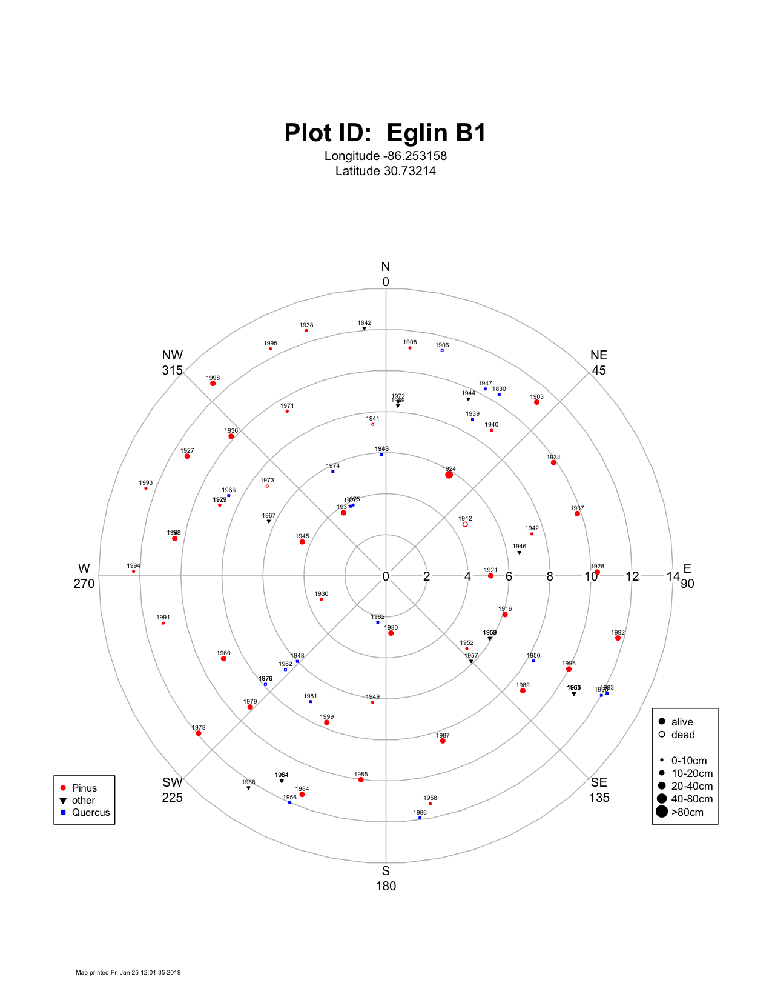

```{r setup, include=FALSE}
knitr::opts_chunk$set(echo = F)
knitr::opts_chunk$set(fig.width = 7.5, fig.height = 7.5)
knitr::opts_chunk$set(dpi = 300)
knitr::opts_chunk$set(warning = F)
knitr::opts_chunk$set(message = F)
```


##### Page Break

# List of Acronyms

| | |
|------|------|
| AFB | Air force base |
| AFR | Air force range |
| DBH | Diameter at breast height (height = 1.37 m) |
| GIS | Geographic information system |
| GPS | Global positioning system |
| OLS | Ordinary least squares (regression model) |


##### Page Break

# Part 1: Field surveys across DoD installations


**Figure 1.** Study area map showing the location of each installation visited.

##### Page Break

"burn unit" = "burn block" = A discrete area within a larger prescribed or fire use project

(https://www.nwcg.gov/term/glossary/burn-block%C2%A0)


# Technical Approach

## Experimental design 

The goal of our experimental design was to assess the potential effects
of fire history (i.e., years since most recent burn) and cogongrass
infestation on tick densities, host availability (i.e., dung pellet
counts), and vegetation type and conditions (i.e., ...) across
installations throughout our study region. The experimental design is
summarized in Figure X. The study region is defined as five states in
the southeastern U.S (i.e., Mississippi, Alabama, Georgia, South
Carolina, and Florida). Within the study region, we collected field data
at nine military installations (i.e., Avon Park AFR, Fort Benning, Camp
Blanding, Eglin AFB, Fort Gordon, Fort Jackson, Moody AFB, Camp Shelby,
and Tyndall AFB). Each installation was divided into burn units, with
separate histories of controlled burns (number of burn units ranged from
\# at INSTALLATION to \# at INSTALLATION). At least one plot was
established within each burn unit. If part of a burn unit was infested
with cogongrass, two plots were established (i.e., one in an invaded
area and one in an uninvaded area). These plots were considered the
smallest experimental unit of replication for all data analyses. The
plots across all installations that have been visited to date are
summarized in Table X.


**Figure X.** Summary of overall experimental design for field data collection.

**Table X. Summary of plots visited across all installations to date.**

  **Installation**   **Number of Plots**   **Years Since Fire**   **Years Visited**             
  ------------------ --------------------- ---------------------- ------------------- --------- ------------
                     **Uninvaded**         **Invaded**            **Total**                     
  Avon Park AFR      8                     4                      12                  0 -- 6    2017, 2018
  Fort Benning       10                    0                      10                  0 -- 4    2018
  Camp Blanding      13                    0                      13                  0 -- 10   2017, 2018
  Eglin AFB          11                    0                      11                  0 -- 11   2017, 2018
  Fort Gordon        8                     0                      8                   0 -- 9    2018
  Fort Jackson       13                    0                      13                  0 -- 11   2018
  Moody AFB          3                     0                      3                   0 -- 11   2017
  Camp Shelby        9                     4                      13                  1 -- 7    2017, 2018
  Tyndall AFB        8                     1                      9                   0 -- 6    2017, 2018
  **Totals**         **83**                **9**                  **92**                        

Due to intensive invasive plant management efforts by installation
managers, many installations lacked congongrass infestations; only Avon
Park AFR, Camp Shelby, and Tyndall AFB had substantial cogongrass
infestations. Thus, to maximize the statistical power of each test, we
developed separate statistical models to analyze (1) the effect of
cogongrass infestation and (2) the effect of fire history on each
response variable; these models guided our selection of burn units in
which to collect data. The first model, designed to test the effect of
cogongrass infestation on the response variables, is a nested split-plot
design that considers the fixed main effects of installation $N_{i}$,
burn unit nested within installation $B_{k\left( i \right)}$ (as the
whole plot), and cogongrass invasion status $C_{l}$ (as the sub-plot),
and the random effect of study year $Y_{j}$ (i.e., 2017 or 2018) on each
response variable (Eqn. 1).

$Y_{\text{ijkl}} = \mu + N_{i} + Y_{j} + B_{k\left( i \right)} + \varepsilon_{\text{ijk}} + C_{l} + \varepsilon_{\text{ijkl}}$
Eqn. 1

The second model, designed to test the effects of years since the most
recent burn on the response variables, is a randomized complete block
design that considers the fixed main effect of installation $N_{i}$,
years since the most recent burn
$\beta\left( x_{\text{ij}} - \overline{x} \right)$ as a covariate, and
the random effect of study year $Y_{j}$ on each response variable (Eqn.
2).

$Y_{\text{ijk}} = \mu + \beta\left( x_{\text{ij}} - \overline{x} \right) + N_{i} + Y_{j} + NY_{\text{ij}} + \varepsilon_{\text{ijk}}$
Eqn. 2

A major consideration in the overall experimental design was whether to
prioritize collecting data at the same plots over multiple years versus
collecting data at a larger number of plots for a single time point. In
general, we prioritized the latter, because (1) this design increases
the power of our statistical tests, which use plot as the experimental
unit, and (2) the short duration of the study (i.e., three planned field
seasons) precluded a repeated-measures analysis of the response
variables over time. However, in the event that a plot that had been
visited in 2017 was burned, we revisited the same plot in 2018 to
conduct a before-and-after comparison of the immediate impacts of the
burn on the response variables. We also revisited in 2018 a subsample of
the plots visited in 2017 to estimate inter-annual variation in the
response variables, particularly tick density and host availability,
throughout the study period.

## Field sampling design
Following the experimental design, we established plots to achieve a stratified sampling that covered the range of fire history at each installation. We obtained fire history and known cogongrass invasions as GIS layers from each installation and identified potential plot locations based on time since last fire. Potential locations were sent to our contacts at the installation to solicit further guidance on selecting the final set of candidate locations and arranging access. Our sampling season coincided with the prescribed fire management season at most installations, so the fire data we had on hand was sometimes out of date by the time a visit was arranged because fires had recently been conducted. In burn blocks with a cogongrass invasion we established one plot in the invaded area and one plot in an univaded area (Figure 2), with at least 100 meters between the plots. In burn blocks without an invasion we established one plot in an area representative of the vegetation conditions in the burn block.


Installations typically have multiple larger management units or trainining areas that are made up of smaller burn units (e.g. Figure 3). At some installations the burn units are the same as the training/management areas. There are training and ecological management needs that are considered in the management plan of each area, such as land navigation training for troops and maintaining habitat for species on the federal threatened and endangered species list (e.g. the red cockaded woodpecker). The fire management applied to the burn blocks within the larger areas varies based on the vegetation and the training uses and management goals.


**Figure 3.** Burn unit map for Fort Gordon, GA.

### Plot design
Each plot consisted of a main circular center plot (12.6 m radius, approximately 500 m^2^), an inner circular subplot (5.64 m radius, approximately 100 m^2^), four four 1 m x 1 m qudarats, four 25 cm x 25 cm quadrats, four 50 m transects, and four locations for sampling tick abundance (Figure 4). In the main circular plot and subplot we measured trees, saplings, and shrubs. Ground vegetation and litter were measured in the 1 m and 25 cm quadrats located 10 m from plot center in each of the cardinal directions. The 50 m transects originated at the plot center going in each cardinal direction and were used to estimate tick-host abundance. Tick abundance sampling locations were placed 8-10 m from the plot center in the NW, NE, SE, and SW areas. The center of each plot was marked with a flag and GPS coordinates were recorded using a Garmin Oregon 650t GPS unit (Olathe, KS).


**Figure 4.** Sample plot design.

### Tree and shrub data collection
Within the 12.6 m radius plot we recorded the DBH of all trees ≥ 3 cm DBH to the nearest 0.1 cm, and the distance (nearest 0.1 m) and azimuth (compass degrees) from the plot center to the center of each tree. Each tree was assigned a health category (Table 1) and relative canopy position (Table 2). We recorded the heights of at least 10 trees in the plot (or all trees if fewer than 10) that were representative of each identified canopy position. In the 5.64 m radius subplot we recorded the abundance of woody species (shrubs and tree seedlings/saplings) that were < 3 cm DBH and ≥ 100 cm tall. We also estimated overstory canopy cover for the plot by taking measurements using a spherical convex densiometer (Forestry Suppliers, Jackson, MS) while standing at each 1 m quadrat and facing plot center.


**Table 1.** Tree health categories.

|Health code|Definition|
|:-----------:|----------|
| 0 | dead, nothing living |
| 1 | healthy |
| 2 | relatively healthy (few dead branches) |
| 3 | unhealthy, barely alive stem |
| 4 | all stems are dead, but has living sprouts not making DBH |
| 5 | missing tree, the tree can’t be found during resampling |


**Table 2.** Tree canopy positions.

|Canopy code|Definition|
|:-----------:|----------|
| U | Understory, growing beneath the forest canopy, no direct sunlight |
| I | Intermediate, extend toward the over-story canopy but receive little or no direct sunlight from above and none from the sides |
| C | Co-dominant, receive direct sunlight from above but limited sunlight from the sides |
| D | Dominant, extend high into the canopy, sticking out above most other trees, and receive direct sunlight from above and partly on its sides |
| E | Emergent, crown extends well above all surrounding trees (typically mature redwoods or possibly douglas-fir) |
| S | Stump, tree no longer has any stems (dead or alive) that make the DBH cutoff, if it does it’s a snag or dead standing stem. If stump present, but also has any stems ≥3cm dbh it is NOT a "stump." Assign canopy class of tallest stem even if it does not make DBH |


### Ground cover and litter data collection
We identified plant species and measured vegetation and litter conditions in each of the four 1 m quadrats. We recorded the percent cover of each plant species, total plant cover, litter cover, and bare ground, and counted the number of stems of each species rooted within the quadrat. Percent cover was visually estimated and estimates were calibrated among observers to ensure consistency. We measured the three tallest heights of woody species and the three tallest heights of non-woody species rooted within each quadrat. Heights were measured from the mineral soil surface. Three measurements of litter depth were taken in each quadrat from the top of the litter level to the mineral soil surface. The 25 cm quadrats were placed adjacent to each 1 m quadrat in an area representative of the conditions in the larger qudrat, and we collected vegetation and litter in order to estimate biomass for the plot. All above-ground fine vegetation and litter within the 25 cm quadrat were collected into separate bags. Samples were weighed at the end of the day to estimate fresh weights, then were returned to the BARS at UF, placed in a 60ºC drying oven for at least 72 hours, and then weighed to obtain dry weights. The difference between fresh weight and dry weight was used to estimate moisture content of litter and standing biomass. 


**Figure 5.** Sampling 1 m and 25 cm quadrats.

### Tick sampling
We primarily collected ticks using CO~2~ traps placed in each plot for 24 hours. Tick traps were constructed by mounting 5-quart hard-sided coolers (Igloo, Katy, TX) onto the center of 0.635 cm (0.25 inch) thick plywood pieces cut to 35 cm x 28 cm. There was approximately 7.6 cm between the edge of the plywood and all sides of the cooler. Two 0.48 cm (3/16 inch) holes were drilled through each side of the cooler just above the bottom of the interior. Strips of double-sided carpet tape (DF 545, ShurTape, Hickory, NC) measuring 4.77 cm (1.88 in) wide were attached to the plywood surface surrounding the cooler. Each trap was baited with 1.5 kg of dry ice, which sublimated out through the holes drilled in the coolers. The CO~2~ from the sublimating dry ice attracts nearby ticks to the trap. A rain cover, to protect the tape, was made from corrugated plastic roofing cut to cover the entire footprint of the trap was attached to the top of each cooler by drilling a 0.48 cm hole through the center of the cooler lid and securing the roofing using a bolt and a wing-nut (Figure 6).


**Figure 6.** Tick trap being deployed.

To ensure that we colelcted ticks attracted by the traps but not stuck to the tape, we dragged a 1 m x 1 m white canvas cloth across the area directly below each trap three times. Ticks were also collected off of personnel and were assigned a plot, burn unit, or installation depending on the confidence in where the encounter occurred. Ticks collected on traps were counted and removed from the tape using tweezers, placed in 2 mL vials (Corning 430659) with 70% ethanol, and transported to the Flory Lab at the University of Florida where they were identified, sorted, and counted by species, life stage, and sex. Sorted ticks were then shipped to the Allan Lab at the University of Illinois where they underwent a second round of identification and sorting, and were subsampled for pathogen analysis.

### Estimating host density
We conducted host-dung surveys along each 50 m transect to estimate abundance of tick hosts near the plot area. Observed dung clusters of host species (e.g. white-tailed deer, *Odocoileus virginianus*) were tallied within 0 to 1 m of the transect line, totaling 400 m^2^ of surveyed area. Species were identified by dung characteristics (Figure 7).


**Figure 7.** Tick-hosts dung survey and identification. (a) Field technician Elena Meyer surveying for tick-host dung, (b) turkey dung, (c) deer dung, (d) rabbit dung.

##### Page Break

# Results and Discussion

## Installation and plot visits

```{r load libraries, echo=F}
library(plyr); library(dplyr); library(ggplot2); library(readr)
library(stringi); library(stringr)
library(tidyr)
library(cowplot)
# library(viridisLite); library(viridis)
```

```{r assign global variables}

# define ggplot theme ####
def_theme <- theme(legend.title = element_blank(),
            legend.text = element_text(size = 12),
            legend.position = "top",
            legend.direction = "vertical",
            axis.text = element_text(size = 14),
            axis.title = element_text(size = 16),
            plot.title = element_text(size = 18),
            strip.background = element_blank(),
            panel.grid = element_blank()
            )

# assign colors ####
invasion_color <- scale_color_manual(values = c("deepskyblue", "red"))
invasion_fill <- scale_fill_manual(values = c("deepskyblue", "red"))

```

```{r plot visit data}

plot_visit_data <- read_csv("data/processed_data/plot_visit_data.csv")
plot_visit_data$imcy_inv <- factor(plot_visit_data$imcy_inv, levels=c("uninvaded","invaded"), labels = c("Uninvaded","Invaded"))

plot_visit_data <- plot_visit_data %>% 
      filter(plot_id != "blanding theater_cogon")

plot_visit_data_noNA <- plot_visit_data[!is.na(plot_visit_data$years_since_fire),]

total_plots <- n_distinct(plot_visit_data$plot_id)
invaded_plots <- n_distinct(filter(plot_visit_data, imcy_inv=="Invaded")$plot_id)
num_installations <- n_distinct(plot_visit_data$installation)
min_yrs_since_fire <- min(plot_visit_data_noNA$years_since_fire)
max_yrs_since_fire <- max(plot_visit_data_noNA$years_since_fire)

```

We established `r total_plots` total plots at `r num_installations` DoD installations across the southeast US. Of the `r total_plots` only `r invaded_plots` were invaded (Figure 8a). Fire history varied across the plots, ranging from 0 to `r max_yrs_since_fire` years since the last fire (Figure 8b). The small number of cogongrass-invaded plots was due to a high level of awareness and recognition of cogongrass as a problematic species, and diligent management practices that quickly eradicate identified invasions. 

```{r summary of plots visited across installations}

inst_plot_nums <- plot_visit_data %>%
      group_by(inst_name, imcy_inv) %>% 
      summarise(plot_ct = n_distinct(plot_id)) %>% 
      
      ggplot(aes(inst_name, plot_ct, label=plot_ct)) +
      geom_col(aes(fill = imcy_inv)) +
      invasion_fill +
      # geom_text(nudge_y = 0) +
      # scale_fill_manual(values = c(installation_name = "blue")) +
      # facet_grid(installation_full_name ~ ., scales = "free_y") +
      ylab("Number of plots") +
      xlab("") +
      # ggtitle("Plots in Burn Units Across Installations") +
      theme_classic() +
      def_theme +
      theme(legend.position = c(.88,.95),
            axis.text.x = element_text(angle = 290, vjust = .5, hjust = .1 )) +
      NULL

```

```{r plots visited across years since fire}

fire_plot_nums <- plot_visit_data %>% 
      filter(!is.na(years_since_fire)) %>%
      ggplot(aes(as.factor(years_since_fire))) +
      geom_bar(aes(fill = imcy_inv), position = "dodge") +
      invasion_fill +
      # scale_fill_discrete(h = c(249,200)) +
      ylab("Number of plots") +
      xlab("Years since fire") +
      # ggtitle("Invaded vs. Uninvaded Plots Across Burn Units") +
      theme_classic() +
      def_theme +
      theme(legend.position = c(.8,.9)) +
      NULL

```

```{r number of plots}

(num_of_plots <- plot_grid(
      inst_plot_nums +
            theme(legend.position = "none"),
      fire_plot_nums +
            theme(legend.position = c(.6,.95)),
      labels = "auto", ncol = 1
      )
)
# ggsave("figures/interim_report_num_of_plots.png", num_of_plots)

```

**Figure 8.** Number of plots established. (a) Number of plots established at each of the DoD installations. (b) Number of plots established in each time since fire. The color shading indicates whether or not plots were in a cogongrass invasion - light blue is uninvadeda nd red is invaded.

## Trees and shrubs
```{r load tree data, results='hide'}

tree_data_import <- read_csv("data/processed_data/trees.csv")

tree_data <- tree_data_import %>% 
      select(installation:date, species:canopy, height, char)
      
tree_data <- left_join(
      tree_data,
      select(plot_visit_data, -notes)) %>% 
      rename(tree_id = species) %>% 
      mutate(labels = "")

tree_data$tree_id <- tolower(tree_data$tree_id)

tree_data$labels[agrep("qu", tree_data$tree_id, max.distance = 0)] <- "Quercus"
tree_data$labels[agrep("pi", tree_data$tree_id, max.distance = 0)] <- "Pinus"
tree_data$labels[!(tree_data$labels %in% c("Quercus","Pinus"))] <- "Other"


tree_grp_summary <- tree_data %>% 
      filter(health!=0, !is.na(imcy_inv)) %>% 
      group_by(plot_id, labels, years_since_fire, imcy_inv, visit_year) %>% 
      summarise(
            total_dbh_cm = sum(dbh, na.rm = T),
            avg_dbh_cm = mean(dbh, na.rm = T),
            n_stems = length(tree_id))

dbh_by_tree_grp <- tree_grp_summary %>% 
      select(-avg_dbh_cm, -n_stems) %>% 
      spread(labels, total_dbh_cm) %>% 
      mutate(Quercus = if_else(is.na(Quercus)==TRUE,0,Quercus),
                   Pinus = if_else(is.na(Pinus)==TRUE,0,Pinus),
                   Other = if_else(is.na(Other)==TRUE,0,Other),
                   total_dbh = rowSums(cbind(Other,Pinus,Quercus), na.rm = T),
                   pct_pinus_dbh = 100*(Pinus/total_dbh))


tree_data_plot_summary <- tree_data %>% 
      filter(health!=0) %>% 
      group_by(plot_id, years_since_fire, imcy_inv, visit_year, inst_name) %>% 
      summarise(
            total_dbh = sum(dbh, na.rm = T),
            richness = n_distinct(tree_id),
            avg_tree_ht = mean(height, na.rm = T),
            avg_char_ht = mean(char, na.rm = T))

tree_data_plot_summary <- left_join(
      tree_data_plot_summary, 
      select(dbh_by_tree_grp, plot_id:visit_year, pct_pinus_dbh)
      )

```

We recorded `r n_distinct(tree_data$tree_id)` different tree and shrub species. The vast majority of the `r nrow(tree_data)` trees recorded were in either the *Pinus* (pine) or *Quercus* (oak) genus, with pine smaking up more than 50% of all trees recorded (Figure 9). Overall, tree diversity, quantified as the number of distinct species, tended to be greater in uninvaded plots, and, regardless of invasion, higher with longer time since fire (Figure 10a). An ordinary least squares (OLS) regression model with additive effects of time since fire and cogongrass invasion resulted in an adjusted R^2^ of 0.29 (Table 1). Shrub and sapling density (stems over one meter tall but less than 3 cm DBH) measured in the center subplot ranged widely, but most plots had fewer than 40 stems per 100 m^2^ (Figure 10b). The relationship between shrub and sapling density and time since last fire was not statistically significant. Recording the location of each tree (distance and azimuth from plot center) enabled generating stem maps for each plot (e.g, Figure 11). Stem maps were included in reports sent to each installation, and can be used to help relocate individual trees for future data collection.


```{r trees by installation}

ggplot(tree_data %>%
             filter(!is.na(years_since_fire)) %>% 
             mutate(labels = factor(labels, levels = c("Pinus","Quercus","Other"))) %>% 
             group_by(inst_name, labels, years_since_fire, imcy_inv) %>% 
             summarise(num_trees = length(labels)),
       aes(inst_name, num_trees)) +
      geom_col(aes(color = labels, fill = labels)) +
      scale_color_viridis_d() +
      scale_fill_viridis_d() +
      # theme_bw() +
      xlab("") +
      ylab("Number of trees") +
      def_theme +
      theme(strip.background = element_blank(),
            panel.grid = element_blank(),
            legend.position = c(.8,.9),
            axis.text.x = element_text(angle = 290, vjust = .5, hjust = .1 )) +
      NULL

```

**Figure 9.** Number of trees recorded at each installation. The majority of trees belonged to the *Pinus* or *Quercus* genus.


```{r tree richness figure}

tree_richness_fig <- ggplot(tree_data_plot_summary, 
       aes(years_since_fire, richness, color = imcy_inv)) +
      geom_point(position = position_jitter(width = .1), size = 2) +
      geom_smooth(aes(fill = imcy_inv), method = "lm", alpha = .2, show.legend = F) +
      invasion_color +
      invasion_fill +
      scale_y_continuous(limits = c(0,9.5), breaks = c(0,2,4,6,8)) +
      theme_classic() +
      def_theme +
      ylab("Tree richness") +
      xlab("Years since fire") +
      NULL

```

```{r subplot figure}
subplot_data_import <- read_csv("data/processed_data/woodysubplot.csv")

subplot_data <- left_join(
      select(subplot_data_import, -notes),
      select(plot_visit_data, -notes),
) %>% 
      mutate(imcy_inv = factor(imcy_inv, levels = c("uninvaded","invaded"), labels = c("Uninvaded","Invaded")))

subplot_plot_summary <- subplot_data %>% 
      group_by(plot_id, visit_year, imcy_inv, years_since_fire, inst_name) %>% 
      summarise(shrub_sap_rich = n_distinct(veg_id),
                total_stems_100m2 = sum(stems_100m2))


shrub_saplings_fig <- ggplot(
      filter(subplot_plot_summary, between(total_stems_100m2,0,500)),
      aes(years_since_fire, total_stems_100m2/100, color = imcy_inv)) +
      geom_point(aes(color = imcy_inv), size = 2, position = position_jitter(width = .1)) +
      geom_smooth(aes(fill = imcy_inv), alpha = .2, method = "lm", show.legend = F) +
      invasion_color +
      invasion_fill +
      theme_classic() +
      def_theme +
      xlab("Years since fire") +
      ylab(expression(paste("Shrub & sapling stem density (", {m}^-2,") "))) +
      ggtitle("") +
      NULL


```

```{r tree richness and subplot figure}

plot_grid(
      tree_richness_fig +
            xlab("") +
            theme(legend.position = "none"),
      shrub_saplings_fig +
            theme(legend.position = c(.85,.85),
            legend.background = element_rect(color = "black")),
      ncol = 1
)

```

**Figure 10.** Tree species richness (a) and shrub and sapling density (b) plotted against time since fire in cogongrass invaded (red) and uninvaded (blue) plots. Points are jittered horizontally to reduce overlap.

```{r tree richness model table 1}

tree_richness_lm <- lm(richness ~ years_since_fire + imcy_inv, data = tree_data_plot_summary)
# summary(tree_richness_lm)
knitr::kable(broom::tidy(tree_richness_lm), digits = 3,
             caption = "Table 1. Tree richness linear model results.")
# broom::confint_tidy(tree_richness_lm)
# broom::glance(tree_richness_lm) %>% select(adj.r.squared, )

# broom::augment(lm(richness ~ years_since_fire + imcy_inv, data = tree_data_plot_summary))

```

```{r shrub sapling density model table, eval=F}

subplot_plot_summary$density_m2 <- subplot_plot_summary$total_stems_100m2/100

shrub_density_model <- lm(density_m2 ~ years_since_fire+imcy_inv, subplot_plot_summary)
summary(shrub_density_model)

```



**Figure 11.** Stem map for Eglin AFB plot B1.


## Understory herbaceous cover and species

```{r load species data}

species_data_import <- read_csv("data/processed_data/species1m.csv")

species_data <- left_join(
      select(species_data_import, installation:visit_year),
      select(plot_visit_data, -notes)
)

species_data$functional_group <- tolower(species_data$functional_group)

species10_data <- species_data %>% 
      filter(quadrat_id %in% c("e10","w10","n10","s10"))

veg_cover_plot_data <- species10_data %>%
      filter(!is.na(imcy_inv)) %>% 
      group_by(inst_name, visit_year, plot_id, imcy_inv, years_since_fire, quadrat_id) %>%
      summarise(veg_cover = sum(pct_cover, na.rm = T)) %>% 
      ungroup(.) %>% 
      group_by(plot_id, visit_year, imcy_inv, years_since_fire, inst_name) %>% 
      summarise(
            plot_avg_veg_cover = mean(veg_cover, na.rm = T),
            n_obs = length(veg_cover),
            max_veg_cover = max(veg_cover, na.rm = T),
            sd_veg_cover = sd(veg_cover, na.rm = T),
            se_veg_cover = sd_veg_cover / sqrt(n_obs)) %>% 
      ungroup(.)

```
```{r load 1m quadrat data}

quadrat_data <- read_csv("data/processed_data/quadrat1m.csv")
quadrat_data <- left_join(
      select(quadrat_data, -notes),
      select(plot_visit_data, -notes)
)
quadrat10_data <- filter(
      quadrat_data, quadrat_id %in% c("e10","w10","n10","s10"),
      plot_id != "blanding theater_cogon"
)
# filter(quadrat10_data, is.na(years_since_fire))$plot_id

quadrat10_summaries <- quadrat10_data %>%
      group_by(plot_id, visit_year, installation) %>%
      summarise(
            avg_woody_ht1 = mean(woody_veg_ht1),
            avg_woody_ht_all = mean(
                  c(woody_veg_ht1,woody_veg_ht2,woody_veg_ht3), na.rm = T),
            avg_herb_ht1 = mean(herb_veg_ht1),
            avg_herb_ht_all = mean(c(herb_veg_ht1, herb_veg_ht2, herb_veg_ht3), na.rm = T),
            avg_litter_depth1 = mean(litter_ht1),
            avg_litter_depth_all =
                  mean(c(litter_ht1,litter_ht2,litter_ht3), na.rm = T),
            avg_pct_green = mean(pct_green),
            avg_pct_litter = mean(pct_litter),
            avg_pct_wood = mean(pct_wood_litter),
            avg_pct_bare = mean(pct_bare))

quadrat10_summaries <- left_join(
      quadrat10_summaries,
      plot_visit_data
)
```
```{r 25cm biomass data, results='hide'}

biomass_data_import <- read_csv("data/processed_data/quadrat25cm.csv")

biomass_data <- biomass_data_import %>% 
      mutate(pct_litter_moisture = 100*(litter_mass_wet-litter_mass_dry)/litter_mass_wet)

biomass_data <- biomass_data %>% 
      mutate(pct_litter_moisture = ifelse(pct_litter_moisture<0,0,pct_litter_moisture))

biomass_data <- left_join(
      select(biomass_data, -Notes),
      select(plot_visit_data, -notes))

biomass_plot_summary <- biomass_data %>% 
      filter(!is.na(imcy_inv)) %>% 
      group_by(plot_id, visit_year, imcy_inv, years_since_fire, inst_name) %>% 
      mutate(standing_gm2 = standing_fuel_mass_wet*16,
             litter_gm2 = litter_mass_wet*16,
             dry_standing_gm2 = standing_fuel_mass_dry*16,
             dry_litter_gm2 = litter_mass_dry*16) %>% 
      summarise(avg_dry_standing_gm2 = mean(dry_standing_gm2),
                se_dry_standing_gm2 = sd(dry_standing_gm2)/sqrt(length(dry_standing_gm2)),
                avg_wet_standing_gm2 = mean(standing_gm2, na.rm = T),
                avg_dry_litter_gm2 = mean(dry_litter_gm2),
                se_litter = sd(dry_litter_gm2)/sqrt(length(dry_litter_gm2)),
                avg_pct_litter_moisture = mean(pct_litter_moisture))

```

Percent cover of understory herbaceous vegetation measured at the 1 m^2^ quadrats tended to be lower with longer time since fire in the uninvaded plots, and higher with longer time since fire in the handful of cogongrass-invaded plots (Figure 12a). An OLS model with additive effects of time since fire and cogongrass invasion status resulted in an adjusted R^2^ of 0.10 (Table 2). The biomass of standing understory vegetation showed the same pattern as percent cover, but also ranged widely from 0.006 to over 1.6 kg m^-2^ (Figure 12b). 

```{r veg cover and mass fig}

veg_cover_fig <- ggplot(veg_cover_plot_data,
      aes(years_since_fire, plot_avg_veg_cover)) +
      geom_point(aes(color = imcy_inv), size = 2, position = position_jitter(width = .1)) +
      geom_smooth(aes(color = imcy_inv, fill = imcy_inv), method = "lm", alpha = .2, show.legend = F) +
      invasion_fill +
      invasion_color +
      # facet_grid(inst_name~.) +
      theme_classic() +
      ylab("Vegetation cover (%)") +
      xlab("Years since fire") +
      # ggtitle("Plot averages for herbaceous vegetation cover") +
      def_theme +
      theme(legend.position = c(.8,.9)) +
      NULL

stand_biomass_fig <- ggplot(biomass_plot_summary,
       aes(years_since_fire, avg_dry_standing_gm2/1000, color = imcy_inv)) +
      geom_point(size = 2, position = position_jitter(width = .1)) +
      geom_smooth(aes(fill = imcy_inv), alpha = .2, method = "lm", show.legend = F) +
      invasion_color +
      invasion_fill +
      theme_classic() +
      ylab(expression(paste("Standing biomass (kg ", m^{-2}, ")"))) +
      xlab("Years since last fire") +
      # ggtitle("Dry standing biomass",
      #         subtitle = "(measurements at 25cm quadrats)") +
      def_theme +
      theme(legend.title = element_blank(),
            legend.position = c(.85,.85),
            legend.background = element_rect(color = "black")) +
      NULL

plot_grid(
      veg_cover_fig +
            xlab("") +
            theme(legend.position = "none",
                  axis.text.x = element_blank()),
      stand_biomass_fig,
      ncol = 1
      )

```

**Figure 12.** Understory herbaceous vegetation. (a) Percent cover versus time since fire and (b) dried mass versus time since fire. The light blue points and line are univaded plots and red points and line are invaded plots.

```{r vegetation cover model table2}

veg_cover_model <- lm(plot_avg_veg_cover ~ years_since_fire + imcy_inv, data = veg_cover_plot_data)
# summary(veg_cover_model)

knitr::kable(broom::tidy(veg_cover_model), digits = 3,
             caption = "Table 2. Herbaceous vegetation cover model results.")

```


Cogongrass-invaded plots didn't have significantly different herbaceous understory diversity (Figure 13a), which is likely in part due to the relatively small sizes of invasions that we encountered. Most invasions did not cover the entire plot area, often resulting in two or three of the 1 m^2^ quadrats located in a area with little cogongrass cover. The variation in species richness decreased with increasing time since fire, changing most dramatically from three to four years since fire (Figure 13b). 

```{r plot richness fig}

species_richness <- species10_data %>%
       filter(!is.na(imcy_inv)) %>% 
      group_by(inst_name, years_since_fire, imcy_inv, plot_id) %>%
      summarise(richness = n_distinct(scientific_name)) %>% 
      mutate(ln_richness = log(richness),
             max_richness = max(richness))

plot_richness_fig <- ggplot(species_richness, aes(as.factor(years_since_fire), richness, color = imcy_inv)) +
      geom_smooth(show.legend = F, alpha = .2, aes(fill = imcy_inv), method = "lm") +
      geom_point(aes(color = imcy_inv), size = 2, position = position_jitter(width = .1)) +
      invasion_color +
      invasion_fill +
      theme_classic() +
      def_theme +
      ylab("Richness") +
      xlab("Years since fire") +
      # ggtitle("Plot understory species diversity") +
      theme(legend.position = c(.83,.85)) +
      NULL


richness_box_plot <- ggplot(
      species_richness %>% filter(!is.na(years_since_fire)), 
      aes(as.factor(years_since_fire), richness, color = imcy_inv)) +
      geom_boxplot() +
      # geom_smooth(show.legend = F, alpha = .2, aes(fill = imcy_inv), method = "lm") +
      geom_point(aes(color = imcy_inv), size = 2, shape = 1, position = position_jitterdodge(), show.legend = F) +
      invasion_color +
      invasion_fill +
      theme_classic() +
      def_theme +
      ylab("Richness") +
      xlab("Years since fire") +
      # ggtitle("Plot understory species diversity") +
      theme(legend.position = c(.85,.85)) +
      NULL

plot_grid(
      plot_richness_fig +
            xlab("") + 
            theme(axis.text.x = element_blank(),
                  # axis.ticks.x = element_blank(),
                  legend.background = element_rect(color = "black", fill = NA)),
      richness_box_plot +
            theme(legend.position = "none"),
      labels = "auto", ncol = 1
      )

```

**Figure 13.** Understory species diversity. (a) Species richness versus time since fire with a small amount of noise added to the points to reduce overlap. (b) Box-plots of species richness illustrating that plots burned further in the past have lower variation in species richness. Open circles are the data points.


## iNaturalist project

We started an [iNaturalist project](https://www.inaturalist.org/projects/serdp-species) to develop a publicly available record of plant species we identified at DoD installations as part of this project (Figure 14). iNaturalist is a digital platform available via iOS, Android, and a website where scientists and naturalists with all levels of experience from around the world can upload observations of plants, animals, and fungi, and offer or seek help in species identification. An observation is tagged as "Research Grade" when identification has been supported by at least two members of the community, the observation was in the wild, and it includes a relatively accurate location and date. Research grade observations can be used for research and included in other websites, such as the Global Biodiversity Information Facility ([GBIF](https://www.gbif.org/)). During our field surveys, we identified over 270 species and currently 50% of these have been designated research grade. In the cases of rare species, such as pitcher plants, we either excluded coordinates or included coordinates that were imprecise (fuzzed approximately 1500 m) using functionality built into the iNaturalist application.


**Figure 14.** iNaturalist SERDP project

## Litter cover, mass, and moisture content

Measurements of litter mass, percent cover, and moisture tended to increase with time since last fire, while only percent cover showed a significant difference in cogongrass-invaded versus uninvaded plots (Figure 15). Litter biomass tended to be a little higher in uninvaded plots (Figure 15a) and an OLS model with years since fire and cogongrass invasion status had an adjusted R^2^ of 0.24 (Table 3). Percent litter cover rapidly recovered following fires, reaching >50% within two years after fire for most uninvaded plots (Figure 15b). An OLS model with years since fire and cogongrass invasion status had and adjusted R^2^ of 0.38 (Table 4). Litter moisture is depends on the prevailing weather conditions, so these results must be interpreted within the context of our sampling time in the southeastern U.S. (June - October). Litter moisture was predominantly <50% across all samples (Figure 15c).

```{r pct litter fig, fig.height=8}

pct_litter_fig <- ggplot(quadrat10_summaries, aes(years_since_fire, avg_pct_litter)) +
      geom_point(aes(color = imcy_inv), size = 2, position = position_jitter(width = .1)) +
      geom_smooth(aes(color = imcy_inv, fill = imcy_inv), method = "lm", alpha = .2, show.legend = F) +
      invasion_color +
      invasion_fill +
      theme_classic() +
      def_theme +
      xlab("Years since fire") +
      ylab("Litter cover (%)") +
      NULL

litter_mass_fig <- ggplot(biomass_plot_summary,
        aes(years_since_fire, avg_dry_litter_gm2/1000, color = imcy_inv)) +
      geom_point(aes(color = imcy_inv), size = 2, position = position_jitter(width = .1)) +      
      geom_smooth(aes(fill = imcy_inv), alpha = .2, method = "lm", show.legend = F) +
      invasion_color +
      invasion_fill +
      theme_classic() +
      ylab(expression(paste("Litter biomass (kg ", m^{-2}, ")"))) +
      xlab("Years since last fire") +
      def_theme +
      NULL

## Litter moisture
litter_moisture_fig <- ggplot(filter(biomass_plot_summary, !is.na(years_since_fire)), 
       aes(years_since_fire, avg_pct_litter_moisture, color = imcy_inv)) +
      geom_smooth(aes(fill = imcy_inv), se = T, alpha = .2, method = "lm", show.legend = F) +
            geom_point(aes(color = imcy_inv), size = 2, position = position_jitter(width = .1)) +
      invasion_color +
      invasion_fill +
      theme_classic() +
      xlab("Years since fire") +
      ylab("Litter moisture (%)") +
      def_theme +
      NULL

plot_grid(
      litter_mass_fig +
            xlab("") +
            theme(legend.position = c(.85,.87),
            legend.background = element_rect(color = "black")) +
            scale_y_continuous(
                  breaks = c(0, 1, 2), labels = c("0","1","2"),
                  limits = c(0,2.2)),
      pct_litter_fig +
            xlab("") +
            theme(legend.position = "none"),
      litter_moisture_fig +
            theme(legend.position = "none"),
      ncol = 1, labels = "auto"
)

```

**Figure 15.** Litter conditions versus time since fire for (a) percent cover, (b) dry mass, and (c) percent moisture. The light blue color is for uninvaded plots and red is for cogongrass-invaded plots. A small amount of noise was added to the points to reduce overlap.


```{r litter mass model table3}
biomass_plot_summary$dry_litter_m2 <- biomass_plot_summary$avg_dry_litter_gm2/1000

litt_mass_model <- lm(dry_litter_m2 ~ years_since_fire + imcy_inv, data = biomass_plot_summary)
# summary(litt_mass_model)

knitr::kable(broom::tidy(litt_mass_model), digits = 3,
             caption = "Table 3. Litter mass model results.")

```

```{r litter cover model table4}

litt_cover_model <- lm(avg_pct_litter ~ years_since_fire + imcy_inv, data = quadrat10_summaries)
# summary(litt_cover_model)

knitr::kable(broom::tidy(litt_cover_model), digits = 3,
             caption = "Table 4. Litter cover model results.")

```

```{r litter moisture model table, eval=F}

litt_mois_model <- lm(avg_pct_litter_moisture ~ years_since_fire + imcy_inv, data = biomass_plot_summary)
summary(litt_mois_model)

```


## Host abundances

We identified eight tick host species during dung surveys across all installations. White-tailed deer (*Odocoileus virginianus*) and eastern cottontail rabbit (*Sylvilagus floridanus*) were typically the most abundant host species at each installation (Figure 16). At Avon Park AFR, cow dung made up a substantial amount of dung encountered due to domestic cattle grazing leases, illustrating the mutli-use character of this installation. Wild turkey (*Meleagris gallopavo*) made notable contribution to host density at Camp Blanding and Eglin AFB during 2018 surveys. Total host densities did not significantly differ between cogongrass-invaded and uninvaded areas, nor with time since last fire (Figure 17).

```{r dung data, results='hide'}

dung_data_import <- read_csv("data/processed_data/dung.csv")
# summary(dung_data_import)
# filter(dung_data_import, is.na(species), dung1m>0 | dung2m>0)$plot_id
dung_data_import$species[is.na(dung_data_import$species) & dung_data_import$dung1m>0] <- "other"
dung_data_import$species[is.na(dung_data_import$species) & dung_data_import$dung2m>0] <- "other"
# filter(dung_data_import, is.na(dung1m)) %>% select(plot_id)

dung_data <- dung_data_import 
# sort(unique(dung_data$plot_id))
# filter(dung_data, is.na(dung1m))

dung_data <- left_join(
      dung_data,
      select(plot_visit_data, -notes))
# summary(dung_data)
# filter(dung_data, is.na(years_since_fire))$plot_id

# dung_data <- rename(dung_data, clusters1m = `1m`, clusters2m = `2m`)
dung_plot_data <- dung_data %>% 
      # filter(species == "deer") %>% 
      group_by(installation, plot_id, visit_year, years_since_fire, imcy_inv, species, inst_name) %>% 
      summarise(
            total_clusters1m = sum(dung1m, na.rm = T),
            avg_clusters1m = mean(dung1m, na.rm = T),
            total_clusters2m = sum(rowSums(cbind(dung1m,dung2m), na.rm=T)),
            avg_clusters2m = mean(rowSums(cbind(dung1m,dung2m), na.rm=T))
                )
# summary(dung_plot_data)
# skimr::skim(dung_data_avg)

```

```{r dung species figure}

(dung_species_fig <- ggplot(filter(dung_plot_data, !is.na(species)),
                            aes(inst_name, log1p(total_clusters1m))) +
       geom_col(aes(fill = species)) +
      scale_color_viridis_d() +
       scale_fill_viridis_d() +
       facet_grid(visit_year~., scales = "free_y") +
      # theme_classic() +
       theme_bw() +
      xlab("") +
      ylab("log(# of dung clusters)") +
      def_theme +
       theme(legend.position = "right",
            axis.text.x = element_text(angle = 290, vjust = .5, hjust = .1 )) +
      NULL
)

# ggsave("~/Dropbox (UF)/SERDP-Project/figures/dung-species.png", height=7.5, width = 7.5)
```

**Figure 16.** Evidence of host species densities at each installation (dung clusters 400 m^-2^). Note that the y-axis has different scales in each panel. Zeroes (no bars) are installations that weren't visited during that year.

```{r dung density vs time since fire}

dung_species <- c("deer", "cottontail", "turkey", "cow")
(deer_dung_fig <- dung_plot_data #%>% filter(species %in% dung_species)
      %>% 
      ggplot(
            aes(years_since_fire, log1p(total_clusters2m), color = imcy_inv)) +
            geom_point(aes(color = imcy_inv), size = 2, position = position_jitter(width = .1)) +
      invasion_fill +
      invasion_color +
      geom_smooth(aes(fill = imcy_inv), se = T, method = "lm", alpha = .2, show.legend = FALSE) +
      theme_classic() +
      ylab("Host dung (ln)") +
      xlab("Years since fire") +
      def_theme +
      theme(legend.position = c(.72,.89),
            legend.background = element_rect(color = "black")) +
      NULL
)

```

**Figure 17.** Host densities vs. time since fire in cogongrass-invaded and uninvaded plots. Blue indicates uninvaded plots and read indicates cogongrass-invaded plots. A small amount of noise was added to the points to reduce overlap. A constant of one was added to dung counts before log-transformation so that values of zero on the log-scale of the figure correspond to true zeroes in the original data.


```{r dung density model table, eval=F}

dung_fire_model <- lm(log1p(total_clusters2m) ~ years_since_fire + imcy_inv, data = dung_plot_data)
# summary(dung_fire_model)

```


## Tick abundances

We collected four different tick species across all installations (Figure 18). The majority of ticks collected were in the nymph life stage during both sample seasons (Figure 19a) and belonged to the target species, *Amblyomma americanum* (Figure 19b). The small number of invaded areas had few ticks (Figure 19). The majority of ticks collected in 2017 were from Camp Blanding, FL and Eglin AFB, FL, while in 2018 most ticks collected were from Camp Blanding, FL, Fort Gordon, GA, and Tyndall AFB, FL (Figure 20). Tick abundances tended to increase with time since fire (Figure 21), indicating that, in general, tick abundance is reduced by more recent prescribed fire management across these installations. An OLS model using only years since fire to predict tick abundance resulted in an adjusted R^2^ of 0.10. (Table 5) Across all sampling, tick abundances were unrelated to host abundances (Figure 22; P-value = 0.87), suggesting that abiotic factors may be stronger drivers of tick abundances in these landscapes. For example, more recently burned areas usually have hotter and drier microclimates, as well as less litter that can provide refuge (Figure 23), resulting in poor conditions for tick survival. An OLS model regressing log-transformed tick abundance against dried litter biomass resulted in an adjusted R^2^ of 0.10 (Table 6).


**Figure 18.** The four commonly collected tick species. (a) *Amblyomma americanum* (Lone star tick), (b) De. var: *Dermacentor variablis* (American dog tick), (c) Am. mac: *Amblyomma maculatum*, (d) Rh. san: *Rhipicephalus sanguineus* (brown dog tick).

```{r tick data QC, results='hide'}

tick_data_import <- read_csv("data/processed_data/ticks.csv")

tick_data <- tick_data_import %>%
      mutate(life_stage = factor(life_stage, 
                                 levels = c("adult","nymph"), 
                                 labels = c("Adult","Nymph"))) %>% 
      rename(tick_count = count)

tick_data <- left_join(
      tick_data,
      select(plot_visit_data, -notes, -pid2, -visit_date)
)
# summary(tick_data)

tick_data_sum <- read_csv("data/all_plotlevel_data.csv")
tick_data_sum <- tick_data_sum %>% 
      mutate(imcy_inv = factor(imcy_inv, levels = c("Uninvaded","Invaded")))

```

```{r tick life stage species abundance}

plot_grid(
tick_data %>% 
      filter(!is.na(imcy_inv), !is.na(life_stage), life_stage!="Larval") %>% 
ggplot(aes(life_stage, tick_count, color = imcy_inv, fill = imcy_inv)) +
      geom_col() +
      invasion_color +
      invasion_fill +
      facet_grid(visit_year~.) +
      xlab("") +
      ylab("Tick abundance") +
      theme_classic() +
      def_theme +
      theme(legend.position = "none",
            legend.background = element_rect(color = "black")) +
      NULL,


tick_data %>% 
      filter(!is.na(imcy_inv), !is.na(species), life_stage!="Larval") %>% 
ggplot(aes(species, tick_count, color = imcy_inv, fill = imcy_inv)) +
      geom_col() +
      invasion_color +
      invasion_fill +
      xlab("") +
      ylab("Tick abundance") +
      theme_classic() +
      facet_grid(visit_year~.) +
      def_theme +
      theme(legend.position = c(.85,.85),
            legend.background = element_rect(color = "black")) +
      NULL,
ncol = 1, labels = "auto"
)

```

**Figure 19.** Tick abundances grouped by (a) life stage and (b) species in each sample year. Am. am: *Amblyomma americanum*, Am. mac: *Amblyomma maculatum*, De. var: *Dermacentor variablis*, Rh. san: *Rhipicephalus sanguineus*. Blue indicates uninvaded and red indicates cogongrass-invaded.


```{r tick abundance by installation fig}

ggplot(tick_data_sum, aes(inst_name, total_ticks, fill = imcy_inv)) +
      geom_col() +
      invasion_fill +
      facet_grid(visit_year~.) +
      # theme_bw() +
      theme_classic() +
      ylab("Tick abundance") +
      xlab("") +
      def_theme +
      theme(legend.position = c(.85,.85),
            legend.background = element_rect(color = "black"),
            axis.text.x = element_text(angle = 290, vjust = .5, hjust = .1 )) +
      NULL

```

**Figure 20.** Tick abundances at each installation for each sample year. Blue indicates uninvaded and red indicates cogongrass-invaded.


```{r tick abundance vs fire}

(tick_fire_fig <- ggplot(filter(tick_data_sum,), 
       aes(years_since_fire, log1p(total_ticks))) +
      geom_smooth(aes(fill = imcy_inv, color = imcy_inv), se = T, method = "lm", alpha = .2, show.legend = F) +
      geom_point(aes(color = imcy_inv), position = position_jitter(width=.1), size = 2) +
      invasion_color +
      invasion_fill +
      theme_classic() +
      xlab("Years since fire") +
      ylab("Tick abundance (ln)") +
      def_theme +
       theme(legend.position = c(.9,.89),
            legend.background = element_rect(color = "black")) +
      NULL
)

```

**Figure 21.** Natural-log transformed tick abundance and time since fire for cogongrass-invaded and uninvaded plots. A small amount of noise was added to the points to reduce overlap. A constant of one was added to tick abundance prior to the log-transformation so that values of zero on the log-scale correspond to true zeroes. 

```{r tick fire model table5}

tick_fire_model <- lm(log1p(total_ticks) ~ years_since_fire, data = tick_data_sum)
# summary(tick_fire_model)
knitr::kable(broom::tidy(tick_fire_model), digits = 3,
              caption = "Table 5. Tick abundance versus fire model results.")

```


```{r tick-hosts}

(tick_host_fig1 <- ggplot(
      filter(tick_data_sum, !is.na(imcy_inv)), 
       aes(log1p(total_clusters2m), log1p(total_ticks), color = imcy_inv)) +
      geom_smooth(aes(fill = imcy_inv), se = T, alpha = .2, method = "lm", show.legend = FALSE) +
      geom_point(aes(color = imcy_inv), position = position_jitter(width=.1), size = 2) +
      invasion_color +
      invasion_fill +
      theme_classic() +
      xlab("Dung (ln)") +
      ylab("Tick abundance (ln)") +
      def_theme +
      theme(legend.position = c(.85,.85),
            legend.background = element_rect(color = "black")
            ) +
      NULL
)

```

**Figure 22.** Natural-log transformed tick abundance plotted against natural-log transformed counts of host dung in cogongrass-invaded (red) and uninvaded (blue) plots. A small amount of noise was added to the points to reduce overlap. A constant of one was added to tick and host abundance values prior to the log-transformation so that values of zero on the log-scale correspond to true zeroes.

```{r tick host model}

tick_host_model <- lm(log1p(total_ticks) ~ total_clusters2m, data = tick_data_sum)
# summary(tick_host_model)

```


```{r tick-litter-mass}

(tick_litter_mass_fig <- ggplot(
      filter(tick_data_sum, !is.na(imcy_inv)), 
       aes(avg_dry_litter_gm2, log1p(total_ticks), color = imcy_inv)) +
      geom_smooth(aes(fill = imcy_inv), se = T, alpha = .2, method = "lm", show.legend = F) +
      geom_point(aes(color = imcy_inv), size = 2) +
      invasion_color +
      invasion_fill +
      theme_classic() +
      xlab(expression(paste("Litter biomass (g ", m^{-2}, ")"))) +
      ylab("Tick abundance (ln)") +
      def_theme +
      theme(legend.position = c(.85,.85),
            legend.background = element_rect(color = "black")
            ) +
      NULL
)

```

**Figure 23.** Natural-log transformed tick abundance and litter biomass in cogongrass-invaded (red) and uninvaded (blue) plots. A constant of one was added to tick abundance prior to the log-transformation so that values of zero on the log-scale correspond to true zeroes. 

```{r ticks litter model table6}

ticks_litter_mass_mod <- lm(log1p(total_ticks) ~ avg_dry_litter_gm2, data = tick_data_sum)
# summary(ticks_litter_mass_mod)

knitr::kable(broom::tidy(ticks_litter_mass_mod), digits = 3,
             caption = "Table 6. Tick abundance versus litter biomass model results.")

```
